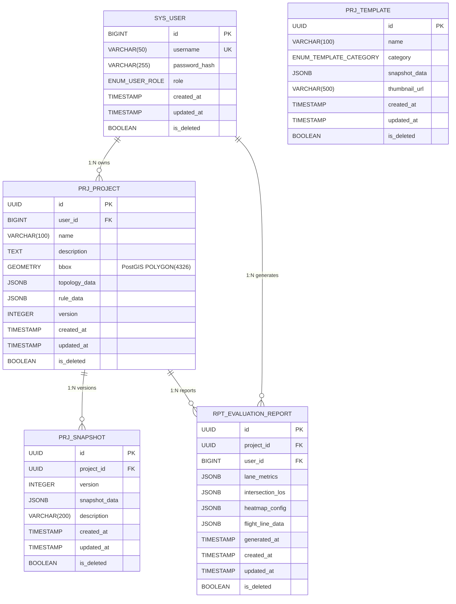

# 《基于Web3D的城市微观路网参数化设计与仿真评估系统》
## 数据库设计文档 (Database Design Document)

| 属性 | 值 |
|:---|:---|
| **文档版本** | V 2.6 |
| **项目代号** | UrbanMicro-CAD |
| **编写日期** | 2026-05-25 |
| **数据库** | PostgreSQL 14+ / PostGIS 3.4+ |
| **依据文档** | 系统详细设计说明书 V1.6、开发规约 |
| **密级** | 内部公开 |

### 文档修订记录

| 版本 | 日期 | 修订内容 | 作者 |
|:---|:---|:---|:---|
| V1.0 | 2026-05-23 | 初始版本 | — |
| V2.0 | 2026-05-23 | 标准化重构：新增枚举类型、触发器、CHECK约束、JSONB校验规则、索引策略分析、数据量估算、备份恢复策略、迁移方案 | — |
| V2.1 | 2026-05-23 | 新增3个典型立交样例模板：苜蓿叶立交(CLOVERLEAF)、菱形立交(DIAMOND)、涡轮立交(TURBINE) | — |
| V2.2 | 2026-05-25 | CrossSectionProfile结构统一、新增枚举类型(LaneDirection/MedianType/SidewalkConfig)、OD矩阵JSONB结构、仿真配置JSONB结构 | — |
| V2.3 | 2026-05-25 | 对齐详细设计V1.2：补充6个缺失JSONB子结构定义、补充3个枚举类型、统一ElevationMode为ANARCHY、补充VirtualSensor/SidewalkConfig.hasCurb、统一OD命名、补充FlightLineData存储 | — |
| V2.4 | 2026-05-25 | 模板数据补hasCurb、FlightLineData补connectorId、SQL版本号对齐、依据文档版本更新、GIN索引策略说明 | — |
| V2.5 | 2026-05-25 | 新增非对称断面模板数据（2+4潮汐断面、3+1公交专用断面）、更新依据文档版本 | — |
| V2.6 | 2026-05-25 | 新增 LaneArrow JSONB 子结构定义（车道级转向箭头）、更新依据文档版本 | — |

---

## 1. 数据库概述

### 1.1 数据库选型与版本

| 项目 | 选型 | 版本 | 选型理由 |
|:---|:---|:---|:---|
| 关系型数据库 | PostgreSQL | 14+ | 原生JSONB支持、PostGIS空间扩展、成熟的事务与并发控制 |
| 空间扩展 | PostGIS | 3.4+ | 路网bbox空间索引、空间查询（ST_Intersects等） |
| 缓存 | Redis | 7+ | JWT黑名单、会话缓存、热数据缓存 |
| ORM | MyBatis-Plus | 3.5+ | 逻辑删除、自动填充、分页插件 |
| 连接池 | HikariCP | Spring Boot 内置 | 高性能、零开销代理 |

### 1.2 数据库命名规范

| 规范项 | 约定 | 示例 | 说明 |
|:---|:---|:---|:---|
| 库名 | snake_case，小写 | `urbanmicro` | 全小写，单词间下划线 |
| 表名 | snake_case，带模块前缀 | `sys_user`, `prj_project` | 前缀与名称间下划线 |
| 字段名 | snake_case，小写 | `created_at`, `is_deleted` | — |
| 主键 | 统一 `id` | `id BIGINT` / `id UUID` | 业务表用UUID，系统表用BIGINT |
| 索引 | `idx_表名_字段名` | `idx_project_user_id` | 普通B-Tree索引 |
| 唯一索引 | `uk_表名_字段名` | `uk_project_user_name` | 复合唯一索引含多字段名 |
| GIST索引 | `idx_表名_字段名` | `idx_project_bbox` | PostGIS空间索引 |
| 外键 | 物理外键，`REFERENCES` | `REFERENCES sys_user(id)` | 严格参照完整性 |
| 枚举类型 | `enum_模块_名称` | `enum_user_role` | 数据库级枚举 |
| 触发器函数 | `tf_表名_操作` | `tf_project_update_at` | — |
| CHECK约束 | `chk_表名_字段名` | `chk_user_role` | — |

### 1.3 表前缀约定

| 前缀 | 含义 | 限界上下文 | 表 |
|:---|:---|:---|:---|
| `sys_` | 系统管理 | 通用域 | `sys_user` |
| `prj_` | 工程管理 | 场景管理上下文 (FR5) | `prj_project`, `prj_snapshot`, `prj_template` |
| `rpt_` | 报表评估 | 评估可视化上下文 (FR6) | `rpt_evaluation_report` |

### 1.4 公共字段规范

所有业务表必须包含以下审计字段，由数据库默认值和触发器自动维护：

| 字段名 | 类型 | 默认值 | 维护方式 | 说明 |
|:---|:---|:---|:---|:---|
| `created_at` | `TIMESTAMP WITH TIME ZONE` | `NOW()` | INSERT时数据库自动填充 | 创建时间，创建后不可变 |
| `updated_at` | `TIMESTAMP WITH TIME ZONE` | `NOW()` | UPDATE触发器自动更新 | 最后修改时间 |
| `is_deleted` | `BOOLEAN` | `FALSE` | 应用层逻辑删除 | 软删除标记，MyBatis-Plus全局拦截 |

### 1.5 主键策略

| 表类型 | 主键类型 | 生成策略 | 理由 |
|:---|:---|:---|:---|
| 系统表 (`sys_`) | `BIGINT` | `GENERATED ALWAYS AS IDENTITY` | 自增整数，查询效率高，适合内部管理表 |
| 业务表 (`prj_`, `rpt_`) | `UUID` | `gen_random_uuid()` | 分布式友好，避免ID猜测攻击，业务表需要对外暴露ID |

---

## 2. ER 关系图

### 2.1 ER 图



### 2.2 关系详细说明

| 关系 | 基数 | 外键 | 级联行为 | 业务含义 |
|:---|:---|:---|:---|:---|
| SYS_USER → PRJ_PROJECT | 1:N | `prj_project.user_id → sys_user.id` | ON DELETE RESTRICT | 用户删除前须先删除所有工程 |
| SYS_USER → RPT_EVALUATION_REPORT | 1:N | `rpt_evaluation_report.user_id → sys_user.id` | ON DELETE RESTRICT | 用户删除前须先删除所有报告 |
| PRJ_PROJECT → PRJ_SNAPSHOT | 1:N | `prj_snapshot.project_id → prj_project.id` | ON DELETE CASCADE | 工程删除时级联删除所有快照 |
| PRJ_PROJECT → RPT_EVALUATION_REPORT | 1:N | `rpt_evaluation_report.project_id → prj_project.id` | ON DELETE CASCADE | 工程删除时级联删除所有报告 |

---

## 3. 枚举类型定义

> 使用 PostgreSQL 原生 `ENUM` 类型替代 `VARCHAR`，确保数据完整性，避免非法值写入。

| 枚举类型 | 值域 | 使用表.字段 | 说明 |
|:---|:---|:---|:---|
| `enum_user_role` | `ADMIN`, `USER` | `sys_user.role` | 用户角色 |
| `enum_template_category` | `BASIC_INTERSECTION`, `CLOVERLEAF`, `TURBINE`, `DIAMOND`, `ROUNDABOUT`, `CUSTOM` | `prj_template.category` | 枢纽模板分类 |
| `enum_lane_direction` | `FORWARD`, `BACKWARD`, `BOTH` | `CrossSectionProfile.lanes[].direction` | 车道方向 |
| `enum_median_type` | `PAINTED`, `CONCRETE`, `GRASS`, `BARRIER`, `NONE` | `CrossSectionProfile.median.type` | 中央隔离带类型 |
| `enum_elevation_mode` | `GROUND`, `BRIDGE`, `TUNNEL`, `ANARCHY` | `ElevationProfile.mode` | 高程模式 |
| `enum_turn_direction` | `LEFT`, `RIGHT`, `STRAIGHT`, `U_TURN` | `TurnRestriction.direction` | 转向方向 |
| `enum_lane_marking_type` | `SOLID_WHITE`, `DASHED_WHITE`, `SOLID_DOUBLE_YELLOW`, `DASHED_YELLOW`, `NONE` | `LaneRestriction.markingType` | 车道标线类型 |
| `enum_transition_curve_type` | `LINEAR`, `PARABOLIC`, `CUBIC` | `RampTransition.transitionCurve` | 坡度过渡曲线类型 |

---

## 4. 表结构详细设计

### 4.1 sys_user — 用户鉴权与权限管理表

**所属限界上下文**：通用域 — 系统管理

| 字段名 | 数据类型 | 可空 | 默认值 | 约束 | 说明 |
|:---|:---|:---|:---|:---|:---|
| id | BIGINT | NO | GENERATED ALWAYS AS IDENTITY | PK | 主键，自增 |
| username | VARCHAR(50) | NO | — | UNIQUE | 用户名，唯一 |
| password_hash | VARCHAR(255) | NO | — | — | BCrypt 加密密码 |
| role | enum_user_role | NO | 'USER' | CHK | 角色 |
| created_at | TIMESTAMPTZ | NO | NOW() | — | 创建时间 |
| updated_at | TIMESTAMPTZ | NO | NOW() | — | 更新时间 |
| is_deleted | BOOLEAN | NO | FALSE | — | 软删除标记 |

**CHECK 约束**：

| 约束名 | 表达式 | 说明 |
|:---|:---|:---|
| `chk_user_username_length` | `LENGTH(username) >= 3` | 用户名最少3字符 |
| `chk_user_username_format` | `username ~ '^[a-zA-Z0-9_]+$'` | 仅允许字母数字下划线 |

**索引**：

| 索引名 | 类型 | 字段 | 说明 |
|:---|:---|:---|:---|
| sys_user_pkey | 主键 | id | — |
| sys_user_username_key | 唯一 | username | 用户名唯一 |

---

### 4.2 prj_project — 工程主表

**所属限界上下文**：场景管理上下文 (FR5)

| 字段名 | 数据类型 | 可空 | 默认值 | 约束 | 说明 |
|:---|:---|:---|:---|:---|:---|
| id | UUID | NO | gen_random_uuid() | PK | 主键 |
| user_id | BIGINT | NO | — | FK → sys_user(id) ON DELETE RESTRICT | 所属用户 |
| name | VARCHAR(100) | NO | — | — | 工程名称 |
| description | TEXT | YES | '' | — | 工程描述 |
| bbox | GEOMETRY(POLYGON, 4326) | YES | NULL | — | PostGIS 空间范围 |
| topology_data | JSONB | NO | '{}' | — | 路网拓扑数据 |
| rule_data | JSONB | NO | '{}' | — | 交规规则数据 |
| version | INTEGER | NO | 1 | CHK | 当前版本号 |
| created_at | TIMESTAMPTZ | NO | NOW() | — | 创建时间 |
| updated_at | TIMESTAMPTZ | NO | NOW() | — | 更新时间 |
| is_deleted | BOOLEAN | NO | FALSE | — | 软删除标记 |

**CHECK 约束**：

| 约束名 | 表达式 | 说明 |
|:---|:---|:---|
| `chk_project_name_length` | `LENGTH(name) >= 1` | 工程名称不可为空串 |
| `chk_project_version_positive` | `version >= 1` | 版本号必须为正整数 |

**索引**：

| 索引名 | 类型 | 字段 | 说明 |
|:---|:---|:---|:---|
| prj_project_pkey | 主键 | id | — |
| idx_project_user_id | B-Tree | user_id | 按用户查询工程列表 |
| idx_project_bbox | GIST | bbox | PostGIS 空间查询（ST_Intersects） |
| uk_project_user_name | 唯一 | (user_id, name) | 同一用户不可创建同名工程 |

**JSONB 索引**：

| 索引名 | 类型 | 表达式 | 说明 |
|:---|:---|:---|:---|
| idx_project_topology_gin | GIN | topology_data | 支持拓扑数据内部字段查询 |
| idx_project_rule_gin | GIN | rule_data | 支持规则数据内部字段查询 |

---

### 4.3 prj_snapshot — 工程版本快照表

**所属限界上下文**：场景管理上下文 (FR5)

| 字段名 | 数据类型 | 可空 | 默认值 | 约束 | 说明 |
|:---|:---|:---|:---|:---|:---|
| id | UUID | NO | gen_random_uuid() | PK | 主键 |
| project_id | UUID | NO | — | FK → prj_project(id) ON DELETE CASCADE | 所属工程 |
| version | INTEGER | NO | — | — | 版本号 |
| snapshot_data | JSONB | NO | — | — | 完整工程快照数据 |
| description | VARCHAR(200) | YES | '' | — | 快照描述 |
| created_at | TIMESTAMPTZ | NO | NOW() | — | 创建时间 |
| updated_at | TIMESTAMPTZ | NO | NOW() | — | 更新时间 |
| is_deleted | BOOLEAN | NO | FALSE | — | 软删除标记 |

**CHECK 约束**：

| 约束名 | 表达式 | 说明 |
|:---|:---|:---|
| `chk_snapshot_version_positive` | `version >= 1` | 版本号必须为正整数 |
| `chk_snapshot_data_not_empty` | `snapshot_data != '{}'::jsonb AND snapshot_data != 'null'::jsonb` | 快照数据不可为空 |

**索引**：

| 索引名 | 类型 | 字段 | 说明 |
|:---|:---|:---|:---|
| prj_snapshot_pkey | 主键 | id | — |
| idx_snapshot_project_id | B-Tree | project_id | 按工程查询快照列表 |
| uk_snapshot_project_version | 唯一 | (project_id, version) | 同一工程不可有重复版本号 |

---

### 4.4 prj_template — 典型枢纽样例库表

**所属限界上下文**：场景管理上下文 (FR5)

| 字段名 | 数据类型 | 可空 | 默认值 | 约束 | 说明 |
|:---|:---|:---|:---|:---|:---|
| id | UUID | NO | gen_random_uuid() | PK | 主键 |
| name | VARCHAR(100) | NO | — | — | 模板名称 |
| category | enum_template_category | NO | — | — | 分类 |
| snapshot_data | JSONB | NO | — | — | 模板快照数据 |
| thumbnail_url | VARCHAR(500) | YES | '' | — | 缩略图 URL |
| created_at | TIMESTAMPTZ | NO | NOW() | — | 创建时间 |
| updated_at | TIMESTAMPTZ | NO | NOW() | — | 更新时间 |
| is_deleted | BOOLEAN | NO | FALSE | — | 软删除标记 |

**CHECK 约束**：

| 约束名 | 表达式 | 说明 |
|:---|:---|:---|
| `chk_template_name_length` | `LENGTH(name) >= 1` | 模板名称不可为空串 |
| `chk_template_snapshot_not_empty` | `snapshot_data != '{}'::jsonb AND snapshot_data != 'null'::jsonb` | 模板快照数据不可为空 |

**索引**：

| 索引名 | 类型 | 字段 | 说明 |
|:---|:---|:---|:---|
| prj_template_pkey | 主键 | id | — |
| idx_template_category | B-Tree | category | 按分类筛选模板 |
| idx_template_name | B-Tree | name | 模板名称模糊搜索 |

---

### 4.5 rpt_evaluation_report — 交通评估报告表

**所属限界上下文**：评估可视化上下文 (FR6)

| 字段名 | 数据类型 | 可空 | 默认值 | 约束 | 说明 |
|:---|:---|:---|:---|:---|:---|
| id | UUID | NO | gen_random_uuid() | PK | 主键 |
| project_id | UUID | NO | — | FK → prj_project(id) ON DELETE CASCADE | 所属工程 |
| user_id | BIGINT | NO | — | FK → sys_user(id) ON DELETE RESTRICT | 所属用户，行级隔离 |
| lane_metrics | JSONB | NO | '{}' | — | 车道级指标数据 |
| intersection_los | JSONB | NO | '{}' | — | 交叉口 LOS 评级数据 |
| heatmap_config | JSONB | NO | '{}' | — | 热力图配置数据 |
| flight_line_data | JSONB | NO | '{}' | — | 交通路线飞线数据 |
| generated_at | TIMESTAMPTZ | NO | NOW() | — | 报告生成时间 |
| created_at | TIMESTAMPTZ | NO | NOW() | — | 创建时间 |
| updated_at | TIMESTAMPTZ | NO | NOW() | — | 更新时间 |
| is_deleted | BOOLEAN | NO | FALSE | — | 软删除标记 |

**索引**：

| 索引名 | 类型 | 字段 | 说明 |
|:---|:---|:---|:---|
| rpt_evaluation_report_pkey | 主键 | id | — |
| idx_report_project_id | B-Tree | project_id | 按工程查询报告 |
| idx_report_user_id | B-Tree | user_id | 行级数据隔离查询 |
| idx_report_generated_at | B-Tree | generated_at DESC | 按生成时间排序 |

---

## 5. JSONB 数据结构定义

### 5.1 topology_data — 路网拓扑数据

存储于 `prj_project.topology_data`，包含节点、路段和半边拓扑。

```typescript
interface TopologyData {
    nodes: {
        id: string;
        position: { x: number; y: number };
        elevation: number;
        boundary: { x: number; y: number }[];
        controlMode: 'YIELD' | 'TRAFFIC_LIGHT' | 'ROUNDABOUT' | 'NONE';
        connectedSegmentIds: string[];
    }[];
    segments: {
        id: string;
        startNodeId: string;
        endNodeId: string;
        centerLine: { x: number; y: number }[];
        profile: CrossSectionProfile;
        elevation: ElevationProfile;
    }[];
    halfEdges: {  // ⚠ 冗余派生数据：可由 nodes + segments 重建，持久化仅为避免运行时重算
        id: string;
        originNodeId: string;
        twinId: string;
        nextId: string;
        segmentId: string;
        laneIndex: number;
    }[];
}
```

> **注**：`centerLine` 存储贝塞尔曲线采样控制点（Point2D[]），运行时通过 `bezier-js` 重建为 `BezierCurve` 对象。

```typescript
interface CrossSectionProfile {
    lanes: {
        width: number;
        type: 'CAR' | 'BUS' | 'BIKE' | 'TRAM';
        direction: 'FORWARD' | 'BACKWARD' | 'BOTH';
    }[];
    median: {
        width: number;
        type: 'PAINTED' | 'CONCRETE' | 'GRASS' | 'BARRIER' | 'NONE';
    };
    sidewalkLeft: {
        width: number;
        hasCurb: boolean;
    };
    sidewalkRight: {
        width: number;
        hasCurb: boolean;
    };
}
```

```typescript
interface ElevationProfile {
    startZ: number;
    endZ: number;
    mode: 'GROUND' | 'BRIDGE' | 'TUNNEL' | 'ANARCHY';
    rampTransition: RampTransition | null;
}
```

```typescript
interface RampTransition {
    rampLength: number;
    maxSlope: number;
    transitionCurve: 'LINEAR' | 'PARABOLIC' | 'CUBIC';
}
```

**JSONB 校验规则**（应用层 `SceneSerializer` 校验，入库前拦截）：

| 规则 | 校验表达式 | 说明 |
|:---|:---|:---|
| nodes 非空数组 | `Array.isArray(data.nodes)` | 至少含1个节点才构成有效路网（空白场景允许空数组） |
| segment 引用完整性 | `segment.startNodeId ∈ nodes.id && segment.endNodeId ∈ nodes.id` | 路段端点必须指向已存在的节点 |
| halfEdge 引用完整性 | `he.originNodeId ∈ nodes.id && he.segmentId ∈ segments.id` | 半边必须关联已存在的节点和路段 |
| twin 互指 | `halfEdges.find(h => h.id === he.twinId).twinId === he.id` | 半边与孪生半边必须互相指向 |
| centerLine 至少2点 | `segment.centerLine.length >= 2` | 路段中心线至少包含起终点 |

### 5.2 rule_data — 交规规则数据

存储于 `prj_project.rule_data`，包含每个节点的 TM:PE 级微观规则。

```typescript
interface RuleData {
    ruleSets: {
        nodeId: string;
        nodeControlMode: 'YIELD' | 'TRAFFIC_LIGHT' | 'ROUNDABOUT' | 'NONE';
        crosswalkEnabled: boolean;
        turnRestrictions: TurnRestriction[];
        laneArrows: {
            laneId: string;
            nodeId: string;
            allowedDirections: ('LEFT' | 'STRAIGHT' | 'RIGHT' | 'U_TURN')[];
        }[];
        laneConnectors: {
            id: string;
            fromLaneId: string;
            toLaneId: string;
            fromAnchor: { x: number; y: number };
            toAnchor: { x: number; y: number };
        }[];
        trafficLight: {
            id: string;
            steps: SignalStep[];
            sensors: VirtualSensor[];
            strategy: 'FIXED_TIMING' | 'SENSOR_ACTUATED';
        } | null;
        laneRestrictions: {
            laneId: string;
            restriction: LaneRestriction;
        }[];
    }[];
    odConfig: {
        pairs: {
            fromNodeId: string;
            toNodeId: string;
            volumePerHour: number;
        }[];
        vehicleMix: {
            ratios: {
                type: 'CAR' | 'BUS' | 'TRUCK' | 'BIKE' | 'TRAM';
                ratio: number;
            }[];
        };
    };
}
```

> **注**：`LaneConnector.guideCurve`（CatmullRomCurve3 引导曲线）为运行时根据 `fromAnchor`/`toAnchor` 自动重建的计算字段，不持久化存储。

```typescript
interface LaneRestriction {
    speedLimit: number;
    allowedVehicleTypes: ('CAR' | 'BUS' | 'TRUCK' | 'BIKE' | 'TRAM')[];
    allowLeftChange: boolean;
    allowRightChange: boolean;
    markingType: 'SOLID_WHITE' | 'DASHED_WHITE' | 'SOLID_DOUBLE_YELLOW' | 'DASHED_YELLOW' | 'NONE';
}
```

```typescript
interface SignalStep {
    greenLanes: string[];
    minGreenTime: number;
    maxGreenTime: number;
    yellowTime: number;
    allRedTime: number;
    sensorBindings: string[];
}
```

```typescript
interface TurnRestriction {
    fromSegmentId: string;
    toSegmentId: string;
    direction: 'LEFT' | 'RIGHT' | 'STRAIGHT' | 'U_TURN';
}
```

```typescript
interface LaneArrow {
    laneId: string;
    nodeId: string;
    allowedDirections: ('LEFT' | 'STRAIGHT' | 'RIGHT' | 'U_TURN')[];
}
```

```typescript
interface VirtualSensor {
    id: string;
    position: { x: number; y: number };
    detectionRadius: number;
}
```

> **注**：`VirtualSensor.triggered`（运行时触发状态）为仿真运行时动态计算字段，不持久化存储。

**JSONB 校验规则**：

| 规则 | 校验表达式 | 说明 |
|:---|:---|:---|
| ruleSets 非空数组 | `Array.isArray(data.ruleSets)` | — |
| nodeId 引用完整性 | `ruleSet.nodeId ∈ topology_data.nodes.id` | 规则集必须关联已存在的节点 |
| TRAFFIC_LIGHT 模式必须有信控 | `mode==='TRAFFIC_LIGHT' → trafficLight !== null` | 红绿灯模式必须配置信控器 |
| steps 非空 | `trafficLight !== null → steps.length >= 1` | 信控器至少含1个步阶 |
| greenTime 合理范围 | `step.minGreenTime >= 5 && step.maxGreenTime <= 300` | 绿灯时间 5-300 秒 |

### 5.3 snapshot_data — 快照数据

`prj_snapshot.snapshot_data` 与 `prj_template.snapshot_data` 共享同一结构：

```typescript
interface SnapshotData {
    topology: TopologyData;
    rules: RuleData;
}
```

### 5.4 lane_metrics — 车道级指标数据

存储于 `rpt_evaluation_report.lane_metrics`：

```typescript
interface LaneMetricsData {
    metrics: {
        laneId: string;
        trafficVolume: number;
        averageSpeed: number;
        density: number;
        maxQueueLength: number;
        occupancyRate: number;
    }[];
    generatedAt: string;
}
```

### 5.5 intersection_los — 交叉口 LOS 评级数据

存储于 `rpt_evaluation_report.intersection_los`：

```typescript
interface IntersectionLOSData {
    intersections: {
        nodeId: string;
        averageDelay: number;
        losGrade: 'A' | 'B' | 'C' | 'D' | 'E' | 'F';
        approachDelays: { [segmentId: string]: number };
    }[];
    generatedAt: string;
}
```

### 5.6 heatmap_config — 热力图配置数据

存储于 `rpt_evaluation_report.heatmap_config`：

```typescript
interface HeatmapConfigData {
    colorStops: { threshold: number; color: string }[];
    laneCongestionMap: { laneId: string; congestion: number }[];
    renderMode: 'LANE' | 'SEGMENT';
}
```

### 5.7 flight_line_data — 交通路线飞线数据

存储于 `rpt_evaluation_report.flight_line_data`：

```typescript
interface FlightLineDataStorage {
    flightLines: {
        vehicleId: string;
        vehicleType: 'CAR' | 'BUS' | 'TRUCK' | 'BIKE' | 'TRAM';
        trajectoryPoints: { x: number; y: number; z: number }[];
        plannedRouteWaypoints: { laneId: string; segmentId: string; nodeId: string | null; connectorId: string | null }[];
    }[];
}
```

> **注**：`plannedRouteWaypoints` 在存储层对应详细设计中 `FlightLineData.plannedRoute`（`RouteWaypoint[]`）的序列化格式。

---

## 6. 触发器设计

### 6.1 updated_at 自动更新触发器

所有含 `updated_at` 字段的表均需创建触发器，确保 UPDATE 操作自动刷新时间戳。

**通用触发器函数**：

```sql
CREATE OR REPLACE FUNCTION tf_set_updated_at()
RETURNS TRIGGER AS $$
BEGIN
    NEW.updated_at = NOW();
    RETURN NEW;
END;
$$ LANGUAGE plpgsql;
```

**各表触发器绑定**：

| 表 | 触发器名 | 事件 | 函数 |
|:---|:---|:---|:---|
| sys_user | trg_user_updated_at | BEFORE UPDATE | tf_set_updated_at() |
| prj_project | trg_project_updated_at | BEFORE UPDATE | tf_set_updated_at() |
| prj_snapshot | trg_snapshot_updated_at | BEFORE UPDATE | tf_set_updated_at() |
| prj_template | trg_template_updated_at | BEFORE UPDATE | tf_set_updated_at() |
| rpt_evaluation_report | trg_report_updated_at | BEFORE UPDATE | tf_set_updated_at() |

### 6.2 工程版本自增触发器

保存快照时自动递增工程版本号：

```sql
CREATE OR REPLACE FUNCTION tf_project_version_increment()
RETURNS TRIGGER AS $$
BEGIN
    NEW.version = OLD.version + 1;
    RETURN NEW;
END;
$$ LANGUAGE plpgsql;

CREATE TRIGGER trg_project_version_increment
    BEFORE UPDATE ON prj_project
    FOR EACH ROW
    WHEN (NEW.topology_data IS DISTINCT FROM OLD.topology_data
       OR NEW.rule_data IS DISTINCT FROM OLD.rule_data)
EXECUTE FUNCTION tf_project_version_increment();
```

---

## 7. 完整建库脚本

> 以下脚本可直接在 PostgreSQL 14+ 环境中按顺序执行。

```sql
-- ============================================================
-- UrbanMicro-CAD 数据库初始化脚本
-- 数据库: PostgreSQL 14+ / PostGIS 3.4+
-- 项目代号: UrbanMicro-CAD
-- 生成日期: 2026-05-26
-- 脚本版本: V2.6
-- ============================================================

-- ============================================================
-- 1. 创建数据库（由 DBA 手动执行，此处仅作参考）
-- ============================================================
-- CREATE DATABASE urbanmicro
--     WITH ENCODING = 'UTF8'
--     LC_COLLATE = 'en_US.utf8'
--     LC_CTYPE = 'en_US.utf8'
--     TEMPLATE = template0;
-- \c urbanmicro;

-- ============================================================
-- 2. 启用扩展
-- ============================================================
CREATE EXTENSION IF NOT EXISTS postgis;
CREATE EXTENSION IF NOT EXISTS "uuid-ossp";

-- ============================================================
-- 3. 定义枚举类型
-- ============================================================
CREATE TYPE enum_user_role AS ENUM ('ADMIN', 'USER');

CREATE TYPE enum_template_category AS ENUM (
    'BASIC_INTERSECTION',
    'CLOVERLEAF',
    'TURBINE',
    'DIAMOND',
    'ROUNDABOUT',
    'CUSTOM'
);

CREATE TYPE enum_lane_direction AS ENUM ('FORWARD', 'BACKWARD', 'BOTH');
CREATE TYPE enum_median_type AS ENUM ('PAINTED', 'CONCRETE', 'GRASS', 'BARRIER', 'NONE');
CREATE TYPE enum_elevation_mode AS ENUM ('GROUND', 'BRIDGE', 'TUNNEL', 'ANARCHY');
CREATE TYPE enum_turn_direction AS ENUM ('LEFT', 'RIGHT', 'STRAIGHT', 'U_TURN');
CREATE TYPE enum_lane_marking_type AS ENUM ('SOLID_WHITE', 'DASHED_WHITE', 'SOLID_DOUBLE_YELLOW', 'DASHED_YELLOW', 'NONE');
CREATE TYPE enum_transition_curve_type AS ENUM ('LINEAR', 'PARABOLIC', 'CUBIC');

-- ============================================================
-- 4. 定义通用触发器函数
-- ============================================================
CREATE OR REPLACE FUNCTION tf_set_updated_at()
RETURNS TRIGGER AS $$
BEGIN
    NEW.updated_at = NOW();
    RETURN NEW;
END;
$$ LANGUAGE plpgsql;

CREATE OR REPLACE FUNCTION tf_project_version_increment()
RETURNS TRIGGER AS $$
BEGIN
    NEW.version = OLD.version + 1;
    RETURN NEW;
END;
$$ LANGUAGE plpgsql;

-- ============================================================
-- 5. 建表（按外键依赖顺序）
-- ============================================================

-- 5.1 sys_user — 用户鉴权与权限管理表
CREATE TABLE sys_user (
    id              BIGINT              PRIMARY KEY GENERATED ALWAYS AS IDENTITY,
    username        VARCHAR(50)         NOT NULL UNIQUE,
    password_hash   VARCHAR(255)        NOT NULL,
    role            enum_user_role      NOT NULL DEFAULT 'USER',
    created_at      TIMESTAMPTZ         NOT NULL DEFAULT NOW(),
    updated_at      TIMESTAMPTZ         NOT NULL DEFAULT NOW(),
    is_deleted      BOOLEAN             NOT NULL DEFAULT FALSE,

    CONSTRAINT chk_user_username_length  CHECK (LENGTH(username) >= 3),
    CONSTRAINT chk_user_username_format  CHECK (username ~ '^[a-zA-Z0-9_]+$')
);

CREATE TRIGGER trg_user_updated_at
    BEFORE UPDATE ON sys_user
    FOR EACH ROW
EXECUTE FUNCTION tf_set_updated_at();

COMMENT ON TABLE  sys_user               IS '用户鉴权与权限管理表';
COMMENT ON COLUMN sys_user.id            IS '主键，自增';
COMMENT ON COLUMN sys_user.username      IS '用户名，唯一，3-50字符，仅字母数字下划线';
COMMENT ON COLUMN sys_user.password_hash IS 'BCrypt加密密码，强度10';
COMMENT ON COLUMN sys_user.role          IS '角色：ADMIN / USER';
COMMENT ON COLUMN sys_user.created_at    IS '创建时间';
COMMENT ON COLUMN sys_user.updated_at    IS '更新时间，触发器自动维护';
COMMENT ON COLUMN sys_user.is_deleted    IS '软删除标记';

-- 5.2 prj_project — 工程主表
CREATE TABLE prj_project (
    id              UUID                PRIMARY KEY DEFAULT gen_random_uuid(),
    user_id         BIGINT              NOT NULL REFERENCES sys_user(id) ON DELETE RESTRICT,
    name            VARCHAR(100)        NOT NULL,
    description     TEXT                DEFAULT '',
    bbox            GEOMETRY(POLYGON, 4326),
    topology_data   JSONB               NOT NULL DEFAULT '{}',
    rule_data       JSONB               NOT NULL DEFAULT '{}',
    version         INTEGER             NOT NULL DEFAULT 1,
    created_at      TIMESTAMPTZ         NOT NULL DEFAULT NOW(),
    updated_at      TIMESTAMPTZ         NOT NULL DEFAULT NOW(),
    is_deleted      BOOLEAN             NOT NULL DEFAULT FALSE,

    CONSTRAINT chk_project_name_length     CHECK (LENGTH(name) >= 1),
    CONSTRAINT chk_project_version_positive CHECK (version >= 1)
);

CREATE INDEX idx_project_user_id ON prj_project(user_id);
CREATE INDEX idx_project_bbox ON prj_project USING GIST(bbox);
CREATE UNIQUE INDEX uk_project_user_name ON prj_project(user_id, name);
CREATE INDEX idx_project_topology_gin ON prj_project USING GIN(topology_data);
CREATE INDEX idx_project_rule_gin ON prj_project USING GIN(rule_data);

CREATE TRIGGER trg_project_updated_at
    BEFORE UPDATE ON prj_project
    FOR EACH ROW
EXECUTE FUNCTION tf_set_updated_at();

CREATE TRIGGER trg_project_version_increment
    BEFORE UPDATE ON prj_project
    FOR EACH ROW
    WHEN (NEW.topology_data IS DISTINCT FROM OLD.topology_data
       OR NEW.rule_data IS DISTINCT FROM OLD.rule_data)
EXECUTE FUNCTION tf_project_version_increment();

COMMENT ON TABLE  prj_project                IS '工程主表，核心拓扑与规则以JSONB存储';
COMMENT ON COLUMN prj_project.id             IS '主键，UUID自动生成';
COMMENT ON COLUMN prj_project.user_id        IS '所属用户ID，外键关联sys_user.id，RESTRICT删除';
COMMENT ON COLUMN prj_project.name           IS '工程名称，同一用户下唯一';
COMMENT ON COLUMN prj_project.description    IS '工程描述';
COMMENT ON COLUMN prj_project.bbox           IS 'PostGIS空间范围(POLYGON, SRID=4326)，用于空间查询';
COMMENT ON COLUMN prj_project.topology_data  IS '路网拓扑JSONB：节点、路段、半边、横断面';
COMMENT ON COLUMN prj_project.rule_data      IS '交规规则JSONB：车道连接器、信控、限速等';
COMMENT ON COLUMN prj_project.version        IS '当前版本号，拓扑/规则变更时触发器自增';
COMMENT ON COLUMN prj_project.created_at     IS '创建时间';
COMMENT ON COLUMN prj_project.updated_at     IS '更新时间，触发器自动维护';
COMMENT ON COLUMN prj_project.is_deleted     IS '软删除标记';

-- 5.3 prj_snapshot — 工程版本快照表
CREATE TABLE prj_snapshot (
    id              UUID                PRIMARY KEY DEFAULT gen_random_uuid(),
    project_id      UUID                NOT NULL REFERENCES prj_project(id) ON DELETE CASCADE,
    version         INTEGER             NOT NULL,
    snapshot_data   JSONB               NOT NULL,
    description     VARCHAR(200)        DEFAULT '',
    created_at      TIMESTAMPTZ         NOT NULL DEFAULT NOW(),
    updated_at      TIMESTAMPTZ         NOT NULL DEFAULT NOW(),
    is_deleted      BOOLEAN             NOT NULL DEFAULT FALSE,

    CONSTRAINT chk_snapshot_version_positive CHECK (version >= 1),
    CONSTRAINT chk_snapshot_data_not_empty   CHECK (snapshot_data != '{}'::jsonb AND snapshot_data != 'null'::jsonb)
);

CREATE INDEX idx_snapshot_project_id ON prj_snapshot(project_id);
CREATE UNIQUE INDEX uk_snapshot_project_version ON prj_snapshot(project_id, version);

CREATE TRIGGER trg_snapshot_updated_at
    BEFORE UPDATE ON prj_snapshot
    FOR EACH ROW
EXECUTE FUNCTION tf_set_updated_at();

COMMENT ON TABLE  prj_snapshot                IS '工程版本快照，支持回滚';
COMMENT ON COLUMN prj_snapshot.id             IS '主键，UUID自动生成';
COMMENT ON COLUMN prj_snapshot.project_id     IS '所属工程ID，外键关联prj_project.id，CASCADE删除';
COMMENT ON COLUMN prj_snapshot.version        IS '版本号，同一工程内唯一';
COMMENT ON COLUMN prj_snapshot.snapshot_data  IS '完整工程快照JSONB，结构见SnapshotData接口';
COMMENT ON COLUMN prj_snapshot.description    IS '快照描述，如"修改信控后保存"';
COMMENT ON COLUMN prj_snapshot.created_at     IS '创建时间';
COMMENT ON COLUMN prj_snapshot.updated_at     IS '更新时间，触发器自动维护';
COMMENT ON COLUMN prj_snapshot.is_deleted     IS '快照软删除标记';

-- 5.4 prj_template — 典型枢纽样例库表
CREATE TABLE prj_template (
    id              UUID                    PRIMARY KEY DEFAULT gen_random_uuid(),
    name            VARCHAR(100)            NOT NULL,
    category        enum_template_category  NOT NULL,
    snapshot_data   JSONB                   NOT NULL,
    thumbnail_url   VARCHAR(500)            DEFAULT '',
    created_at      TIMESTAMPTZ             NOT NULL DEFAULT NOW(),
    updated_at      TIMESTAMPTZ             NOT NULL DEFAULT NOW(),
    is_deleted      BOOLEAN                 NOT NULL DEFAULT FALSE,

    CONSTRAINT chk_template_name_length       CHECK (LENGTH(name) >= 1),
    CONSTRAINT chk_template_snapshot_not_empty CHECK (snapshot_data != '{}'::jsonb AND snapshot_data != 'null'::jsonb)
);

CREATE INDEX idx_template_category ON prj_template(category);
CREATE INDEX idx_template_name ON prj_template(name);

CREATE TRIGGER trg_template_updated_at
    BEFORE UPDATE ON prj_template
    FOR EACH ROW
EXECUTE FUNCTION tf_set_updated_at();

COMMENT ON TABLE  prj_template                IS '典型枢纽样例库';
COMMENT ON COLUMN prj_template.id             IS '主键，UUID自动生成';
COMMENT ON COLUMN prj_template.name           IS '模板名称，如"标准十字路口"';
COMMENT ON COLUMN prj_template.category       IS '分类枚举：BASIC_INTERSECTION/CLOVERLEAF/TURBINE/DIAMOND/ROUNDABOUT/CUSTOM';
COMMENT ON COLUMN prj_template.snapshot_data  IS '模板快照JSONB，结构与prj_snapshot.snapshot_data一致';
COMMENT ON COLUMN prj_template.thumbnail_url  IS '缩略图URL';
COMMENT ON COLUMN prj_template.created_at     IS '创建时间';
COMMENT ON COLUMN prj_template.updated_at     IS '更新时间，触发器自动维护';
COMMENT ON COLUMN prj_template.is_deleted     IS '软删除标记';

-- 5.5 rpt_evaluation_report — 交通评估报告表
CREATE TABLE rpt_evaluation_report (
    id                  UUID            PRIMARY KEY DEFAULT gen_random_uuid(),
    project_id          UUID            NOT NULL REFERENCES prj_project(id) ON DELETE CASCADE,
    user_id             BIGINT          NOT NULL REFERENCES sys_user(id) ON DELETE RESTRICT,
    lane_metrics        JSONB           NOT NULL DEFAULT '{}',
    intersection_los    JSONB           NOT NULL DEFAULT '{}',
    heatmap_config      JSONB           NOT NULL DEFAULT '{}',
    flight_line_data    JSONB           NOT NULL DEFAULT '{}',
    generated_at        TIMESTAMPTZ     NOT NULL DEFAULT NOW(),
    created_at          TIMESTAMPTZ     NOT NULL DEFAULT NOW(),
    updated_at          TIMESTAMPTZ     NOT NULL DEFAULT NOW(),
    is_deleted          BOOLEAN         NOT NULL DEFAULT FALSE
);

CREATE INDEX idx_report_project_id ON rpt_evaluation_report(project_id);
CREATE INDEX idx_report_user_id ON rpt_evaluation_report(user_id);
CREATE INDEX idx_report_generated_at ON rpt_evaluation_report(generated_at DESC);

CREATE TRIGGER trg_report_updated_at
    BEFORE UPDATE ON rpt_evaluation_report
    FOR EACH ROW
EXECUTE FUNCTION tf_set_updated_at();

COMMENT ON TABLE  rpt_evaluation_report                  IS '交通评估报告';
COMMENT ON COLUMN rpt_evaluation_report.id               IS '主键，UUID自动生成';
COMMENT ON COLUMN rpt_evaluation_report.project_id       IS '所属工程ID，外键关联prj_project.id，CASCADE删除';
COMMENT ON COLUMN rpt_evaluation_report.user_id          IS '用户ID，行级数据隔离，外键关联sys_user.id，RESTRICT删除';
COMMENT ON COLUMN rpt_evaluation_report.lane_metrics     IS '车道级指标JSONB：交通量/速度/密度/排队长度';
COMMENT ON COLUMN rpt_evaluation_report.intersection_los IS '交叉口LOS评级JSONB：延误/LOS等级';
COMMENT ON COLUMN rpt_evaluation_report.heatmap_config   IS '热力图配置JSONB：颜色映射/渲染参数';
COMMENT ON COLUMN rpt_evaluation_report.flight_line_data IS '交通路线飞线JSONB：车辆轨迹与导航路径';
COMMENT ON COLUMN rpt_evaluation_report.generated_at     IS '报告生成时间';
COMMENT ON COLUMN rpt_evaluation_report.created_at       IS '创建时间';
COMMENT ON COLUMN rpt_evaluation_report.updated_at       IS '更新时间，触发器自动维护';
COMMENT ON COLUMN rpt_evaluation_report.is_deleted       IS '软删除标记';

-- ============================================================
-- 6. 初始化数据
-- ============================================================

-- 6.1 插入默认管理员账户（密码: admin123，BCrypt强度10加密）
INSERT INTO sys_user (username, password_hash, role)
VALUES ('admin', '$2a$10$N9qo8uLOickgx2ZMRZoMyeIjZAgcfl7p92ldGxad68LJZdL17lhWy', 'ADMIN')
ON CONFLICT (username) DO NOTHING;

-- 6.2 插入默认样例模板
INSERT INTO prj_template (name, category, snapshot_data) VALUES
    ('空白场景', 'CUSTOM',
     '{"topology":{"nodes":[],"segments":[],"halfEdges":[]},"rules":{"ruleSets":[]}}'),
    ('标准十字路口', 'BASIC_INTERSECTION',
     '{"topology":{"nodes":[{"id":"n1","position":{"x":0,"y":0},"elevation":0,"boundary":[{"x":-15,"y":-15},{"x":15,"y":-15},{"x":15,"y":15},{"x":-15,"y":15}],"controlMode":"TRAFFIC_LIGHT","connectedSegmentIds":["s1","s2","s3","s4"]}],"segments":[{"id":"s1","startNodeId":"n1","endNodeId":"n_ext_n","centerLine":[{"x":0,"y":0},{"x":0,"y":100}],"profile":{"lanes":[{"width":3.5,"type":"CAR","direction":"FORWARD"},{"width":3.5,"type":"CAR","direction":"FORWARD"}],"median":{"width":1,"type":"PAINTED"},"sidewalkLeft":{"width":2,"hasCurb":true},"sidewalkRight":{"width":2,"hasCurb":true}},"elevation":{"startZ":0,"endZ":0,"mode":"GROUND","rampTransition":null}},{"id":"s2","startNodeId":"n1","endNodeId":"n_ext_s","centerLine":[{"x":0,"y":0},{"x":0,"y":-100}],"profile":{"lanes":[{"width":3.5,"type":"CAR","direction":"FORWARD"},{"width":3.5,"type":"CAR","direction":"FORWARD"}],"median":{"width":1,"type":"PAINTED"},"sidewalkLeft":{"width":2,"hasCurb":true},"sidewalkRight":{"width":2,"hasCurb":true}},"elevation":{"startZ":0,"endZ":0,"mode":"GROUND","rampTransition":null}},{"id":"s3","startNodeId":"n1","endNodeId":"n_ext_e","centerLine":[{"x":0,"y":0},{"x":100,"y":0}],"profile":{"lanes":[{"width":3.5,"type":"CAR","direction":"FORWARD"},{"width":3.5,"type":"CAR","direction":"FORWARD"}],"median":{"width":1,"type":"PAINTED"},"sidewalkLeft":{"width":2,"hasCurb":true},"sidewalkRight":{"width":2,"hasCurb":true}},"elevation":{"startZ":0,"endZ":0,"mode":"GROUND","rampTransition":null}},{"id":"s4","startNodeId":"n1","endNodeId":"n_ext_w","centerLine":[{"x":0,"y":0},{"x":-100,"y":0}],"profile":{"lanes":[{"width":3.5,"type":"CAR","direction":"FORWARD"},{"width":3.5,"type":"CAR","direction":"FORWARD"}],"median":{"width":1,"type":"PAINTED"},"sidewalkLeft":{"width":2,"hasCurb":true},"sidewalkRight":{"width":2,"hasCurb":true}},"elevation":{"startZ":0,"endZ":0,"mode":"GROUND","rampTransition":null}}],"halfEdges":[]},"rules":{"ruleSets":[{"nodeId":"n1","nodeControlMode":"TRAFFIC_LIGHT","crosswalkEnabled":true,"turnRestrictions":[],"laneConnectors":[],"trafficLight":{"id":"tl1","steps":[{"greenLanes":[],"minGreenTime":30,"maxGreenTime":60,"yellowTime":3,"allRedTime":2,"sensorBindings":[]}],"sensors":[],"strategy":"FIXED_TIMING"},"laneRestrictions":[],"laneArrows":[]}`]}}'),
    ('标准T型路口', 'BASIC_INTERSECTION',
     '{"topology":{"nodes":[{"id":"n1","position":{"x":0,"y":0},"elevation":0,"boundary":[{"x":-15,"y":-15},{"x":15,"y":-15},{"x":15,"y":15},{"x":-15,"y":15}],"controlMode":"YIELD","connectedSegmentIds":["s1","s2","s3"]}],"segments":[{"id":"s1","startNodeId":"n1","endNodeId":"n_ext_n","centerLine":[{"x":0,"y":0},{"x":0,"y":100}],"profile":{"lanes":[{"width":3.5,"type":"CAR","direction":"FORWARD"}],"median":{"width":0.5,"type":"PAINTED"},"sidewalkLeft":{"width":2,"hasCurb":true},"sidewalkRight":{"width":2,"hasCurb":true}},"elevation":{"startZ":0,"endZ":0,"mode":"GROUND","rampTransition":null}},{"id":"s2","startNodeId":"n1","endNodeId":"n_ext_s","centerLine":[{"x":0,"y":0},{"x":0,"y":-100}],"profile":{"lanes":[{"width":3.5,"type":"CAR","direction":"FORWARD"}],"median":{"width":0.5,"type":"PAINTED"},"sidewalkLeft":{"width":2,"hasCurb":true},"sidewalkRight":{"width":2,"hasCurb":true}},"elevation":{"startZ":0,"endZ":0,"mode":"GROUND","rampTransition":null}},{"id":"s3","startNodeId":"n1","endNodeId":"n_ext_e","centerLine":[{"x":0,"y":0},{"x":100,"y":0}],"profile":{"lanes":[{"width":3.5,"type":"CAR","direction":"FORWARD"}],"median":{"width":0.5,"type":"PAINTED"},"sidewalkLeft":{"width":2,"hasCurb":true},"sidewalkRight":{"width":2,"hasCurb":true}},"elevation":{"startZ":0,"endZ":0,"mode":"GROUND","rampTransition":null}}],"halfEdges":[]},"rules":{"ruleSets":[{"nodeId":"n1","nodeControlMode":"YIELD","crosswalkEnabled":true,"turnRestrictions":[],"laneConnectors":[],"trafficLight":null,"laneRestrictions":[],"laneArrows":[]}`]}}'),
    ('标准环岛', 'ROUNDABOUT',
     '{"topology":{"nodes":[{"id":"n1","position":{"x":0,"y":0},"elevation":0,"boundary":[{"x":-20,"y":-20},{"x":20,"y":-20},{"x":20,"y":20},{"x":-20,"y":20}],"controlMode":"ROUNDABOUT","connectedSegmentIds":["s1","s2","s3","s4"]}],"segments":[{"id":"s1","startNodeId":"n1","endNodeId":"n_ext_n","centerLine":[{"x":0,"y":0},{"x":0,"y":100}],"profile":{"lanes":[{"width":3.5,"type":"CAR","direction":"FORWARD"}],"median":{"width":0.5,"type":"PAINTED"},"sidewalkLeft":{"width":2,"hasCurb":true},"sidewalkRight":{"width":2,"hasCurb":true}},"elevation":{"startZ":0,"endZ":0,"mode":"GROUND","rampTransition":null}},{"id":"s2","startNodeId":"n1","endNodeId":"n_ext_s","centerLine":[{"x":0,"y":0},{"x":0,"y":-100}],"profile":{"lanes":[{"width":3.5,"type":"CAR","direction":"FORWARD"}],"median":{"width":0.5,"type":"PAINTED"},"sidewalkLeft":{"width":2,"hasCurb":true},"sidewalkRight":{"width":2,"hasCurb":true}},"elevation":{"startZ":0,"endZ":0,"mode":"GROUND","rampTransition":null}},{"id":"s3","startNodeId":"n1","endNodeId":"n_ext_e","centerLine":[{"x":0,"y":0},{"x":100,"y":0}],"profile":{"lanes":[{"width":3.5,"type":"CAR","direction":"FORWARD"}],"median":{"width":0.5,"type":"PAINTED"},"sidewalkLeft":{"width":2,"hasCurb":true},"sidewalkRight":{"width":2,"hasCurb":true}},"elevation":{"startZ":0,"endZ":0,"mode":"GROUND","rampTransition":null}},{"id":"s4","startNodeId":"n1","endNodeId":"n_ext_w","centerLine":[{"x":0,"y":0},{"x":-100,"y":0}],"profile":{"lanes":[{"width":3.5,"type":"CAR","direction":"FORWARD"}],"median":{"width":0.5,"type":"PAINTED"},"sidewalkLeft":{"width":2,"hasCurb":true},"sidewalkRight":{"width":2,"hasCurb":true}},"elevation":{"startZ":0,"endZ":0,"mode":"GROUND","rampTransition":null}}],"halfEdges":[]},"rules":{"ruleSets":[{"nodeId":"n1","nodeControlMode":"ROUNDABOUT","crosswalkEnabled":false,"turnRestrictions":[],"laneConnectors":[],"trafficLight":null,"laneRestrictions":[],"laneArrows":[]}`]}}');

-- 非对称断面：2+4 潮汐断面（2车道北行+4车道南行）
INSERT INTO prj_template (id, name, category, snapshot_data, thumbnail_url) VALUES (
    gen_random_uuid(), '2+4潮汐断面', 'CUSTOM',
    '{"topology":{"nodes":[{"id":"n1","position":{"x":0,"y":0},"elevation":0,"boundary":[{"x":-20,"y":-15},{"x":20,"y":-15},{"x":20,"y":15},{"x":-20,"y":15}],"controlMode":"NONE","connectedSegmentIds":["s1","s2"]}],"segments":[{"id":"s1","startNodeId":"n1","endNodeId":"n_ext_n","centerLine":[{"x":0,"y":0},{"x":0,"y":100}],"profile":{"lanes":[{"width":3.5,"type":"CAR","direction":"FORWARD"},{"width":3.5,"type":"CAR","direction":"FORWARD"},{"width":3.5,"type":"CAR","direction":"BACKWARD"},{"width":3.5,"type":"CAR","direction":"BACKWARD"},{"width":3.5,"type":"CAR","direction":"BACKWARD"},{"width":3.5,"type":"CAR","direction":"BACKWARD"}],"median":{"width":1,"type":"CONCRETE"},"sidewalkLeft":{"width":2,"hasCurb":true},"sidewalkRight":{"width":2,"hasCurb":true}},"elevation":{"startZ":0,"endZ":0,"mode":"GROUND","rampTransition":null}},{"id":"s2","startNodeId":"n1","endNodeId":"n_ext_s","centerLine":[{"x":0,"y":0},{"x":0,"y":-100}],"profile":{"lanes":[{"width":3.5,"type":"CAR","direction":"FORWARD"},{"width":3.5,"type":"CAR","direction":"FORWARD"},{"width":3.5,"type":"CAR","direction":"BACKWARD"},{"width":3.5,"type":"CAR","direction":"BACKWARD"},{"width":3.5,"type":"CAR","direction":"BACKWARD"},{"width":3.5,"type":"CAR","direction":"BACKWARD"}],"median":{"width":1,"type":"CONCRETE"},"sidewalkLeft":{"width":2,"hasCurb":true},"sidewalkRight":{"width":2,"hasCurb":true}},"elevation":{"startZ":0,"endZ":0,"mode":"GROUND","rampTransition":null}}],"halfEdges":[]},"rules":{"ruleSets":[{"nodeId":"n1","nodeControlMode":"YIELD","crosswalkEnabled":true,"turnRestrictions":[],"laneConnectors":[],"trafficLight":null,"laneRestrictions":[],"laneArrows":[]}`]}}',
    '/templates/asymmetric-2plus4.webp'
);

-- 非对称断面：3+1公交专用断面（3车道直行+1公交专用+1自行车道）
INSERT INTO prj_template (id, name, category, snapshot_data, thumbnail_url) VALUES (
    gen_random_uuid(), '3+1公交专用断面', 'CUSTOM',
    '{"topology":{"nodes":[{"id":"n1","position":{"x":0,"y":0},"elevation":0,"boundary":[{"x":-20,"y":-15},{"x":20,"y":-15},{"x":20,"y":15},{"x":-20,"y":15}],"controlMode":"NONE","connectedSegmentIds":["s1","s2"]}],"segments":[{"id":"s1","startNodeId":"n1","endNodeId":"n_ext_n","centerLine":[{"x":0,"y":0},{"x":0,"y":100}],"profile":{"lanes":[{"width":3.5,"type":"CAR","direction":"FORWARD"},{"width":3.5,"type":"CAR","direction":"FORWARD"},{"width":3.5,"type":"CAR","direction":"FORWARD"},{"width":3.5,"type":"BUS","direction":"BACKWARD"},{"width":2.5,"type":"BIKE","direction":"BACKWARD"}],"median":{"width":1,"type":"PAINTED"},"sidewalkLeft":{"width":2,"hasCurb":true},"sidewalkRight":{"width":2,"hasCurb":true}},"elevation":{"startZ":0,"endZ":0,"mode":"GROUND","rampTransition":null}},{"id":"s2","startNodeId":"n1","endNodeId":"n_ext_s","centerLine":[{"x":0,"y":0},{"x":0,"y":-100}],"profile":{"lanes":[{"width":3.5,"type":"CAR","direction":"FORWARD"},{"width":3.5,"type":"CAR","direction":"FORWARD"},{"width":3.5,"type":"CAR","direction":"FORWARD"},{"width":3.5,"type":"BUS","direction":"BACKWARD"},{"width":2.5,"type":"BIKE","direction":"BACKWARD"}],"median":{"width":1,"type":"PAINTED"},"sidewalkLeft":{"width":2,"hasCurb":true},"sidewalkRight":{"width":2,"hasCurb":true}},"elevation":{"startZ":0,"endZ":0,"mode":"GROUND","rampTransition":null}}],"halfEdges":[]},"rules":{"ruleSets":[{"nodeId":"n1","nodeControlMode":"YIELD","crosswalkEnabled":true,"turnRestrictions":[],"laneConnectors":[],"trafficLight":null,"laneRestrictions":[],"laneArrows":[]}`]}}',
    '/templates/bus-lane-3plus1.webp'
);

INSERT INTO prj_template (name, category, snapshot_data) VALUES
    ('苜蓿叶立交', 'CLOVERLEAF',
     '{"topology":{"nodes":[{"id":"n_n","position":{"x":0,"y":250},"elevation":0,"boundary":[{"x":-12,"y":238},{"x":12,"y":238},{"x":12,"y":262},{"x":-12,"y":262}],"controlMode":"NONE","connectedSegmentIds":["s_n_rn"]},{"id":"n_s","position":{"x":0,"y":-250},"elevation":0,"boundary":[{"x":-12,"y":-262},{"x":12,"y":-262},{"x":12,"y":-238},{"x":-12,"y":-238}],"controlMode":"NONE","connectedSegmentIds":["s_rs_s"]},{"id":"n_e","position":{"x":250,"y":0},"elevation":6,"boundary":[{"x":238,"y":-12},{"x":262,"y":-12},{"x":262,"y":12},{"x":238,"y":12}],"controlMode":"NONE","connectedSegmentIds":["s_e_re"]},{"id":"n_w","position":{"x":-250,"y":0},"elevation":6,"boundary":[{"x":-262,"y":-12},{"x":-238,"y":-12},{"x":-238,"y":12},{"x":-262,"y":12}],"controlMode":"NONE","connectedSegmentIds":["s_rw_w"]},{"id":"n_rn","position":{"x":0,"y":100},"elevation":0,"boundary":[{"x":-15,"y":85},{"x":15,"y":85},{"x":15,"y":115},{"x":-15,"y":115}],"controlMode":"NONE","connectedSegmentIds":["s_n_rn","s_rn_rs","s_loop_ne","s_loop_nw","s_direct_ne","s_direct_nw"]},{"id":"n_rs","position":{"x":0,"y":-100},"elevation":0,"boundary":[{"x":-15,"y":-115},{"x":15,"y":-115},{"x":15,"y":-85},{"x":-15,"y":-85}],"controlMode":"NONE","connectedSegmentIds":["s_rn_rs","s_rs_s","s_loop_se","s_loop_sw","s_direct_se","s_direct_sw"]},{"id":"n_re","position":{"x":100,"y":0},"elevation":6,"boundary":[{"x":85,"y":-15},{"x":115,"y":-15},{"x":115,"y":15},{"x":85,"y":15}],"controlMode":"NONE","connectedSegmentIds":["s_e_re","s_re_rw","s_loop_ne","s_loop_se","s_direct_ne","s_direct_se"]},{"id":"n_rw","position":{"x":-100,"y":0},"elevation":6,"boundary":[{"x":-115,"y":-15},{"x":-85,"y":-15},{"x":-85,"y":15},{"x":-115,"y":15}],"controlMode":"NONE","connectedSegmentIds":["s_re_rw","s_rw_w","s_loop_nw","s_loop_sw","s_direct_nw","s_direct_sw"]}],"segments":[{"id":"s_n_rn","startNodeId":"n_n","endNodeId":"n_rn","centerLine":[{"x":0,"y":250},{"x":0,"y":100}],"profile":{"lanes":[{"width":3.5,"type":"CAR","direction":"FORWARD"},{"width":3.5,"type":"CAR","direction":"FORWARD"}],"median":{"width":2,"type":"CONCRETE"},"sidewalkLeft":{"width":2,"hasCurb":true},"sidewalkRight":{"width":2,"hasCurb":true}},"elevation":{"startZ":0,"endZ":0,"mode":"GROUND","rampTransition":null}},{"id":"s_rs_s","startNodeId":"n_rs","endNodeId":"n_s","centerLine":[{"x":0,"y":-100},{"x":0,"y":-250}],"profile":{"lanes":[{"width":3.5,"type":"CAR","direction":"FORWARD"},{"width":3.5,"type":"CAR","direction":"FORWARD"}],"median":{"width":2,"type":"CONCRETE"},"sidewalkLeft":{"width":2,"hasCurb":true},"sidewalkRight":{"width":2,"hasCurb":true}},"elevation":{"startZ":0,"endZ":0,"mode":"GROUND","rampTransition":null}},{"id":"s_e_re","startNodeId":"n_e","endNodeId":"n_re","centerLine":[{"x":250,"y":0},{"x":100,"y":0}],"profile":{"lanes":[{"width":3.5,"type":"CAR","direction":"FORWARD"},{"width":3.5,"type":"CAR","direction":"FORWARD"}],"median":{"width":2,"type":"CONCRETE"},"sidewalkLeft":{"width":2,"hasCurb":true},"sidewalkRight":{"width":2,"hasCurb":true}},"elevation":{"startZ":6,"endZ":6,"mode":"BRIDGE","rampTransition":null}},{"id":"s_rw_w","startNodeId":"n_rw","endNodeId":"n_w","centerLine":[{"x":-100,"y":0},{"x":-250,"y":0}],"profile":{"lanes":[{"width":3.5,"type":"CAR","direction":"FORWARD"},{"width":3.5,"type":"CAR","direction":"FORWARD"}],"median":{"width":2,"type":"CONCRETE"},"sidewalkLeft":{"width":2,"hasCurb":true},"sidewalkRight":{"width":2,"hasCurb":true}},"elevation":{"startZ":6,"endZ":6,"mode":"BRIDGE","rampTransition":null}},{"id":"s_rn_rs","startNodeId":"n_rn","endNodeId":"n_rs","centerLine":[{"x":0,"y":100},{"x":0,"y":-100}],"profile":{"lanes":[{"width":3.5,"type":"CAR","direction":"FORWARD"},{"width":3.5,"type":"CAR","direction":"FORWARD"}],"median":{"width":2,"type":"CONCRETE"},"sidewalkLeft":{"width":2,"hasCurb":true},"sidewalkRight":{"width":2,"hasCurb":true}},"elevation":{"startZ":0,"endZ":0,"mode":"GROUND","rampTransition":null}},{"id":"s_re_rw","startNodeId":"n_re","endNodeId":"n_rw","centerLine":[{"x":100,"y":0},{"x":-100,"y":0}],"profile":{"lanes":[{"width":3.5,"type":"CAR","direction":"FORWARD"},{"width":3.5,"type":"CAR","direction":"FORWARD"}],"median":{"width":2,"type":"CONCRETE"},"sidewalkLeft":{"width":2,"hasCurb":true},"sidewalkRight":{"width":2,"hasCurb":true}},"elevation":{"startZ":6,"endZ":6,"mode":"BRIDGE","rampTransition":null}},{"id":"s_loop_ne","startNodeId":"n_rn","endNodeId":"n_re","centerLine":[{"x":0,"y":100},{"x":50,"y":50},{"x":100,"y":0}],"profile":{"lanes":[{"width":3.5,"type":"CAR","direction":"FORWARD"}],"median":{"width":0,"type":"NONE"},"sidewalkLeft":{"width":0,"hasCurb":false},"sidewalkRight":{"width":0,"hasCurb":false}},"elevation":{"startZ":0,"endZ":6,"mode":"ANARCHY","rampTransition":{"rampLength":100,"maxSlope":4,"transitionCurve":"PARABOLIC"}}},{"id":"s_loop_se","startNodeId":"n_rs","endNodeId":"n_re","centerLine":[{"x":0,"y":-100},{"x":50,"y":-50},{"x":100,"y":0}],"profile":{"lanes":[{"width":3.5,"type":"CAR","direction":"FORWARD"}],"median":{"width":0,"type":"NONE"},"sidewalkLeft":{"width":0,"hasCurb":false},"sidewalkRight":{"width":0,"hasCurb":false}},"elevation":{"startZ":0,"endZ":6,"mode":"ANARCHY","rampTransition":{"rampLength":100,"maxSlope":4,"transitionCurve":"PARABOLIC"}}},{"id":"s_loop_nw","startNodeId":"n_rn","endNodeId":"n_rw","centerLine":[{"x":0,"y":100},{"x":-50,"y":50},{"x":-100,"y":0}],"profile":{"lanes":[{"width":3.5,"type":"CAR","direction":"FORWARD"}],"median":{"width":0,"type":"NONE"},"sidewalkLeft":{"width":0,"hasCurb":false},"sidewalkRight":{"width":0,"hasCurb":false}},"elevation":{"startZ":0,"endZ":6,"mode":"ANARCHY","rampTransition":{"rampLength":100,"maxSlope":4,"transitionCurve":"PARABOLIC"}}},{"id":"s_loop_sw","startNodeId":"n_rs","endNodeId":"n_rw","centerLine":[{"x":0,"y":-100},{"x":-50,"y":-50},{"x":-100,"y":0}],"profile":{"lanes":[{"width":3.5,"type":"CAR","direction":"FORWARD"}],"median":{"width":0,"type":"NONE"},"sidewalkLeft":{"width":0,"hasCurb":false},"sidewalkRight":{"width":0,"hasCurb":false}},"elevation":{"startZ":0,"endZ":6,"mode":"ANARCHY","rampTransition":{"rampLength":100,"maxSlope":4,"transitionCurve":"PARABOLIC"}}},{"id":"s_direct_ne","startNodeId":"n_rn","endNodeId":"n_re","centerLine":[{"x":0,"y":100},{"x":50,"y":50},{"x":100,"y":0}],"profile":{"lanes":[{"width":3.5,"type":"CAR","direction":"FORWARD"}],"median":{"width":0,"type":"NONE"},"sidewalkLeft":{"width":0,"hasCurb":false},"sidewalkRight":{"width":0,"hasCurb":false}},"elevation":{"startZ":0,"endZ":6,"mode":"ANARCHY","rampTransition":{"rampLength":100,"maxSlope":4,"transitionCurve":"PARABOLIC"}}},{"id":"s_direct_se","startNodeId":"n_rs","endNodeId":"n_re","centerLine":[{"x":0,"y":-100},{"x":50,"y":-50},{"x":100,"y":0}],"profile":{"lanes":[{"width":3.5,"type":"CAR","direction":"FORWARD"}],"median":{"width":0,"type":"NONE"},"sidewalkLeft":{"width":0,"hasCurb":false},"sidewalkRight":{"width":0,"hasCurb":false}},"elevation":{"startZ":0,"endZ":6,"mode":"ANARCHY","rampTransition":{"rampLength":100,"maxSlope":4,"transitionCurve":"PARABOLIC"}}},{"id":"s_direct_nw","startNodeId":"n_rn","endNodeId":"n_rw","centerLine":[{"x":0,"y":100},{"x":-50,"y":50},{"x":-100,"y":0}],"profile":{"lanes":[{"width":3.5,"type":"CAR","direction":"FORWARD"}],"median":{"width":0,"type":"NONE"},"sidewalkLeft":{"width":0,"hasCurb":false},"sidewalkRight":{"width":0,"hasCurb":false}},"elevation":{"startZ":0,"endZ":6,"mode":"ANARCHY","rampTransition":{"rampLength":100,"maxSlope":4,"transitionCurve":"PARABOLIC"}}},{"id":"s_direct_sw","startNodeId":"n_rs","endNodeId":"n_rw","centerLine":[{"x":0,"y":-100},{"x":-50,"y":-50},{"x":-100,"y":0}],"profile":{"lanes":[{"width":3.5,"type":"CAR","direction":"FORWARD"}],"median":{"width":0,"type":"NONE"},"sidewalkLeft":{"width":0,"hasCurb":false},"sidewalkRight":{"width":0,"hasCurb":false}},"elevation":{"startZ":0,"endZ":6,"mode":"ANARCHY","rampTransition":{"rampLength":100,"maxSlope":4,"transitionCurve":"PARABOLIC"}}}],"halfEdges":[]},"rules":{"ruleSets":[{"nodeId":"n_rn","nodeControlMode":"NONE","crosswalkEnabled":false,"turnRestrictions":[],"laneConnectors":[],"trafficLight":null,"laneRestrictions":[],"laneArrows":[]}`,{"nodeId":"n_rs","nodeControlMode":"NONE","crosswalkEnabled":false,"turnRestrictions":[],"laneConnectors":[],"trafficLight":null,"laneRestrictions":[],"laneArrows":[]}`,{"nodeId":"n_re","nodeControlMode":"NONE","crosswalkEnabled":false,"turnRestrictions":[],"laneConnectors":[],"trafficLight":null,"laneRestrictions":[],"laneArrows":[]}`,{"nodeId":"n_rw","nodeControlMode":"NONE","crosswalkEnabled":false,"turnRestrictions":[],"laneConnectors":[],"trafficLight":null,"laneRestrictions":[],"laneArrows":[]}`]}}'),
    ('菱形立交', 'DIAMOND',
     '{"topology":{"nodes":[{"id":"n_n","position":{"x":0,"y":200},"elevation":0,"boundary":[{"x":-12,"y":188},{"x":12,"y":188},{"x":12,"y":212},{"x":-12,"y":212}],"controlMode":"NONE","connectedSegmentIds":["s_n_rn"]},{"id":"n_s","position":{"x":0,"y":-200},"elevation":0,"boundary":[{"x":-12,"y":-212},{"x":12,"y":-212},{"x":12,"y":-188},{"x":-12,"y":-188}],"controlMode":"NONE","connectedSegmentIds":["s_rs_s"]},{"id":"n_e","position":{"x":250,"y":0},"elevation":6,"boundary":[{"x":238,"y":-12},{"x":262,"y":-12},{"x":262,"y":12},{"x":238,"y":12}],"controlMode":"NONE","connectedSegmentIds":["s_e_he"]},{"id":"n_w","position":{"x":-250,"y":0},"elevation":6,"boundary":[{"x":-262,"y":-12},{"x":-238,"y":-12},{"x":-238,"y":12},{"x":-262,"y":12}],"controlMode":"NONE","connectedSegmentIds":["s_hw_w"]},{"id":"n_rn","position":{"x":0,"y":80},"elevation":0,"boundary":[{"x":-15,"y":65},{"x":15,"y":65},{"x":15,"y":95},{"x":-15,"y":95}],"controlMode":"TRAFFIC_LIGHT","connectedSegmentIds":["s_n_rn","s_rn_rs","s_ramp_ne","s_ramp_nw"]},{"id":"n_rs","position":{"x":0,"y":-80},"elevation":0,"boundary":[{"x":-15,"y":-95},{"x":15,"y":-95},{"x":15,"y":-65},{"x":-15,"y":-65}],"controlMode":"TRAFFIC_LIGHT","connectedSegmentIds":["s_rn_rs","s_rs_s","s_ramp_se","s_ramp_sw"]},{"id":"n_he","position":{"x":100,"y":0},"elevation":6,"boundary":[{"x":88,"y":-12},{"x":112,"y":-12},{"x":112,"y":12},{"x":88,"y":12}],"controlMode":"NONE","connectedSegmentIds":["s_e_he","s_he_hw","s_ramp_ne","s_ramp_se"]},{"id":"n_hw","position":{"x":-100,"y":0},"elevation":6,"boundary":[{"x":-112,"y":-12},{"x":-88,"y":-12},{"x":-88,"y":12},{"x":-112,"y":12}],"controlMode":"NONE","connectedSegmentIds":["s_he_hw","s_hw_w","s_ramp_nw","s_ramp_sw"]}],"segments":[{"id":"s_n_rn","startNodeId":"n_n","endNodeId":"n_rn","centerLine":[{"x":0,"y":200},{"x":0,"y":80}],"profile":{"lanes":[{"width":3.5,"type":"CAR","direction":"FORWARD"},{"width":3.5,"type":"CAR","direction":"FORWARD"}],"median":{"width":1,"type":"PAINTED"},"sidewalkLeft":{"width":2,"hasCurb":true},"sidewalkRight":{"width":2,"hasCurb":true}},"elevation":{"startZ":0,"endZ":0,"mode":"GROUND","rampTransition":null}},{"id":"s_rs_s","startNodeId":"n_rs","endNodeId":"n_s","centerLine":[{"x":0,"y":-80},{"x":0,"y":-200}],"profile":{"lanes":[{"width":3.5,"type":"CAR","direction":"FORWARD"},{"width":3.5,"type":"CAR","direction":"FORWARD"}],"median":{"width":1,"type":"PAINTED"},"sidewalkLeft":{"width":2,"hasCurb":true},"sidewalkRight":{"width":2,"hasCurb":true}},"elevation":{"startZ":0,"endZ":0,"mode":"GROUND","rampTransition":null}},{"id":"s_e_he","startNodeId":"n_e","endNodeId":"n_he","centerLine":[{"x":250,"y":0},{"x":100,"y":0}],"profile":{"lanes":[{"width":3.5,"type":"CAR","direction":"FORWARD"},{"width":3.5,"type":"CAR","direction":"FORWARD"}],"median":{"width":2,"type":"CONCRETE"},"sidewalkLeft":{"width":2,"hasCurb":true},"sidewalkRight":{"width":2,"hasCurb":true}},"elevation":{"startZ":6,"endZ":6,"mode":"BRIDGE","rampTransition":null}},{"id":"s_hw_w","startNodeId":"n_hw","endNodeId":"n_w","centerLine":[{"x":-100,"y":0},{"x":-250,"y":0}],"profile":{"lanes":[{"width":3.5,"type":"CAR","direction":"FORWARD"},{"width":3.5,"type":"CAR","direction":"FORWARD"}],"median":{"width":2,"type":"CONCRETE"},"sidewalkLeft":{"width":2,"hasCurb":true},"sidewalkRight":{"width":2,"hasCurb":true}},"elevation":{"startZ":6,"endZ":6,"mode":"BRIDGE","rampTransition":null}},{"id":"s_rn_rs","startNodeId":"n_rn","endNodeId":"n_rs","centerLine":[{"x":0,"y":80},{"x":0,"y":-80}],"profile":{"lanes":[{"width":3.5,"type":"CAR","direction":"FORWARD"},{"width":3.5,"type":"CAR","direction":"FORWARD"}],"median":{"width":1,"type":"PAINTED"},"sidewalkLeft":{"width":2,"hasCurb":true},"sidewalkRight":{"width":2,"hasCurb":true}},"elevation":{"startZ":0,"endZ":0,"mode":"GROUND","rampTransition":null}},{"id":"s_he_hw","startNodeId":"n_he","endNodeId":"n_hw","centerLine":[{"x":100,"y":0},{"x":-100,"y":0}],"profile":{"lanes":[{"width":3.5,"type":"CAR","direction":"FORWARD"},{"width":3.5,"type":"CAR","direction":"FORWARD"}],"median":{"width":2,"type":"CONCRETE"},"sidewalkLeft":{"width":2,"hasCurb":true},"sidewalkRight":{"width":2,"hasCurb":true}},"elevation":{"startZ":6,"endZ":6,"mode":"BRIDGE","rampTransition":null}},{"id":"s_ramp_ne","startNodeId":"n_rn","endNodeId":"n_he","centerLine":[{"x":0,"y":80},{"x":50,"y":40},{"x":100,"y":0}],"profile":{"lanes":[{"width":3.5,"type":"CAR","direction":"FORWARD"}],"median":{"width":0,"type":"NONE"},"sidewalkLeft":{"width":0,"hasCurb":false},"sidewalkRight":{"width":0,"hasCurb":false}},"elevation":{"startZ":0,"endZ":6,"mode":"ANARCHY","rampTransition":{"rampLength":100,"maxSlope":4,"transitionCurve":"PARABOLIC"}}},{"id":"s_ramp_se","startNodeId":"n_rs","endNodeId":"n_he","centerLine":[{"x":0,"y":-80},{"x":50,"y":-40},{"x":100,"y":0}],"profile":{"lanes":[{"width":3.5,"type":"CAR","direction":"FORWARD"}],"median":{"width":0,"type":"NONE"},"sidewalkLeft":{"width":0,"hasCurb":false},"sidewalkRight":{"width":0,"hasCurb":false}},"elevation":{"startZ":0,"endZ":6,"mode":"ANARCHY","rampTransition":{"rampLength":100,"maxSlope":4,"transitionCurve":"PARABOLIC"}}},{"id":"s_ramp_nw","startNodeId":"n_rn","endNodeId":"n_hw","centerLine":[{"x":0,"y":80},{"x":-50,"y":40},{"x":-100,"y":0}],"profile":{"lanes":[{"width":3.5,"type":"CAR","direction":"FORWARD"}],"median":{"width":0,"type":"NONE"},"sidewalkLeft":{"width":0,"hasCurb":false},"sidewalkRight":{"width":0,"hasCurb":false}},"elevation":{"startZ":0,"endZ":6,"mode":"ANARCHY","rampTransition":{"rampLength":100,"maxSlope":4,"transitionCurve":"PARABOLIC"}}},{"id":"s_ramp_sw","startNodeId":"n_rs","endNodeId":"n_hw","centerLine":[{"x":0,"y":-80},{"x":-50,"y":-40},{"x":-100,"y":0}],"profile":{"lanes":[{"width":3.5,"type":"CAR","direction":"FORWARD"}],"median":{"width":0,"type":"NONE"},"sidewalkLeft":{"width":0,"hasCurb":false},"sidewalkRight":{"width":0,"hasCurb":false}},"elevation":{"startZ":0,"endZ":6,"mode":"ANARCHY","rampTransition":{"rampLength":100,"maxSlope":4,"transitionCurve":"PARABOLIC"}}}],"halfEdges":[]},"rules":{"ruleSets":[{"nodeId":"n_rn","nodeControlMode":"TRAFFIC_LIGHT","crosswalkEnabled":true,"turnRestrictions":[],"laneConnectors":[],"trafficLight":{"id":"tl_rn","steps":[{"greenLanes":[],"minGreenTime":30,"maxGreenTime":60,"yellowTime":3,"allRedTime":2,"sensorBindings":[]}],"sensors":[],"strategy":"FIXED_TIMING"},"laneRestrictions":[],"laneArrows":[]}`,{"nodeId":"n_rs","nodeControlMode":"TRAFFIC_LIGHT","crosswalkEnabled":true,"turnRestrictions":[],"laneConnectors":[],"trafficLight":{"id":"tl_rs","steps":[{"greenLanes":[],"minGreenTime":30,"maxGreenTime":60,"yellowTime":3,"allRedTime":2,"sensorBindings":[]}],"sensors":[],"strategy":"FIXED_TIMING"},"laneRestrictions":[],"laneArrows":[]}`,{"nodeId":"n_he","nodeControlMode":"NONE","crosswalkEnabled":false,"turnRestrictions":[],"laneConnectors":[],"trafficLight":null,"laneRestrictions":[],"laneArrows":[]}`,{"nodeId":"n_hw","nodeControlMode":"NONE","crosswalkEnabled":false,"turnRestrictions":[],"laneConnectors":[],"trafficLight":null,"laneRestrictions":[],"laneArrows":[]}`]}}'),
    ('涡轮立交', 'TURBINE',
     '{"topology":{"nodes":[{"id":"n_n","position":{"x":0,"y":250},"elevation":0,"boundary":[{"x":-12,"y":238},{"x":12,"y":238},{"x":12,"y":262},{"x":-12,"y":262}],"controlMode":"NONE","connectedSegmentIds":["s_n_rn"]},{"id":"n_s","position":{"x":0,"y":-250},"elevation":0,"boundary":[{"x":-12,"y":-262},{"x":12,"y":-262},{"x":12,"y":-238},{"x":-12,"y":-238}],"controlMode":"NONE","connectedSegmentIds":["s_rs_s"]},{"id":"n_e","position":{"x":250,"y":0},"elevation":6,"boundary":[{"x":238,"y":-12},{"x":262,"y":-12},{"x":262,"y":12},{"x":238,"y":12}],"controlMode":"NONE","connectedSegmentIds":["s_e_re"]},{"id":"n_w","position":{"x":-250,"y":0},"elevation":6,"boundary":[{"x":-262,"y":-12},{"x":-238,"y":-12},{"x":-238,"y":12},{"x":-262,"y":12}],"controlMode":"NONE","connectedSegmentIds":["s_rw_w"]},{"id":"n_rn","position":{"x":0,"y":100},"elevation":0,"boundary":[{"x":-15,"y":85},{"x":15,"y":85},{"x":15,"y":115},{"x":-15,"y":115}],"controlMode":"NONE","connectedSegmentIds":["s_n_rn","s_rn_rs","s_semi_ne","s_direct_nw"]},{"id":"n_rs","position":{"x":0,"y":-100},"elevation":0,"boundary":[{"x":-15,"y":-115},{"x":15,"y":-115},{"x":15,"y":-85},{"x":-15,"y":-85}],"controlMode":"NONE","connectedSegmentIds":["s_rn_rs","s_rs_s","s_semi_sw","s_direct_se"]},{"id":"n_re","position":{"x":100,"y":0},"elevation":6,"boundary":[{"x":85,"y":-15},{"x":115,"y":-15},{"x":115,"y":15},{"x":85,"y":15}],"controlMode":"NONE","connectedSegmentIds":["s_e_re","s_re_rw","s_semi_ne","s_direct_se"]},{"id":"n_rw","position":{"x":-100,"y":0},"elevation":6,"boundary":[{"x":-115,"y":-15},{"x":-85,"y":-15},{"x":-85,"y":15},{"x":-115,"y":15}],"controlMode":"NONE","connectedSegmentIds":["s_re_rw","s_rw_w","s_semi_sw","s_direct_nw"]}],"segments":[{"id":"s_n_rn","startNodeId":"n_n","endNodeId":"n_rn","centerLine":[{"x":0,"y":250},{"x":0,"y":100}],"profile":{"lanes":[{"width":3.5,"type":"CAR","direction":"FORWARD"},{"width":3.5,"type":"CAR","direction":"FORWARD"}],"median":{"width":2,"type":"CONCRETE"},"sidewalkLeft":{"width":2,"hasCurb":true},"sidewalkRight":{"width":2,"hasCurb":true}},"elevation":{"startZ":0,"endZ":0,"mode":"GROUND","rampTransition":null}},{"id":"s_rs_s","startNodeId":"n_rs","endNodeId":"n_s","centerLine":[{"x":0,"y":-100},{"x":0,"y":-250}],"profile":{"lanes":[{"width":3.5,"type":"CAR","direction":"FORWARD"},{"width":3.5,"type":"CAR","direction":"FORWARD"}],"median":{"width":2,"type":"CONCRETE"},"sidewalkLeft":{"width":2,"hasCurb":true},"sidewalkRight":{"width":2,"hasCurb":true}},"elevation":{"startZ":0,"endZ":0,"mode":"GROUND","rampTransition":null}},{"id":"s_e_re","startNodeId":"n_e","endNodeId":"n_re","centerLine":[{"x":250,"y":0},{"x":100,"y":0}],"profile":{"lanes":[{"width":3.5,"type":"CAR","direction":"FORWARD"},{"width":3.5,"type":"CAR","direction":"FORWARD"}],"median":{"width":2,"type":"CONCRETE"},"sidewalkLeft":{"width":2,"hasCurb":true},"sidewalkRight":{"width":2,"hasCurb":true}},"elevation":{"startZ":6,"endZ":6,"mode":"BRIDGE","rampTransition":null}},{"id":"s_rw_w","startNodeId":"n_rw","endNodeId":"n_w","centerLine":[{"x":-100,"y":0},{"x":-250,"y":0}],"profile":{"lanes":[{"width":3.5,"type":"CAR","direction":"FORWARD"},{"width":3.5,"type":"CAR","direction":"FORWARD"}],"median":{"width":2,"type":"CONCRETE"},"sidewalkLeft":{"width":2,"hasCurb":true},"sidewalkRight":{"width":2,"hasCurb":true}},"elevation":{"startZ":6,"endZ":6,"mode":"BRIDGE","rampTransition":null}},{"id":"s_rn_rs","startNodeId":"n_rn","endNodeId":"n_rs","centerLine":[{"x":0,"y":100},{"x":0,"y":-100}],"profile":{"lanes":[{"width":3.5,"type":"CAR","direction":"FORWARD"},{"width":3.5,"type":"CAR","direction":"FORWARD"}],"median":{"width":2,"type":"CONCRETE"},"sidewalkLeft":{"width":2,"hasCurb":true},"sidewalkRight":{"width":2,"hasCurb":true}},"elevation":{"startZ":0,"endZ":0,"mode":"GROUND","rampTransition":null}},{"id":"s_re_rw","startNodeId":"n_re","endNodeId":"n_rw","centerLine":[{"x":100,"y":0},{"x":-100,"y":0}],"profile":{"lanes":[{"width":3.5,"type":"CAR","direction":"FORWARD"},{"width":3.5,"type":"CAR","direction":"FORWARD"}],"median":{"width":2,"type":"CONCRETE"},"sidewalkLeft":{"width":2,"hasCurb":true},"sidewalkRight":{"width":2,"hasCurb":true}},"elevation":{"startZ":6,"endZ":6,"mode":"BRIDGE","rampTransition":null}},{"id":"s_semi_ne","startNodeId":"n_rn","endNodeId":"n_re","centerLine":[{"x":0,"y":100},{"x":50,"y":50},{"x":100,"y":0}],"profile":{"lanes":[{"width":3.5,"type":"CAR","direction":"FORWARD"}],"median":{"width":0,"type":"NONE"},"sidewalkLeft":{"width":0,"hasCurb":false},"sidewalkRight":{"width":0,"hasCurb":false}},"elevation":{"startZ":0,"endZ":6,"mode":"ANARCHY","rampTransition":{"rampLength":100,"maxSlope":4,"transitionCurve":"PARABOLIC"}}},{"id":"s_semi_sw","startNodeId":"n_rs","endNodeId":"n_rw","centerLine":[{"x":0,"y":-100},{"x":-50,"y":-50},{"x":-100,"y":0}],"profile":{"lanes":[{"width":3.5,"type":"CAR","direction":"FORWARD"}],"median":{"width":0,"type":"NONE"},"sidewalkLeft":{"width":0,"hasCurb":false},"sidewalkRight":{"width":0,"hasCurb":false}},"elevation":{"startZ":0,"endZ":6,"mode":"ANARCHY","rampTransition":{"rampLength":100,"maxSlope":4,"transitionCurve":"PARABOLIC"}}},{"id":"s_direct_nw","startNodeId":"n_rn","endNodeId":"n_rw","centerLine":[{"x":0,"y":100},{"x":-50,"y":50},{"x":-100,"y":0}],"profile":{"lanes":[{"width":3.5,"type":"CAR","direction":"FORWARD"}],"median":{"width":0,"type":"NONE"},"sidewalkLeft":{"width":0,"hasCurb":false},"sidewalkRight":{"width":0,"hasCurb":false}},"elevation":{"startZ":0,"endZ":6,"mode":"ANARCHY","rampTransition":{"rampLength":100,"maxSlope":4,"transitionCurve":"PARABOLIC"}}},{"id":"s_direct_se","startNodeId":"n_rs","endNodeId":"n_re","centerLine":[{"x":0,"y":-100},{"x":50,"y":-50},{"x":100,"y":0}],"profile":{"lanes":[{"width":3.5,"type":"CAR","direction":"FORWARD"}],"median":{"width":0,"type":"NONE"},"sidewalkLeft":{"width":0,"hasCurb":false},"sidewalkRight":{"width":0,"hasCurb":false}},"elevation":{"startZ":0,"endZ":6,"mode":"ANARCHY","rampTransition":{"rampLength":100,"maxSlope":4,"transitionCurve":"PARABOLIC"}}}],"halfEdges":[]},"rules":{"ruleSets":[{"nodeId":"n_rn","nodeControlMode":"NONE","crosswalkEnabled":false,"turnRestrictions":[],"laneConnectors":[],"trafficLight":null,"laneRestrictions":[],"laneArrows":[]}`,{"nodeId":"n_rs","nodeControlMode":"NONE","crosswalkEnabled":false,"turnRestrictions":[],"laneConnectors":[],"trafficLight":null,"laneRestrictions":[],"laneArrows":[]}`,{"nodeId":"n_re","nodeControlMode":"NONE","crosswalkEnabled":false,"turnRestrictions":[],"laneConnectors":[],"trafficLight":null,"laneRestrictions":[],"laneArrows":[]}`,{"nodeId":"n_rw","nodeControlMode":"NONE","crosswalkEnabled":false,"turnRestrictions":[],"laneConnectors":[],"trafficLight":null,"laneRestrictions":[],"laneArrows":[]}`]}}');

-- ============================================================
-- 建库脚本结束
-- ============================================================
```

---

## 8. 索引策略分析

### 8.1 索引总览

| 表 | 索引名 | 类型 | 字段 | 基数估算 | 查询场景 |
|:---|:---|:---|:---|:---|:---|
| sys_user | sys_user_pkey | B-Tree | id | — | 主键查找 |
| sys_user | sys_user_username_key | 唯一B-Tree | username | — | 登录校验 |
| prj_project | prj_project_pkey | B-Tree | id | — | 主键查找 |
| prj_project | idx_project_user_id | B-Tree | user_id | ~100/用户 | 用户工程列表 |
| prj_project | idx_project_bbox | GIST | bbox | — | 空间范围查询 |
| prj_project | uk_project_user_name | 唯一B-Tree | (user_id, name) | — | 同名校验 |
| prj_project | idx_project_topology_gin | GIN | topology_data | — | JSONB内部查询 |
| prj_project | idx_project_rule_gin | GIN | rule_data | — | JSONB内部查询 |
| prj_snapshot | prj_snapshot_pkey | B-Tree | id | — | 主键查找 |
| prj_snapshot | idx_snapshot_project_id | B-Tree | project_id | ~20/工程 | 快照列表查询 |
| prj_snapshot | uk_snapshot_project_version | 唯一B-Tree | (project_id, version) | — | 版本唯一性 |
| prj_template | prj_template_pkey | B-Tree | id | — | 主键查找 |
| prj_template | idx_template_category | B-Tree | category | ~6 | 分类筛选 |
| prj_template | idx_template_name | B-Tree | name | — | 名称搜索 |
| rpt_evaluation_report | rpt_evaluation_report_pkey | B-Tree | id | — | 主键查找 |
| rpt_evaluation_report | idx_report_project_id | B-Tree | project_id | ~10/工程 | 工程报告列表 |
| rpt_evaluation_report | idx_report_user_id | B-Tree | user_id | — | 行级隔离查询 |
| rpt_evaluation_report | idx_report_generated_at | B-Tree | generated_at DESC | — | 按时间排序 |

### 8.2 GIN 索引使用场景

JSONB 字段的 GIN 索引支持 `@>` 包含查询和 `?` 键存在查询。典型场景：

```sql
-- 查找包含特定控制模式的节点
SELECT * FROM prj_project
WHERE topology_data @> '{"nodes":[{"controlMode":"TRAFFIC_LIGHT"}]}';

-- 查找包含信控配置的工程
SELECT * FROM prj_project
WHERE rule_data ? 'ruleSets';
```

**GIN 索引策略说明**：`prj_project.topology_data` 和 `prj_project.rule_data` 配备 GIN 索引，因为前端需按内部键（如节点ID、路段ID）局部查询。其余 JSONB 列（`prj_snapshot.snapshot_data`、`prj_template.snapshot_data`、`rpt_evaluation_report` 的四个 JSONB 列）始终作为完整对象加载，不按内部键查询，因此 GIN 索引只会增加写入开销而无查询收益，故不创建。

---

## 9. 数据安全设计

### 9.1 行级数据隔离

所有涉及用户数据的查询必须附加 `WHERE user_id = ?` 条件，MyBatis-Plus 通过 `@TableField(fill = FieldFill.INSERT)` 自动注入当前登录用户 ID。

| 表 | 隔离字段 | 说明 |
|:---|:---|:---|
| prj_project | user_id | 用户只能访问自己的工程 |
| rpt_evaluation_report | user_id | 用户只能访问自己的报告 |

**MyBatis-Plus 配置**：

```java
@Component
public class AutoFillHandler implements MetaObjectHandler {
    @Override
    public void insertFill(MetaObject metaObject) {
        this.strictInsertFill(metaObject, "userId", Long.class,
            SecurityContextHolder.getCurrentUserId());
    }
}
```

### 9.2 软删除策略

所有业务表使用 `is_deleted` 字段实现软删除，MyBatis-Plus 配置全局逻辑删除：

```yaml
mybatis-plus:
  global-config:
    db-config:
      logic-delete-field: isDeleted
      logic-delete-value: true
      logic-not-delete-value: false
```

### 9.3 敏感字段加密

| 表 | 字段 | 加密方式 | 说明 |
|:---|:---|:---|:---|
| sys_user | password_hash | BCrypt（强度 10） | 单向哈希，不可逆 |

### 9.4 SQL 注入防护

| 措施 | 实现方式 |
|:---|:---|
| 参数化查询 | MyBatis-Plus 默认使用 `#{}` 预编译 |
| JSONB 参数化 | `@JdbcTypeCode(SqlTypes.JSON)` + Jackson 序列化 |
| 禁止拼接 SQL | 严禁在 Mapper XML 中使用 `${}` 拼接用户输入 |

---

## 10. 数据量估算与容量规划

### 10.1 数据量估算（单用户/年）

| 表 | 行数估算 | 行均大小 | 年数据量 | 说明 |
|:---|:---|:---|:---|:---|
| sys_user | ~100 | ~300B | ~30KB | 用户量有限 |
| prj_project | ~50/用户 | ~50KB | ~2.5MB/用户 | JSONB占主要空间 |
| prj_snapshot | ~20/工程 | ~50KB | ~50MB/用户 | 快照为完整数据副本 |
| prj_template | ~7(全局) | ~35KB | ~245KB | 预置模板（含3个典型立交），增长缓慢 |
| rpt_evaluation_report | ~10/工程 | ~20KB | ~10MB/用户 | JSONB指标数据 |

### 10.2 总容量估算

| 场景 | 用户数 | 年数据量 | 3年数据量 |
|:---|:---|:---|:---|
| 小规模 | 50 | ~3.1GB | ~9.3GB |
| 中规模 | 200 | ~12.5GB | ~37.5GB |
| 大规模 | 1000 | ~62.5GB | ~187.5GB |

### 10.3 存储优化建议

| 优化项 | 策略 | 说明 |
|:---|:---|:---|
| 快照压缩 | 应用层 gzip 压缩后以 BYTEA 存储 | JSONB 压缩率约 70% |
| 冷数据归档 | 超过 1 年的快照迁移至归档表 | 减少活跃表体积 |
| VACUUM | 配置 autovacuum 自动回收 | JSONB 频繁更新产生死元组 |

---

## 11. 备份与恢复策略

### 11.1 备份策略

| 备份类型 | 工具 | 频率 | 保留周期 | 存储位置 |
|:---|:---|:---|:---|:---|
| 全量备份 | `pg_dump` | 每日 02:00 | 7天 | 异地对象存储 |
| WAL 归档 | `archive_mode=on` | 实时 | 7天 | 本地 + 异地 |
| 逻辑备份 | `pg_dump --format=custom` | 每周日 | 4周 | 异地对象存储 |

### 11.2 恢复策略

| 场景 | 恢复方式 | RTO | RPO |
|:---|:---|:---|:---|
| 误删数据 | `pg_restore` 逻辑恢复 | < 30min | 24h |
| 实例故障 | PITR (Point-In-Time Recovery) | < 1h | < 5min |
| 灾难恢复 | 全量备份 + WAL 重放 | < 4h | < 5min |

### 11.3 Docker 环境备份脚本

```bash
#!/bin/bash
BACKUP_DIR="/backups/postgresql"
TIMESTAMP=$(date +%Y%m%d_%H%M%S)
docker exec db pg_dump -U postgres urbanmicro \
    | gzip > "${BACKUP_DIR}/urbanmicro_${TIMESTAMP}.sql.gz"
find ${BACKUP_DIR} -name "*.sql.gz" -mtime +7 -delete
```

---

## 12. 数据库迁移策略

### 12.1 迁移工具

使用 Flyway 管理数据库版本迁移，脚本存放于 `backend/src/main/resources/db/migration/`。

### 12.2 迁移脚本命名规范

| 前缀 | 含义 | 示例 |
|:---|:---|:---|
| `V{version}__` | 版本迁移（只进不退） | `V1__init_schema.sql` |
| `U{version}__` | 回滚迁移 | `U1__rollback_init.sql` |
| `R__` | 可重复执行 | `R__insert_default_templates.sql` |

### 12.3 初始迁移脚本

```
db/migration/
├── V1__create_enum_types.sql
├── V2__create_sys_user.sql
├── V3__create_prj_project.sql
├── V4__create_prj_snapshot.sql
├── V5__create_prj_template.sql
├── V6__create_rpt_evaluation_report.sql
├── V7__create_triggers.sql
└── R__insert_default_data.sql
```

---

## 13. 数据库连接池配置

```yaml
spring:
  datasource:
    url: jdbc:postgresql://db:5432/urbanmicro?currentSchema=public&stringtype=unspecified
    username: ${DB_USERNAME}
    password: ${DB_PASSWORD}
    hikari:
      maximum-pool-size: 20
      minimum-idle: 5
      idle-timeout: 300000
      connection-timeout: 20000
      max-lifetime: 1200000
      pool-name: UrbanMicroHikariCP
```

| 参数 | 值 | 说明 |
|:---|:---|:---|
| maximum-pool-size | 20 | 最大连接数，按 (CPU核心数 * 2) + 有效磁盘数 估算 |
| minimum-idle | 5 | 最小空闲连接 |
| idle-timeout | 300000 | 空闲连接超时 5 分钟 |
| connection-timeout | 20000 | 获取连接超时 20 秒 |
| max-lifetime | 1200000 | 连接最大存活 20 分钟 |

---

## 14. PostgreSQL 参数调优建议

| 参数 | 建议值 | 默认值 | 说明 |
|:---|:---|:---|:---|
| `shared_buffers` | 系统内存的 25% | 128MB | 共享缓冲区 |
| `effective_cache_size` | 系统内存的 75% | 4GB | 查询规划器缓存估算 |
| `work_mem` | 32MB | 4MB | 排序/哈希操作内存 |
| `maintenance_work_mem` | 512MB | 64MB | VACUUM/CREATE INDEX 内存 |
| `wal_level` | replica | replica | WAL 级别，支持 PITR |
| `archive_mode` | on | off | 启用 WAL 归档 |
| `autovacuum` | on | on | 自动 VACUUM |
| `random_page_cost` | 1.1 | 4.0 | SSD 存储降低随机 IO 成本估算 |

---

## 15. 功能模块与数据表映射

| 功能模块 | 需求编号 | 涉及表 | 访问模式 |
|:---|:---|:---|:---|
| 用户鉴权 | — | sys_user | 读多写少（登录/注册） |
| 路网建模 | FR1 | prj_project (topology_data) | 高频读写（JSONB更新） |
| 枢纽微调 | FR2 | prj_project (topology_data) | 中频读写 |
| 交规引擎 | FR3 | prj_project (rule_data) | 中频读写 |
| 微观仿真 | FR4 | prj_project (topology_data, rule_data) | 只读（加载数据到Worker） |
| 场景管理 | FR5 | prj_project, prj_snapshot, prj_template | 保存时写、加载时读 |
| 评估可视化 | FR6 | rpt_evaluation_report, prj_project | 仿真后写、导出时读 |

---

*文档结束。本数据库设计文档 V2.6 在 V2.5 基础上新增了 `LaneArrow` JSONB 子结构定义（车道级转向箭头），在 `RuleData.ruleSets[].laneArrows` 中存储每条车道的允许转向方向集合，配合详细设计说明书 V1.6 的车道级转向箭头功能，使交规控制从"路口级"细化到"车道级"。*