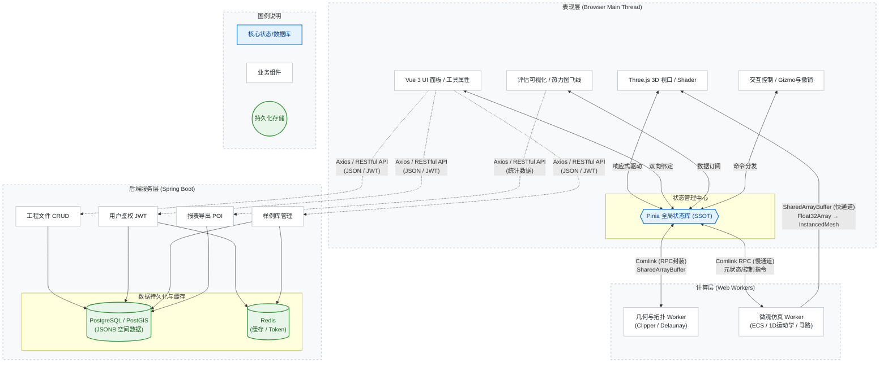

---

# 《基于Web3D的城市微观路网参数化设计与仿真评估系统》
## 系统概要设计文档 (HLD)

**文档版本**：V 1.5
**项目代号**：UrbanMicro-CAD
**编写日期**：2026-05-25
**密级**：内部公开

---

## 1. 引言

### 1.1 编写目的
本文档旨在对"基于Web3D的城市微观路网参数化设计与仿真评估系统"进行总体架构与模块概要设计。明确系统的技术选型、逻辑架构、核心模块设计思路、数据结构及接口规范。本文档是后续详细设计、编码实现、系统测试及项目验收的核心基准文件。

### 1.2 项目范围
本系统是一款基于 B/S 架构的 Web3D 应用，面向交通工程师与相关专业研究者。系统支持在浏览器中进行城市微观路网（路段、交叉口、立交）的参数化三维设计、微观交通规则配置（对标《城市：天际线》TM:PE模组）、高逼真度微观交通仿真，并提供多维度的交通运行状态评估与可视化分析功能。

### 1.3 术语与缩写
* **Web3D**：基于 WebGL/WebGPU 技术的浏览器端三维图形渲染技术。
* **TM:PE**：Traffic Manager: President Edition，知名城市模拟游戏的高级交通管理模组。
* **LOS**：Level of Service，服务水平，衡量交通设施运行质量的指标（A-F级）。
* **Decal**：贴花/投影贴图技术，用于将二维纹理投影贴合到三维模型表面。
* **SSOT**：Single Source of Truth，单一数据源，确保系统状态一致性。

---

## 2. 总体设计

### 2.1 设计原则
1. **重工程架构，轻底层图形学**：采用"2.5D降维计算"与"视觉投影（Decal）"策略，规避复杂的 3D 网格布尔运算与物理碰撞，确保项目高可行性。
2. **前后端分离与重前端**：核心 3D 渲染、几何计算与仿真逻辑在浏览器端完成；后端作为"薄服务端"，负责持久化、鉴权与报表生成。
3. **计算与渲染分离**：利用 Web Worker 将高耗时的几何计算与仿真逻辑剥离出 UI 主线程，保障 3D 视口 60FPS 流畅度。
4. **单一数据源 (SSOT)**：UI 视图与 3D 场景严格响应同一份全局状态数据，杜绝状态割裂。

### 2.2 技术栈选型
| 层级 | 技术选型 | 选型理由 |
| :--- | :--- | :--- |
| **前端框架** | Vue 3 (Composition API) + TypeScript + Vite | 现代化前端工程标准，类型安全，响应式性能优异。 |
| **状态管理** | Pinia | 轻量级，完美支持 TS，实现 SSOT 架构。 |
| **3D 渲染引擎** | Three.js | 业界最成熟的 Web3D 库，生态丰富，支持 Shader 与 Decal。 |
| **2.5D 几何计算** | `clipper-lib` + `d3-delaunay` + `bezier-js` | 处理 2D 多边形布尔运算、三角剖分与曲线插值，实现降维打击。 |
| **多线程架构** | Web Workers + `comlink` | 将仿真与几何计算移出主线程，`comlink` 降低通信心智负担。 |
| **后端服务** | Spring Boot 3 (Java 21) + MyBatis-Plus | 企业级标准，生态完善，适合快速构建 RESTful 服务。 |
| **数据库** | PostgreSQL + PostGIS + Redis | PostGIS 提供强大的空间数据支持，JSONB 适合存储复杂拓扑。 |

### 2.3 系统逻辑架构
系统采用经典的分层架构设计，整体逻辑架构如下：


---

## 3. 核心子系统概要设计

### 3.1 沉浸式路网建模与动态拓扑子系统 (FR1)
**设计策略：2.5D 降维几何计算 + 绘制交互状态机**

* **道路绘制交互状态机**：定义 `DrawingState` 状态机（IDLE → DRAWING → PREVIEW → CONFIRMED），用户点击起点进入 DRAWING 状态，鼠标移动时实时计算预览路面（半透明 `MeshBasicMaterial` + `opacity: 0.5`），点击终点触发 `DrawRoadCommand`。连续绘制模式下，终点自动成为下一段起点，状态从 CONFIRMED 直接回到 DRAWING。
* **三种绘制模式**：直线模式（起终点直线连接）、曲线模式（中间控制点生成贝塞尔曲线，拖拽控制点实时调整曲率）、自由模式（按住 Shift 解除角度约束，允许任意方向绘制）。模式切换通过工具栏按钮或快捷键。
* **实时预览渲染**：绘制过程中，基于当前鼠标位置与起点，实时调用 `bezier-js` 生成中心线，`clipper-lib` 偏移生成 2D 路面多边形，`d3-delaunay` 三角剖分，生成半透明预览 `BufferGeometry`。预览计算在主线程完成（利用简化版几何管线，跳过 Union 运算），保证 60FPS 响应。
* **测量标注**：利用 `CSS2DRenderer`（已在 FR6 LOS 徽章中使用），在预览路面旁渲染 HTML 标签显示路段长度、坡度百分比、与已有路段夹角。
* **2D 平面布线**：所有道路绘制、节点吸附在 2D 平面（X-Y轴）完成。利用 `bezier-js` 生成中心线，利用 `clipper-lib` 根据车道宽度向两侧偏移（Offset）生成 2D 路面多边形。
* **高程与坡度约束**：`ElevationProfile` 记录起终点 Z 值与高程模式（GROUND/BRIDGE/TUNNEL/ANARCHY），每种模式有独立最大坡度限制。绘制时实时计算当前坡度，预览路面按坡度值着色：**绿色**（合规，坡度 < 限制×70%）→ **黄色**（接近限制，70%~100%）→ **红色**（超限，> 100%），超限时禁止确认绘制。`RampTransition` 负责高架→地面的平滑过渡插值。
* **路口布尔运算**：道路交叉时，在 2D 平面对路面多边形执行 `Union`（并集）运算，自动生成完美的 2D 交叉口边界，彻底规避 3D 网格穿模。
* **Delaunay 剖分与 Z 轴拉伸**：使用 `d3-delaunay` 将 2D 多边形转为三角网格。根据端点高程线性插值赋予 Z 值，传入 Three.js `BufferGeometry` 生成 3D 路面。
* **道路升级工具**：升级时仅修改 2D 偏移宽度，重新执行"布尔运算 -> 剖分 -> 拉伸"流水线，原交规规则通过 ID 映射保留。降级时校验车道连接器冲突。
* **自定义断面编辑器**：提供"断面编辑器"面板，以2D横截面示意图实时预览断面配置。用户可逐条添加/删除车道，每条车道独立设置 `direction`（FORWARD/BACKWARD/BOTH）、`type`（CAR/BUS/BIKE/TRAM）、`width`（2.5~4.5m）。编辑结果生成完整的 `CrossSectionProfile` 对象，通过 `SetCrossSectionCommand` 应用到选中路段，触发 Worker 重算路面网格。支持保存为"用户模板"存入 `prj_template` 表。非对称断面（如2+4）通过 `lanes` 数组中不同 `direction` 的车道数量差异实现，2D偏移时 `clipper-lib` 根据 `direction` 决定偏移方向（FORWARD偏左、BACKWARD偏右）。
* **连续绘制与对齐**：延续绘制模式下，自动继承端点横断面模板；平行路模式通过 `clipper-lib` 对中心线做固定距离偏移；对齐辅助线通过向量点积计算最近 15° 倍数角度，以 `THREE.Line` 虚线渲染。
* **动态拓扑自愈**：新路段与已有路段交叉时，2D 平面通过 `clipper-lib` 的 `Intersection` 运算检测交叉点，自动在交叉处打断生成新节点，并重新执行布尔运算生成新交叉口多边形。删除路段时，系统自动重算图论拓扑：若十字路口某方向路段被删除，退化为丁字路口，自动重算多边形边界并更新关联的 `TrafficRuleSet`。
* **推土机与删除工具**：用户删除路段前，系统查询 `TrafficRuleStore` 统计关联规则数量（车道连接器、限制、信控），弹出确认提示。删除操作封装为 `DeleteRoadCommand`，保存完整路段快照与关联规则用于撤销。支持框选批量删除。

### 3.2 枢纽节点微调与 3D 场景控制子系统 (FR2)
* **3D 切线手柄**：基于 Three.js `TransformControls` 实现。拖拽控制点时，仅修改 2D 控制点坐标与 Z 轴高程，触发 Worker 异步重算 2.5D 网格，保证主线程不卡顿。
* **多边形边界自定义**：允许用户直接拖拽 2D 节点顶点，`clipper-lib` 实时重算边界并更新 3D 网格。

### 3.3 微观交规控制与 TM:PE 规则引擎子系统 (FR3)
**设计策略：Decal 投影贴图技术**
* **标线贴花渲染**：摒弃为斑马线、箭头生成 3D 网格的做法。将标线制作为带 Alpha 通道的 PNG，利用 Three.js `DecalGeometry` 根据路面法线直接"投影"到 3D 路面上，完美贴合且性能极高。
* **车道连接器**：在 2D 平面计算进出口锚点，生成 `THREE.CatmullRomCurve3` 作为 3D 引导线。
* **规则数据绑定**：限速、禁行、信控步阶等规则序列化为 JSON，作为组件（Component）挂载在 Pinia 的 Lane/Node 实体上。
* **车道级转向箭头**：每条车道独立维护 `LaneArrow` 值对象，记录该车道允许的转向方向集合（LEFT/STRAIGHT/RIGHT/U_TURN 的子集）。新建路口时，系统根据 `LaneConnector` 自动推断箭头：有左转连接器的车道自动添加 LEFT，有直行连接器的添加 STRAIGHT。用户可手动覆盖，点击车道端点弹出箭头选择面板。3D 渲染通过 `DecalRenderer` 将对应箭头 PNG 投影到路面。仿真中，车辆进入路口前必须检查目标转向是否在当前车道 `LaneArrow.allowedDirections` 中，若不在则 MOBIL 模型提前触发变道。

### 3.4 严格交规驱动的微观交通仿真子系统 (FR4)
**设计策略：1D 运动学插值 + MOBIL 变道模型 + OD 需求驱动**

* **1D 样条曲线进度控制**：不使用 3D 物理引擎。车辆视为沿 3D 样条曲线移动的点，维护 `progress` (0.0~1.0) 变量。通过 IDM 模型计算速度标量累加至 `progress`，利用 `curve.getPointAt()` 获取 3D 坐标与四元数朝向。
* **MOBIL 变道模型**：在虚线区，车辆通过 MOBIL 模型评估变道意愿。安全性准则：目标车道后车减速度 ≤ `b_safe`(3 m/s²)；激励性准则：自身加速度增益 - 礼貌因子 × 后车减速代价 ≥ 阈值 `p`(0.2)。变道过程采用平滑横向过渡：车辆 `lateralOffset` 从 0 渐变至目标车道偏移量（2秒过渡），主线程根据 `lateralOffset` 偏移 `InstancedMesh` 矩阵。
* **OD 需求驱动**：用户配置 OD 矩阵（起讫点→小时交通量）和车型比例。仿真 Worker 根据泊松分布按发车间隔在路段起点生成车辆，通过 `AStarPathFinder` 计算最短路径。未配置 OD 时使用"随机流量"默认模式。
* **伪碰撞检测**：在 1D 车道线上，仅比较前后车的 `progress` 差值（弧长距离）。小于安全距离则触发减速，将复杂度从 O(N²) 降至 O(N)。
* **严格规则校验**：实线区直接阻断变道状态机；路口内通过简单的 PID 控制器使车辆吸附于车道连接器曲线。

### 3.5 典型枢纽样例库与场景管理子系统 (FR5)

**设计策略：序列化/反序列化与版本快照**

* **样例库浏览与一键加载 (FR5.1)**：后端维护 `prj_template` 表，存储预定义的枢纽模板（基础路口、苜蓿叶立交、涡轮立交等），模板数据以 JSONB 格式存储完整拓扑与规则快照。前端 `ProjectStore` 通过 `GET /api/templates/{id}` 获取模板数据，经 `SceneSerializer.deserialize()` 反序列化后批量写入 `RoadNetworkStore` 与 `TrafficRuleStore`，再由 GeometryWorker 重建所有路面网格。目标：3 秒内完成场景重建。
* **参数化微调 (FR5.2)**：加载的样例数据进入 Pinia Store 后即成为可编辑状态，用户可使用升级刷修改车道数、交规编辑器配置 TM:PE 规则、微调工具调整节点高程/坡度。所有修改操作与手动创建场景完全一致，均通过 Command 模式支持撤销/重做。
* **工程持久化 (FR5.3)**：`ProjectStore.saveProject()` 将 `RoadNetworkStore.serialize()` 与 `TrafficRuleStore.serialize()` 合并为 `ProjectPayload`，通过 `PUT /api/projects/{id}/snapshot` 保存至后端。后端同时写入 `prj_project`（更新 topology_data/rule_data）与 `prj_snapshot`（新增版本快照），支持版本回滚。数据库层面通过 `user_id` 实现行级数据隔离。

### 3.6 交通运行状态评估与可视化分析子系统 (FR6)
* **交通流量热力图**：将车道"拥堵系数"作为 Uniform 传入 `ShaderMaterial`，在 Fragment Shader 中通过 `mix()` 混合红黄绿颜色，实现零 CPU 开销的 GPU 渲染。
* **交通路线飞线**：筛选特定车辆的 `plannedRoute`，传入 `THREE.Line2`（胖线），利用 UV 动画实现流动飞线效果。
* **LOS 评级悬浮**：Worker 统计延误时间，通过 `CSS2DRenderer` 在 3D 场景中渲染 HTML 样式的 A-F 评级徽章。

---

## 4. 突出软件工程优势的核心架构设计

为体现专业的软件工程素养，系统采用以下高级设计模式与架构：

### 4.1 撤销/重做与容错架构 (Command Pattern)
* **设计模式**：采用**命令模式**。定义 `ICommand` 接口（含 `execute()` 与 `undo()`）。
* **实现机制**：用户操作（如 `DrawRoadCommand`）实例化后压入 `HistoryStack`。
* **系统级容错**：当 Worker 线程抛出几何计算异常（如多边形自交）时，系统捕获异常并自动调用栈顶命令的 `undo()`，实现状态无损回滚。

### 4.2 多线程防阻塞架构 (Web Worker)
* **线程划分**：主线程专责 Three.js 渲染与 Vue UI 响应；Worker 1 负责 `clipper-lib` 几何运算；Worker 2 负责 ECS 仿真循环。
* **双通道数据架构**：仿真位置数据采用**快通道**——Worker 通过 `SharedArrayBuffer` 直接传递 `Float32Array` 至主线程，主线程仅更新 `InstancedMesh` 矩阵，**完全绕过 Pinia 响应式追踪**，避免 500+ 车辆位置数据触发 Vue Proxy 依赖收集导致帧率崩塌；仿真元状态（running/speed/vehicleCount/odMatrix）走**慢通道**——通过 `comlink` RPC 封装写入 `SimulationStore`，由 UI 面板订阅消费。

### 4.3 响应式单一数据源 (SSOT)
* 摒弃传统 WebGL 开发中"手动同步 UI 与 3D 场景"的痛点。Pinia 作为唯一数据源，Three.js 场景的网格更新、Decal 投影、UI 面板属性均通过 Vue 3 的 `watch` 响应式驱动，确保数据强一致性。

---

## 5. 数据结构与数据库设计

### 5.1 关系型数据库设计 (PostgreSQL + PostGIS)
| 表名 | 核心字段 | 数据类型 | 说明 |
| :--- | :--- | :--- | :--- |
| `sys_user` | id, username, password_hash, role | VARCHAR, INT | 用户鉴权与权限管理 |
| `prj_project` | id, user_id, name, **topology_data**, **rule_data**, created_at | UUID, **JSONB**, TIMESTAMP | 工程主表，核心拓扑与规则以 JSONB 存储 |
| `prj_snapshot` | id, project_id, version, **snapshot_data**, created_at | UUID, INT, **JSONB**, TIMESTAMPTZ | 快照表（版本管理），ON DELETE CASCADE |
| `prj_template` | id, name, category, **snapshot_data**, thumbnail_url | UUID, **JSONB**, VARCHAR | 样例库，支持快速加载 |

```typescript
// 快照表（版本管理）
interface prj_snapshot {
    id: string;             // UUID, PK
    project_id: string;     // FK -> prj_project.id, ON DELETE CASCADE
    version: number;        // 版本号，自增
    snapshot_data: JSONB;   // { topology: TopologyData; rules: RuleData }
    created_at: string;     // TIMESTAMPTZ
}
```

### 5.2 前端核心图论数据模型 (TypeScript 接口)
```typescript
// 1. 半边形拓扑结构 (Half-Edge)
interface HalfEdge {
    id: string;
    originNodeId: string;
    twinId: string;      // 对向边
    nextId: string;      // 下一条边
    segmentId: string;   // 所属路段
}

// 2. 道路横断面配置 (支持升级工具)
interface CrossSectionProfile {
    lanes: { width: number, type: 'car'|'bus'|'bike' }[];
    median: { width: number, type: 'grass'|'barrier' };
}

// 3. TM:PE 车道级规则组件
interface LaneRestrictions {
    speedLimit: number;
    allowLeftChange: boolean;
    allowRightChange: boolean;
    allowedVehicleTypes: string[];
}

// 4. 场景序列化/反序列化 (FR5)
interface ProjectPayload {
    topologyData: TopologyData;
    ruleData: RuleData;
    version: number;
}

interface SceneRebuildResult {
    network: RoadNetwork;
    ruleSets: TrafficRuleSet[];
    requiresMeshRebuild: boolean;
}

// 5. OD 矩阵与车型比例配置 (FR4.6)
interface ODMatrix {
    pairs: ODPair[];
}

interface ODPair {
    fromNodeId: string;
    toNodeId: string;
    volumePerHour: number;
}

interface VehicleMixConfig {
    ratios: { type: VehicleType; ratio: number }[];
}

// 6. 高程模式与坡度约束 (FR1.2)
interface SlopeConstraint {
    mode: ElevationMode;
    maxSlope: number;
}

// 7. 绘制状态机 (FR1.1)
type DrawingState = 'IDLE' | 'DRAWING' | 'PREVIEW' | 'CONFIRMED';

// 8. 核心路网实体
interface RoadNode {
    id: string;
    position: Point2D;
    controlMode: 'YIELD' | 'TRAFFIC_LIGHT' | 'ROUNDABOUT' | 'NONE';
    connectedSegmentIds: string[];
}

interface RoadSegment {
    id: string;
    startNodeId: string;
    endNodeId: string;
    centerLine: Point2D[];
    profile: CrossSectionProfile;
    elevation: ElevationProfile;
}

// 9. 车道与连接器
interface Lane {
    id: string;
    segmentId: string;
    index: number;
    direction: LaneDirection;
    type: 'CAR' | 'BUS' | 'BIKE' | 'TRAM';
}

interface LaneConnection {
    id: string;
    fromLaneId: string;
    toLaneId: string;
    fromAnchor: Point2D;
    toAnchor: Point2D;
}

// 10. 仿真车辆
interface SimVehicle {
    id: string;
    type: VehicleType;
    progress: number;
    currentSpeed: number;
    lateralOffset: number;
    targetLaneId: string | null;
    plannedRoute: RouteWaypoint[];
}

// 11. 命令接口
interface ICommand {
    execute(): void;
    undo(): void;
    getDescription(): string;
}

// 12. 枚举定义
type ElevationMode = 'GROUND' | 'BRIDGE' | 'TUNNEL' | 'ANARCHY';
type VehicleType = 'CAR' | 'BUS' | 'TRUCK' | 'BIKE' | 'TRAM';
type LaneDirection = 'FORWARD' | 'BACKWARD' | 'BOTH';

// 13. 自定义断面编辑器
interface CrossSectionEditorState {
    targetSegmentId: string | null;
    profile: CrossSectionProfile;
    previewDirty: boolean;
}

interface UserTemplatePayload {
    name: string;
    category: 'CUSTOM';
    profile: CrossSectionProfile;
}

// 14. 车道级转向箭头
interface LaneArrow {
    laneId: string;
    nodeId: string;
    allowedDirections: ('LEFT' | 'STRAIGHT' | 'RIGHT' | 'U_TURN')[];
}
```

---

## 6. 接口设计

### 6.1 外部接口 (RESTful API)
| 接口路径 | 方法 | 描述 | 核心技术点 |
| :--- | :--- | :--- | :--- |
| `/api/auth/login` | POST | 用户登录认证 | Spring Security + JWT |
| `/api/projects` | POST/GET | 创建/获取工程列表 | MyBatis-Plus 分页，返回元数据 |
| `/api/projects/{id}/snapshot`| PUT | 保存工程全量快照 | 接收前端压缩后的 JSONB 数据 |
| `/api/templates` | GET | 获取样例库列表 | Redis 缓存加速 |
| `/api/templates/{id}` | GET | 获取模板详情(含快照数据) | JSONB 反序列化，3秒内完成场景重建 |
| `/api/projects/{id}/snapshots` | GET | 获取工程版本快照列表 | 按版本号降序分页 |
| `/api/projects/{id}/snapshots/{version}` | GET | 加载指定版本快照 | 支持版本回滚 |
| `/api/reports/export` | POST | 导出评估报表 | 接收统计数据，Apache POI 生成 Excel |

### 6.2 内部接口 (前后端/线程间)
* **主线程与 Worker**：通过 `comlink` 暴露 RPC 风格接口，如 `worker.calculateIntersection(poly1, poly2)`。
* **Three.js 与 Pinia**：通过自定义 Hook（如 `useSyncMeshWithStore`）监听 Store 变化，自动调用 Three.js 的 `geometry.dispose()` 和 `material.dispose()` 防止内存泄漏。

---

## 7. 非功能性设计

### 7.1 性能设计
1. **实例化渲染 (InstancedMesh)**：场景中的路灯、树木及同质化仿真车辆，全部使用 `InstancedMesh`，将 Draw Call 控制在 50 以内。
2. **空间哈希 (Spatial Hashing)**：仿真 Worker 中实现 2D 网格哈希表，车辆跟驰检测仅查询相邻网格，提升计算效率。
3. **按需计算 (Lazy Evaluation)**：2.5D 网格剖分与 Delaunay 计算仅在用户结束拖拽（`pointerup`）时触发，拖拽过程中仅更新控制点预览。

### 7.2 可靠性与容错设计
1. **状态回滚**：基于命令模式的 50 步 Undo/Redo 栈，确保任何误操作或底层计算崩溃均可恢复。
2. **离线缓存**：基于 `IndexedDB` 缓存样例库与基础资产，弱网环境下仍可加载基础场景。

### 7.3 安全设计
1. **接口鉴权**：所有 API 需携带 JWT Token，Spring Security 拦截器进行校验。
2. **数据隔离**：数据库层面通过 `user_id` 进行列级数据隔离，防止越权访问他人工程。

---

## 8. 部署与运维设计

### 8.1 部署架构
* **前端**：Vite 构建产物部署于 Nginx，开启 Gzip/Brotli 压缩，配置 CORS 跨域。
* **后端**：Spring Boot 构建为 Docker 镜像，通过 Docker Compose 编排。
* **数据库**：PostgreSQL 与 Redis 采用独立容器，挂载外部数据卷（Volume）保障数据持久化。

### 8.2 CI/CD 流水线
基于 GitLab CI / GitHub Actions 实现自动化流水线：
1. **代码提交**：触发 ESLint 与 Prettier 代码规范检查。
2. **单元测试**：运行 JUnit (后端) 与 Vitest (前端核心算法) 测试。
3. **构建与部署**：自动构建 Docker 镜像并推送至镜像仓库，通过 SSH 脚本在目标服务器拉取并重启容器。

---
**文档审批记录**

| 角色 | 姓名 | 日期 | 审批意见 |
| :--- | :--- | :--- | :--- |
| 架构师/作者 | [您的名字] | 2026-05-22 | 初始版本创建，确立降维技术路线 |
| 项目经理/导师| [导师名字] | | |
| 评审专家 | | | |

---
*文档结束。本概要设计文档 V1.5 在 V1.4 基础上补充了"车道级转向箭头(Lane Arrows)"的设计，每条车道独立维护允许转向方向集合，自动推断+手动覆盖，仿真车辆提前选择正确车道，使交规控制从"路口级"细化到"车道级"。*