# 《基于Web3D的城市微观路网参数化设计与仿真评估系统》
## 系统详细设计说明书 (Detailed Design Document)

**文档版本**：V 1.6 (Lane-Level Turn Arrows)
**项目代号**：UrbanMicro-CAD
**编写日期**：2026-05-23
**修订日期**：2026-05-25
**密级**：内部公开
**依据文档**：软件需求规格说明书 V8.0、系统概要设计说明书 V1.2、数据库设计文档 V2.3

---

## 1. 引言

### 1.1 编写目的
本文档在《系统概要设计说明书》基础上，对 UrbanMicro-CAD 系统进行**面向编码实现的详细设计**。采用 DDD（领域驱动设计）方法论划分限界上下文，使用 Mermaid 绘制类图、包图与时序图，定义完整的数据库 Schema，为开发团队提供可直接落地的编码蓝图。

### 1.2 术语与缩写
| 缩写 | 全称 | 含义 |
|:---|:---|:---|
| DDD | Domain-Driven Design | 领域驱动设计 |
| BC | Bounded Context | 限界上下文 |
| AR | Aggregate Root | 聚合根 |
| VO | Value Object | 值对象 |
| DM | Domain Model | 领域模型 |
| HE | Half-Edge | 半边数据结构 |
| IDM | Intelligent Driver Model | 智能驾驶员跟驰模型 |
| MOBIL | Minimizing Overall Braking Induced by Lane Changes | 最小化变道制动模型 |
| OD | Origin-Destination | 起讫点 |
| ECS | Entity-Component-System | 实体组件系统 |
| LOS | Level of Service | 服务水平评级 |
| SSOT | Single Source of Truth | 单一数据源 |

### 1.3 设计约束
- 前端：Vue 3.4+ / TypeScript 5+ / Vite 5+ / Pinia 2+ / Three.js 0.160+
- 后端：Spring Boot 3.2+ / Java 21 / MyBatis-Plus 3.5+ / PostgreSQL 14+ (PostGIS)
- 严禁使用 `any` / `@ts-ignore`；所有 Geometry/Material/Texture 必须 `.dispose()`
- 大量对象必须使用 `InstancedMesh`；重计算必须使用 Web Worker + Comlink

---

## 2. DDD 领域模型与限界上下文

### 2.1 限界上下文划分

基于需求规格说明书 FR1-FR6 的业务边界，系统划分为 **6 个限界上下文**：

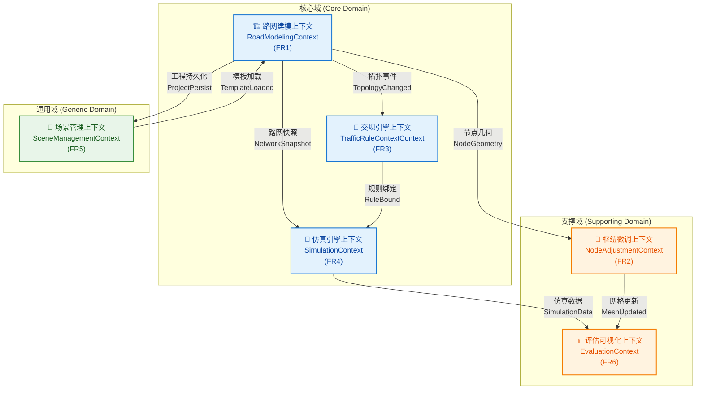
```mermaid
flowchart TB
    subgraph CoreDomain ["核心域 (Core Domain)"]
        direction LR
        BC1["🏗️ 路网建模上下文\nRoadModelingContext\n(FR1)"]
        BC2["🚦 交规引擎上下文\nTrafficRuleContextContext\n(FR3)"]
        BC3["🚗 仿真引擎上下文\nSimulationContext\n(FR4)"]
    end

    subgraph SupportingDomain ["支撑域 (Supporting Domain)"]
        direction LR
        BC4["🔧 枢纽微调上下文\nNodeAdjustmentContext\n(FR2)"]
        BC5["📊 评估可视化上下文\nEvaluationContext\n(FR6)"]
    end

    subgraph GenericDomain ["通用域 (Generic Domain)"]
        direction LR
        BC6["💾 场景管理上下文\nSceneManagementContext\n(FR5)"]
    end

    BC1 -->|"拓扑事件\nTopologyChanged"| BC2
    BC1 -->|"路网快照\nNetworkSnapshot"| BC3
    BC2 -->|"规则绑定\nRuleBound"| BC3
    BC3 -->|"仿真数据\nSimulationData"| BC5
    BC1 -->|"节点几何\nNodeGeometry"| BC4
    BC4 -->|"网格更新\nMeshUpdated"| BC5
    BC6 -->|"模板加载\nTemplateLoaded"| BC1
    BC1 -->|"工程持久化\nProjectPersist"| BC6

    classDef core fill:#e3f2fd,stroke:#1976d2,stroke-width:2px,color:#0d47a1;
    classDef supporting fill:#fff3e0,stroke:#f57c00,stroke-width:2px,color:#e65100;
    classDef generic fill:#e8f5e9,stroke:#388e3c,stroke-width:2px,color:#1b5e20;

    class BC1,BC2,BC3 core;
    class BC4,BC5 supporting;
    class BC6 generic;
```

### 2.2 限界上下文映射关系

| 上游上下文 | 下游上下文 | 映射关系 | 通信方式 |
|:---|:---|:---|:---|
| 路网建模 | 交规引擎 | 发布-订阅 | Pinia Store 事件 |
| 路网建模 | 仿真引擎 | 开放主机服务 | Worker RPC (Comlink) |
| 交规引擎 | 仿真引擎 | 遵从者 | 共享内核 (规则接口) |
| 仿真引擎 | 评估可视化 | 开放主机服务 | SharedArrayBuffer |
| 路网建模 | 枢纽微调 | 客户-供应商 | Pinia Store 直接调用 |
| 枢纽微调 | 评估可视化 | 开放主机服务 | Pinia watch 响应式 |
| 场景管理 | 路网建模 | 开放主机服务 | RESTful API + JSON 反序列化 |
| 路网建模 | 场景管理 | 遵从者 | RESTful API + JSON 序列化 |

### 2.3 各限界上下文聚合根与核心实体

#### 2.3.1 路网建模上下文 (RoadModelingContext)

| 类型 | 名称 | 说明 |
|:---|:---|:---|
| **聚合根** | `RoadNetwork` | 全局唯一路网实例，管理所有路段与节点 |
| **实体** | `RoadSegment` | 路段：含中心线、横断面、高程 |
| **实体** | `NetworkNode` | 网络节点：交叉口或端点 |
| **值对象** | `CrossSectionProfile` | 横断面配置（车道数组+中央隔离带） |
| **值对象** | `HalfEdge` | 半边拓扑：originNode/twin/next/segment |
| **值对象** | `ElevationProfile` | 高程配置：起终点Z值+坡度模式 |
| **领域服务** | `TopologyHealingService` | 拓扑自愈：交叉打断/删除重算 |

#### 2.3.2 交规引擎上下文 (TrafficRuleContextContext)

| 类型 | 名称 | 说明 |
|:---|:---|:---|
| **聚合根** | `TrafficRuleSet` | 节点级规则集合 |
| **实体** | `LaneConnector` | 车道连接器：进口→出口锚点映射 |
| **实体** | `TrafficLightController` | 信控器：步阶+传感器+状态机 |
| **值对象** | `LaneRestriction` | 车道级限制：限速/禁行/变道权限 |
| **值对象** | `SignalStep` | 信控步阶：绿灯时长/黄灯/全红 |
| **值对象** | `TurnRestriction` | 转向限制：禁左/禁右/禁直行 |
| **领域服务** | `RuleValidationService` | 规则冲突校验 |

#### 2.3.3 仿真引擎上下文 (SimulationContext)

| 类型 | 名称 | 说明 |
|:---|:---|:---|
| **聚合根** | `SimulationWorld` | 仿真世界实例 |
| **实体** | `SimVehicle` | 仿真车辆：1D进度+速度+状态机 |
| **实体** | `SignalState` | 信控状态：当前步阶+倒计时 |
| **值对象** | `VehicleProfile` | 车型参数：最大速度/加速度/车身长度 |
| **值对象** | `RoutePlan` | 导航路径：车道ID序列 |
| **值对象** | `ODMatrix` | OD矩阵：起讫点→小时交通量 |
| **值对象** | `VehicleMixConfig` | 车型比例配置 |
| **领域服务** | `IDMCarFollowModel` | IDM跟驰模型 |
| **领域服务** | `MOBILLaneChangeModel` | MOBIL变道模型 |
| **领域服务** | `AStarPathFinder` | A*寻路算法 |
| **领域服务** | `VehicleSpawner` | 车辆生成器：泊松分布发车 |
| **领域服务** | `SpatialHashGrid` | 空间哈希网格 |

#### 2.3.4 枢纽微调上下文 (NodeAdjustmentContext)

| 类型 | 名称 | 说明 |
|:---|:---|:---|
| **聚合根** | `AdjustableNode` | 可微调节点 |
| **实体** | `TangentHandle` | 切线手柄：3D方向+长度 |
| **值对象** | `PolygonBoundary` | 多边形边界：顶点数组 |
| **值对象** | `CurbRadius` | 拐角半径：转角索引+半径值 |
| **领域服务** | `CoonsPatchBuilder` | Coons曲面融合计算 |

#### 2.3.5 评估可视化上下文 (EvaluationContext)

| 类型 | 名称 | 说明 |
|:---|:---|:---|
| **聚合根** | `EvaluationReport` | 评估报告实例 |
| **实体** | `LaneMetric` | 车道级指标：流量/速度/密度/排队长度 |
| **实体** | `IntersectionLOS` | 交叉口LOS：延误+评级 |
| **值对象** | `HeatmapData` | 热力图数据：车道ID→拥堵系数映射 |
| **值对象** | `FlightLineData` | 飞线数据：车辆轨迹点序列 |
| **领域服务** | `HCMLOSClassifier` | HCM标准LOS分级 |

#### 2.3.6 场景管理上下文 (SceneManagementContext)

| 类型 | 名称 | 说明 |
|:---|:---|:---|
| **聚合根** | `Project` | 工程实例 |
| **实体** | `ProjectSnapshot` | 工程快照：版本号+时间戳+JSON数据 |
| **值对象** | `TemplateMetadata` | 模板元数据：名称/分类/缩略图 |
| **领域服务** | `SceneSerializer` | 场景序列化/反序列化 |

---

## 3. 系统包图与分层架构

### 3.1 前端包图 (Vue 3 + TypeScript)

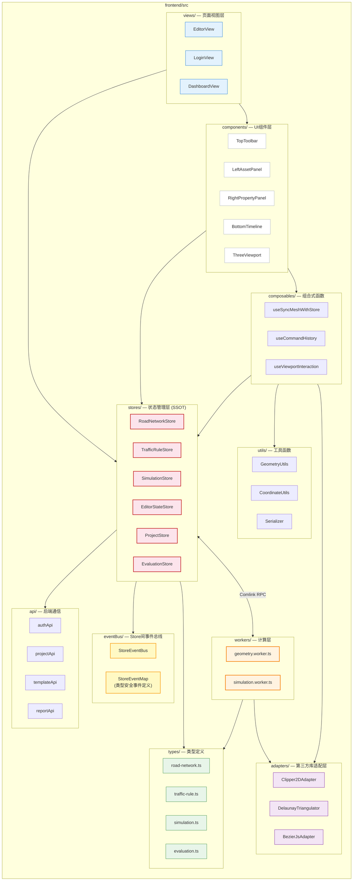
```mermaid
flowchart TB
    subgraph FrontendApp ["frontend/src"]
        direction TB

        subgraph Views ["views/ — 页面视图层"]
            V1[EditorView]
            V2[LoginView]
            V3[DashboardView]
        end

        subgraph Components ["components/ — UI组件层"]
            C1[TopToolbar]
            C2[LeftAssetPanel]
            C3[RightPropertyPanel]
            C4[BottomTimeline]
            C5[ThreeViewport]
        end

        subgraph Stores ["stores/ — 状态管理层 (SSOT)"]
            S1[RoadNetworkStore]
            S2[TrafficRuleStore]
            S3[SimulationStore]
            S4[EditorStateStore]
            S5[ProjectStore]
            S6[EvaluationStore]
        end

        subgraph EventBus ["eventBus/ — Store间事件总线"]
            E1[StoreEventBus]
            E2["StoreEventMap\n(类型安全事件定义)"]
        end

        subgraph Workers ["workers/ — 计算层"]
            W1[geometry.worker.ts]
            W2[simulation.worker.ts]
        end

        subgraph Composables ["composables/ — 组合式函数"]
            CO1[useSyncMeshWithStore]
            CO2[useCommandHistory]
            CO3[useViewportInteraction]
        end

        subgraph Adapters ["adapters/ — 第三方库适配层"]
            AD1[Clipper2DAdapter]
            AD2[DelaunayTriangulator]
            AD3[BezierJsAdapter]
        end

        subgraph Types ["types/ — 类型定义"]
            T1[road-network.ts]
            T2[traffic-rule.ts]
            T3[simulation.ts]
            T4[evaluation.ts]
        end

        subgraph Utils ["utils/ — 工具函数"]
            U1[GeometryUtils]
            U2[CoordinateUtils]
            U3[Serializer]
        end

        subgraph API ["api/ — 后端通信"]
            A1[authApi]
            A2[projectApi]
            A3[templateApi]
            A4[reportApi]
        end
    end

    Views --> Components
    Views --> Stores
    Components --> Stores
    Components --> Composables
    Composables --> Stores
    Stores --> EventBus
    Stores <-->|"Comlink RPC"| Workers
    Stores --> API
    Stores --> Types
    Workers --> Types
    Workers --> Adapters
    Composables --> Utils
    Composables --> Adapters

    classDef view fill:#e3f2fd,stroke:#1976d2,stroke-width:1px;
    classDef comp fill:#ffffff,stroke:#adb5bd,stroke-width:1px;
    classDef store fill:#fce4ec,stroke:#c62828,stroke-width:2px;
    classDef worker fill:#fff3e0,stroke:#f57c00,stroke-width:2px;
    classDef type fill:#e8f5e9,stroke:#388e3c,stroke-width:1px;
    classDef adapter fill:#f3e5f5,stroke:#7b1fa2,stroke-width:1px;
    classDef event fill:#fff9c4,stroke:#f9a825,stroke-width:2px;

    class V1,V2,V3 view;
    class C1,C2,C3,C4,C5 comp;
    class S1,S2,S3,S4,S5,S6 store;
    class W1,W2 worker;
    class T1,T2,T3,T4 type;
    class AD1,AD2,AD3 adapter;
    class E1,E2 event;
```

### 3.2 后端包图 (Spring Boot)

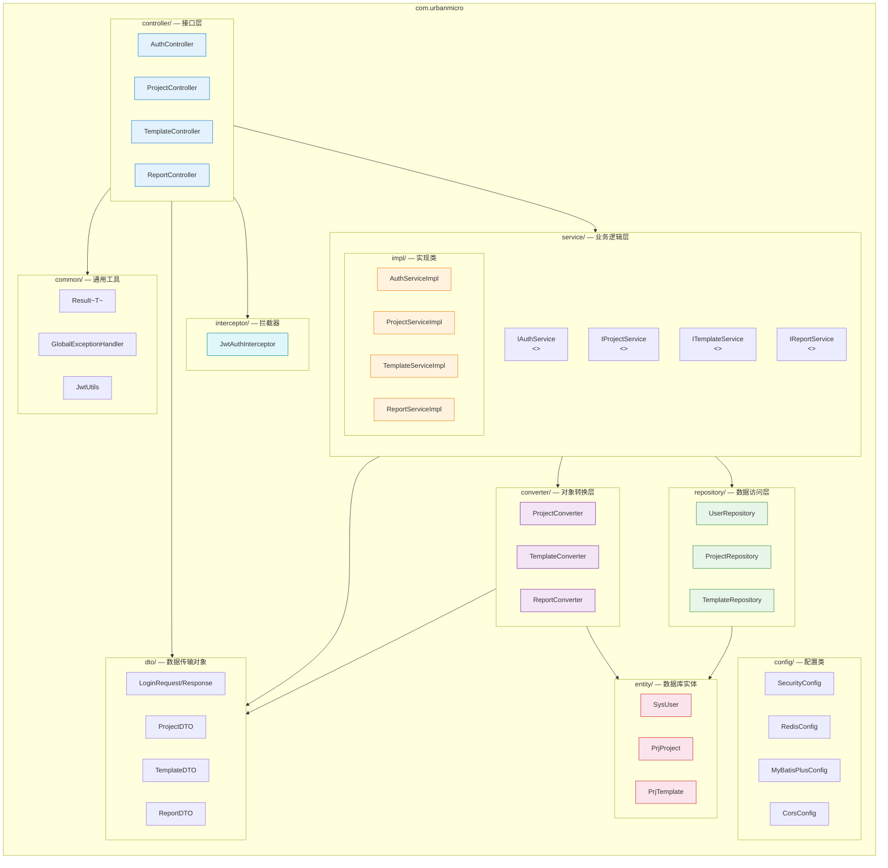
```mermaid
flowchart TB
    subgraph BackendApp ["com.urbanmicro"]
        direction TB

        subgraph Controller ["controller/ — 接口层"]
            CT1[AuthController]
            CT2[ProjectController]
            CT3[TemplateController]
            CT4[ReportController]
        end

        subgraph Service ["service/ — 业务逻辑层"]
            direction TB
            subgraph ServiceImpl ["impl/ — 实现类"]
                SV1[AuthServiceImpl]
                SV2[ProjectServiceImpl]
                SV3[TemplateServiceImpl]
                SV4[ReportServiceImpl]
            end
            SI1["IAuthService\n<<interface>>"]
            SI2["IProjectService\n<<interface>>"]
            SI3["ITemplateService\n<<interface>>"]
            SI4["IReportService\n<<interface>>"]
        end

        subgraph Repository ["repository/ — 数据访问层"]
            R1[UserRepository]
            R2[ProjectRepository]
            R3[TemplateRepository]
        end

        subgraph DTO ["dto/ — 数据传输对象"]
            D1[LoginRequest/Response]
            D2[ProjectDTO]
            D3[TemplateDTO]
            D4[ReportDTO]
        end

        subgraph Converter ["converter/ — 对象转换层"]
            CV1[ProjectConverter]
            CV2[TemplateConverter]
            CV3[ReportConverter]
        end

        subgraph Entity ["entity/ — 数据库实体"]
            E1[SysUser]
            E2[PrjProject]
            E3[PrjTemplate]
        end

        subgraph Interceptor ["interceptor/ — 拦截器"]
            IC1[JwtAuthInterceptor]
        end

        subgraph Config ["config/ — 配置类"]
            CF1[SecurityConfig]
            CF2[RedisConfig]
            CF3[MyBatisPlusConfig]
            CF4[CorsConfig]
        end

        subgraph Common ["common/ — 通用工具"]
            CM1[Result~T~]
            CM2[GlobalExceptionHandler]
            CM3[JwtUtils]
        end
    end

    Controller --> Service
    Controller --> DTO
    Service --> Repository
    Service --> DTO
    Service --> Converter
    Converter --> Entity
    Converter --> DTO
    Repository --> Entity
    Controller --> Common
    Controller --> Interceptor

    classDef ctrl fill:#e3f2fd,stroke:#1976d2,stroke-width:1px;
    classDef svc fill:#fff3e0,stroke:#f57c00,stroke-width:1px;
    classDef repo fill:#e8f5e9,stroke:#388e3c,stroke-width:1px;
    classDef entity fill:#fce4ec,stroke:#c62828,stroke-width:1px;
    classDef converter fill:#f3e5f5,stroke:#7b1fa2,stroke-width:1px;
    classDef interceptor fill:#e0f7fa,stroke:#00838f,stroke-width:1px;

    class CT1,CT2,CT3,CT4 ctrl;
    class SV1,SV2,SV3,SV4 svc;
    class R1,R2,R3 repo;
    class E1,E2,E3 entity;
    class CV1,CV2,CV3 converter;
    class IC1 interceptor;
```

### 3.3 依赖方向约束

```
Views → Components → Stores → API → (HTTP)
Stores ↔ Workers (Comlink RPC)
Stores → Types ← Workers
Components → Composables → Stores
Controller → Service → Repository → Entity
Controller → DTO ← Service
严禁循环依赖！
```

---

## 4. 核心模块详细类图

### 4.1 路网建模子系统 (FR1)

#### 4.1.1 功能详细说明

**对标机制**：原版道路建设工具、`Network Multitool`、`Fine Road Anarchy 2`

本子系统是整个系统的数据基石，负责路网拓扑的创建、编辑与维护。所有后续的交规配置、仿真运行与评估分析均依赖本子系统产出的路网数据。

| 功能编号 | 功能名称 | 详细描述 | 关键实现机制 |
|:---|:---|:---|:---|
| FR1.1 | 道路绘制交互与状态机 | 绘制状态机（IDLE→DRAWING→PREVIEW→CONFIRMED）；连续绘制模式（终点自动成为下一段起点）；三种绘制模式（直线/曲线/自由）；实时3D预览（半透明路面网格）；测量标注（长度/坡度/角度）；智能吸附（10px半径）与角度约束（15°倍数） | `DrawingState` 状态机驱动；预览使用 `MeshBasicMaterial(opacity:0.5)` + 简化几何管线；测量标注使用 `CSS2DRenderer`；吸附检测基于2D空间哈希；角度约束通过向量点积 |
| FR1.2 | 高程控制与坡度约束 | 通过 PageUp/PageDown 调整端点Z值；三种高程模式切换（F1地面/F2高架/F3隧道）各有独立最大坡度限制；Anarchy模式解除所有坡度限制；自动坡道过渡；坡度可视化（绿→黄→红着色） | `ElevationProfile` 记录起终点Z值+高程模式+`RampTransition`；坡度超限时预览路面变红阻止确认；坡度着色通过 `ShaderMaterial` Uniform 驱动 |
| FR1.3 | 道路升级工具 | "升级刷"原位无损升级横断面；升级时保留TM:PE规则；**降级保护**：降级时校验车道连接器冲突，有冲突则阻止 | `RoadSegment.upgrade()` 替换 profile 后触发 Worker 重算；规则通过 laneId 映射保留；降级前调用 `TrafficRuleStore.validateDowngrade()` |
| FR1.4 | 横断面模板库 | 内置基础路、干道、高速公路、土路等模板。支持复合断面：带自行车道、公交专用道、电车轨道、中央绿化带/隔音屏障 | `CrossSectionProfile` 值对象包含 `LaneConfig[]` + `MedianConfig` + `SidewalkConfig`，模板即预定义的 Profile 实例 |
| FR1.5 | 动态拓扑自愈 | 新路段交叉自动打断生成节点；删除路段时自动重算图论拓扑（十字路口→丁字路口自动退化）；半边拓扑实时维护 | `TopologyHealingService` 监听路段增删事件，执行交叉检测→节点打断→半边重连→边界重算 |
| FR1.6 | 连续绘制与对齐工具 | 延续绘制：选中路段端点后自动以该端点横断面为模板延续绘制；平行路绘制：按P键进入平行路模式，输入偏移距离自动生成平行路段；对齐参考线：绘制时自动显示平行/垂直对齐辅助线 | 延续绘制复用 `CrossSectionProfile`；平行路通过 `clipper-lib` 对中心线做固定距离偏移；对齐辅助线通过向量点积计算最近15°倍数角度 |
| FR1.7 | 推土机与删除工具 | 删除路段时弹出确认提示（含级联影响说明）；支持框选批量删除；通过 `DeleteRoadCommand` 支持撤销/重做 | `DeleteRoadCommand` 保存被删路段完整快照用于 undo；级联影响通过 `TrafficRuleStore` 查询关联规则数量 |
| FR1.8 | 自定义断面编辑器 | 逐条添加/删除车道，独立设置方向(FORWARD/BACKWARD/BOTH)/类型(CAR/BUS/BIKE/TRAM)/宽度(2.5~4.5m)；实时2D横截面预览；支持非对称断面(2+4等)；保存为用户模板；SetCrossSectionCommand支持撤销 | `CrossSectionEditorStore` 管理编辑状态；`clipper-lib` 根据direction决定偏移方向(FORWARD偏左/BACKWARD偏右)；用户模板存入`prj_template` |
| FR1.9 | 测量标注与夹角标注 | 绘制路段时实时标注长度(m)、坡度(%)、高程模式名；选中交叉口节点时标注相连路段间的夹角(°)；夹角标注显示在节点旁悬浮 Sprite，列出所有相邻路段对的角度；MEASURE 工具支持点击两个节点测量距离 | 长度/坡度标注使用 `THREE.Sprite`(Canvas 绘制圆角矩形背景+文字)；夹角计算通过向量点积 `acos((v1·v2)/(|v1|·|v2|))` 并转换为度数；夹角标注数据结构 `AngleAnnotation { nodeId, pairs: AnglePair[] }`，`AnglePair { fromSegmentId, toSegmentId, angleDeg }`；标注跟随节点移动自动更新；MEASURE 工具通过 `MeasurementCommand` 支持撤销 |

**核心数据流**：用户绘制 → `EditorStateStore.drawRoad()` → `DrawRoadCommand.execute()` → `RoadNetworkStore.addSegment()` → `GeometryWorker`（offset→union→triangulate）→ `TopologyHealingService.healOnSegmentAdd()` → Pinia 响应式更新 → Three.js 视口重绘

#### 4.1.2 类图

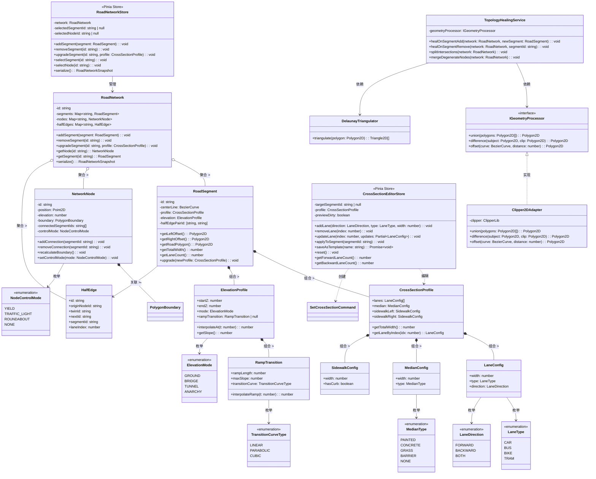
```mermaid
classDiagram
    class RoadNetwork {
        -id: string
        -segments: Map~string, RoadSegment~
        -nodes: Map~string, NetworkNode~
        -halfEdges: Map~string, HalfEdge~
        +addSegment(segment: RoadSegment): void
        +removeSegment(id: string): void
        +upgradeSegment(id: string, profile: CrossSectionProfile): void
        +getNode(id: string): NetworkNode
        +getSegment(id: string): RoadSegment
        +serialize(): RoadNetworkSnapshot
    }

    class RoadSegment {
        -id: string
        -centerLine: BezierCurve
        -profile: CrossSectionProfile
        -elevation: ElevationProfile
        -halfEdgePairId: [string, string]
        +getLeftOffset(): Polygon2D
        +getRightOffset(): Polygon2D
        +getRoadPolygon(): Polygon2D
        +getTotalWidth(): number
        +getLaneCount(): number
        +upgrade(newProfile: CrossSectionProfile): void
    }

    class NetworkNode {
        -id: string
        -position: Point2D
        -elevation: number
        -boundary: PolygonBoundary
        -connectedSegmentIds: string[]
        -controlMode: NodeControlMode
        +addConnection(segmentId: string): void
        +removeConnection(segmentId: string): void
        +recalculateBoundary(): void
        +setControlMode(mode: NodeControlMode): void
    }

    class HalfEdge {
        +id: string
        +originNodeId: string
        +twinId: string
        +nextId: string
        +segmentId: string
        +laneIndex: number
    }

    class CrossSectionProfile {
        +lanes: LaneConfig[]
        +median: MedianConfig
        +sidewalkLeft: SidewalkConfig
        +sidewalkRight: SidewalkConfig
        +getTotalWidth(): number
        +getLaneByIndex(idx: number): LaneConfig
    }

    class LaneConfig {
        +width: number
        +type: LaneType
        +direction: LaneDirection
    }

    class MedianConfig {
        +width: number
        +type: MedianType
    }

    class ElevationProfile {
        +startZ: number
        +endZ: number
        +mode: ElevationMode
        +rampTransition: RampTransition | null
        +interpolateAt(t: number): number
        +getSlope(): number
    }

    class RampTransition {
        +rampLength: number
        +maxSlope: number
        +transitionCurve: TransitionCurveType
        +interpolateRamp(t: number): number
    }

    class TransitionCurveType {
        <<enumeration>>
        LINEAR
        PARABOLIC
        CUBIC
    }

    class NodeControlMode {
        <<enumeration>>
        YIELD
        TRAFFIC_LIGHT
        ROUNDABOUT
        NONE
    }

    class LaneType {
        <<enumeration>>
        CAR
        BUS
        BIKE
        TRAM
    }

    class LaneDirection {
        <<enumeration>>
        FORWARD
        BACKWARD
        BOTH
    }

    class MedianType {
        <<enumeration>>
        PAINTED
        CONCRETE
        GRASS
        BARRIER
        NONE
    }

    class SidewalkConfig {
        +width: number
        +hasCurb: boolean
    }

    class ElevationMode {
        <<enumeration>>
        GROUND
        BRIDGE
        TUNNEL
        ANARCHY
    }

    class IGeometryProcessor {
        <<interface>>
        +union(polygons: Polygon2D[]): Polygon2D
        +difference(subject: Polygon2D, clip: Polygon2D): Polygon2D
        +offset(curve: BezierCurve, distance: number): Polygon2D
    }

    class Clipper2DAdapter {
        -clipper: ClipperLib
        +union(polygons: Polygon2D[]): Polygon2D
        +difference(subject: Polygon2D, clip: Polygon2D): Polygon2D
        +offset(curve: BezierCurve, distance: number): Polygon2D
    }

    class DelaunayTriangulator {
        +triangulate(polygon: Polygon2D): Triangle2D[]
    }

    class TopologyHealingService {
        -geometryProcessor: IGeometryProcessor
        +healOnSegmentAdd(network: RoadNetwork, newSegment: RoadSegment): void
        +healOnSegmentRemove(network: RoadNetwork, segmentId: string): void
        +splitIntersections(network: RoadNetwork): void
        +mergeDegenerateNodes(network: RoadNetwork): void
    }

    class RoadNetworkStore {
        <<Pinia Store>>
        -network: RoadNetwork
        -selectedSegmentId: string | null
        -selectedNodeId: string | null
        +addSegment(segment: RoadSegment): void
        +removeSegment(id: string): void
        +upgradeSegment(id: string, profile: CrossSectionProfile): void
        +selectSegment(id: string): void
        +selectNode(id: string): void
        +serialize(): RoadNetworkSnapshot
    }

    class CrossSectionEditorStore {
        <<Pinia Store>>
        -targetSegmentId: string | null
        -profile: CrossSectionProfile
        -previewDirty: boolean
        +addLane(direction: LaneDirection, type: LaneType, width: number): void
        +removeLane(index: number): void
        +updateLane(index: number, updates: Partial~LaneConfig~): void
        +applyToSegment(segmentId: string): void
        +saveAsTemplate(name: string): Promise~void~
        +reset(): void
        +getForwardLaneCount(): number
        +getBackwardLaneCount(): number
    }

    RoadNetwork o-- RoadSegment : 聚合 >
    RoadNetwork o-- NetworkNode : 聚合 >
    RoadNetwork o-- HalfEdge : 聚合 >
    RoadSegment *-- CrossSectionProfile : 组合 >
    RoadSegment *-- ElevationProfile : 组合 >
    ElevationProfile *-- RampTransition : 组合 >
    RampTransition --> TransitionCurveType : 枚举
    CrossSectionProfile *-- LaneConfig : 组合 >
    CrossSectionProfile *-- MedianConfig : 组合 >
    CrossSectionProfile *-- SidewalkConfig : 组合 >
    NetworkNode *-- PolygonBoundary : 组合 >
    NetworkNode --> NodeControlMode : 枚举
    LaneConfig --> LaneType : 枚举
    LaneConfig --> LaneDirection : 枚举
    MedianConfig --> MedianType : 枚举
    ElevationProfile --> ElevationMode : 枚举
    IGeometryProcessor <|.. Clipper2DAdapter : 实现
    TopologyHealingService --> IGeometryProcessor : 依赖
    TopologyHealingService --> DelaunayTriangulator : 依赖
    RoadNetworkStore --> RoadNetwork : 管理
    RoadSegment --> HalfEdge : 关联 >
    CrossSectionEditorStore ..> CrossSectionProfile : 编辑
    CrossSectionEditorStore ..> SetCrossSectionCommand : 创建
```

### 4.2 枢纽节点微调子系统 (FR2)

#### 4.2.1 功能详细说明

**对标机制**：`Move It`、`Node Controller`

本子系统允许用户对路网中已生成的交叉口节点进行精细化三维调整，解决自动生成的交叉口边界不够贴合实际渠化需求的问题。微调操作通过 Gizmo 控件实现所见即所得的交互体验。

| 功能编号 | 功能名称 | 详细描述 | 关键实现机制 |
|:---|:---|:---|:---|
| FR2.1 | 多边形边界自定义 | 允许用户直接拖拽交叉口多边形边界的顶点，将其编辑为任意形状以贴合畸形渠化路口（如斜交路口、喇叭口） | `PolygonBoundary.moveVertex()` 修改顶点坐标 → `GeometryWorker.triangulate()` 重算三角网格 → Three.js 更新 |
| FR2.2 | 三维曲面融合与切线微调 | 提供 Move It 级 3D 切线手柄（Tangent Handles），拖拽手柄时实时插值计算节点内部顶点高程和法线，消除网格扭曲。支持 Coons Patch 双三次曲面融合 | `TangentHandle` 控制 BezierCurve 方向与长度 → `CoonsPatchBuilder.blendSurface()` 生成光滑曲面 → `BufferGeometry` 更新 |
| FR2.3 | 3D 场景对象微调 | 提供万能 Gizmo 控件（Three.js `TransformControls`），支持对节点、桥墩、标志牌进行三维平移(TRANSLATE)、旋转(ROTATE)、缩放(SCALE) | `GizmoController` 封装 `TransformControls`，通过 `NodeAdjustmentStore` 管理激活状态与模式切换 |

**核心数据流**：用户激活微调工具 → `NodeAdjustmentStore.activateNode()` → Three.js 显示 Gizmo → 用户拖拽手柄 → `TangentHandle.setDirection()` → `CoonsPatchBuilder.blendSurface()` [Comlink RPC] → 返回 `BufferGeometry` → Three.js dispose 旧 Geometry → 应用新 Geometry

**性能保障**：拖拽过程中仅更新控制点预览（不触发重算），`pointerup` 事件触发 Lazy Evaluation 调用 Worker 重算完整网格，保证拖拽中 60FPS。

#### 4.2.2 类图

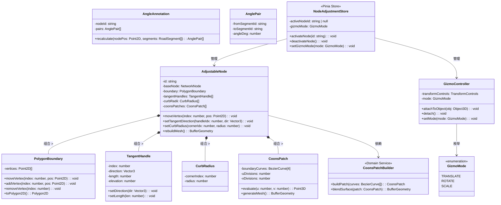
```mermaid
classDiagram
    class AdjustableNode {
        -id: string
        -baseNode: NetworkNode
        -boundary: PolygonBoundary
        -tangentHandles: TangentHandle[]
        -curbRadii: CurbRadius[]
        -coonsPatches: CoonsPatch[]
        +moveVertex(index: number, pos: Point2D): void
        +setTangentDirection(handleIdx: number, dir: Vector3): void
        +setCurbRadius(cornerIdx: number, radius: number): void
        +rebuildMesh(): BufferGeometry
    }

    class TangentHandle {
        -index: number
        -direction: Vector3
        -length: number
        -elevation: number
        +setDirection(dir: Vector3): void
        +setLength(len: number): void
    }

    class PolygonBoundary {
        -vertices: Point2D[]
        +moveVertex(index: number, pos: Point2D): void
        +addVertex(index: number, pos: Point2D): void
        +removeVertex(index: number): void
        +toPolygon2D(): Polygon2D
    }

    class CurbRadius {
        -cornerIndex: number
        -radius: number
    }

    class AngleAnnotation {
        -nodeId: string
        -pairs: AnglePair[]
        +recalculate(nodePos: Point2D, segments: RoadSegment[]): AnglePair[]
    }

    class AnglePair {
        -fromSegmentId: string
        -toSegmentId: string
        -angleDeg: number
    }

    class CoonsPatch {
        -boundaryCurves: BezierCurve[4]
        -uDivisions: number
        -vDivisions: number
        +evaluate(u: number, v: number): Point3D
        +generateMesh(): BufferGeometry
    }

    class GizmoController {
        -transformControls: TransformControls
        -mode: GizmoMode
        +attachToObject(obj: Object3D): void
        +detach(): void
        +setMode(mode: GizmoMode): void
    }

    class GizmoMode {
        <<enumeration>>
        TRANSLATE
        ROTATE
        SCALE
    }

    class CoonsPatchBuilder {
        <<Domain Service>>
        +buildPatch(curves: BezierCurve[]): CoonsPatch
        +blendSurface(patch: CoonsPatch): BufferGeometry
    }

    class NodeAdjustmentStore {
        <<Pinia Store>>
        -activeNodeId: string | null
        -gizmoMode: GizmoMode
        +activateNode(id: string): void
        +deactivateNode(): void
        +setGizmoMode(mode: GizmoMode): void
    }

    AdjustableNode *-- PolygonBoundary : 组合 >
    AdjustableNode *-- TangentHandle : 组合 >
    AdjustableNode *-- CurbRadius : 组合 >
    AdjustableNode *-- CoonsPatch : 组合 >
    AdjustableNode --> CoonsPatchBuilder : 依赖
    GizmoController --> GizmoMode : 枚举
    NodeAdjustmentStore --> AdjustableNode : 管理
    NodeAdjustmentStore --> GizmoController : 管理
```

### 4.3 交规引擎与 TM:PE 规则子系统 (FR3)

#### 4.3.1 功能详细说明

**对标机制**：原版基础交规、`TM:PE`、`Intersection Marking Tool (IMT)`

本子系统是系统"硬核"属性的核心来源，深度对标 TM:PE 模组，提供节点级、车道级的微观交通规则配置能力。所有规则数据序列化为 JSON 绑定在节点/车道实体上，作为仿真引擎的输入驱动严格仿真行为。

| 功能编号 | 功能名称 | 详细描述 | 关键实现机制 |
|:---|:---|:---|:---|
| FR3.1 | 原生基础交规配置 | 提供路口"禁止左转/右转/直行"快捷开关（`TurnRestriction`）；支持切换路口控制模式：无控制(YIELD)/红绿灯(TRAFFIC_LIGHT)/环岛(ROUNDABOUT)；支持开启/关闭人行横道（`crosswalkEnabled`） | `TrafficRuleSet` 聚合根管理 `TurnRestriction[]` + `NodeControlMode` + `crosswalkEnabled`；模式切换触发 `DecalRenderer` 更新斑马线贴花 |
| FR3.2 | 车道连接器工具 | 激活后显示进出口车道锚点，用户拖拽连线生成贝塞尔引导线（`CatmullRomCurve3`）。未连接的进口车道视为死胡同，仿真车辆不会从该车道驶出 | `LaneConnector` 记录 fromLaneId→toLaneId 映射 + `fromAnchor/toAnchor` 锚点 + `guideCurve` 引导曲线；3D 渲染为半透明曲线 |
| FR3.3 | 定时与多步阶信控工具 | 提供多步阶编辑器 (Step Editor)，每步阶设置最小/最大绿灯时间、黄灯过渡时间、全红清空时间。支持绑定"虚拟传感器"实现动态感应延长绿灯 | `TrafficLightController` 管理 `SignalStep[]` + `VirtualSensor[]`；通过 `ISignalStrategy` 策略接口支持固定配时(`FixedTimingStrategy`)和感应控制(`SensorActuatedStrategy`)两种模式 |
| FR3.4 | 车道级限制与标线工具 | 单条车道独立限速、特定车型禁行（`LaneRestriction`）；绘制"实线/虚线"同步修改底层变道权限矩阵与 3D 贴花；绘制"导向箭头"锁定强制方向 | `LaneRestriction` 包含 speedLimit/allowedVehicleTypes/allowLeftChange/allowRightChange/markingType；`DecalRenderer` 使用 `DecalGeometry` 将标线 PNG 投影到路面 |
| FR3.5 | 车道级转向箭头 | 每条车道独立设置允许转向(LEFT/STRAIGHT/RIGHT/U_TURN)；新建路口时根据LaneConnector自动推断箭头；用户手动覆盖；3D箭头贴花渲染；仿真车辆提前选择正确车道 | `LaneArrow` 值对象存储于 `TrafficRuleSet.laneArrows[]`；自动推断逻辑遍历 `LaneConnector` 的 fromLaneId→toSegmentId 方向；MOBIL模型在路口前检查 `LaneArrow.allowedDirections` |

**核心数据流**：用户选择节点 → `TrafficRuleStore.loadRuleSet()` → 用户配置规则 → `EditorStateStore.executeCommand()` → `TrafficRuleStore` 更新规则 → `DecalRenderer` 投影贴花 → `StoreEventBus.emit('traffic-rule:rule-changed')` → `SimulationStore` 订阅更新仿真规则

**规则冲突校验**：`RuleValidationService` 在每次规则变更后自动执行冲突检测（如：禁止左转但车道连接器指向左转出口），冲突时阻止提交并高亮提示。

#### 4.3.2 类图


```mermaid
classDiagram
    class TrafficRuleSet {
        -id: string
        -nodeId: string
        -turnRestrictions: TurnRestriction[]
        -laneConnectors: LaneConnector[]
        -trafficLight: TrafficLightController | null
        -laneRestrictions: Map~string, LaneRestriction~
        -laneArrows: LaneArrow[]
        -crosswalkEnabled: boolean
        -nodeControlMode: NodeControlMode
        +addTurnRestriction(r: TurnRestriction): void
        +removeTurnRestriction(r: TurnRestriction): void
        +addLaneConnector(c: LaneConnector): void
        +removeLaneConnector(c: LaneConnector): void
        +setTrafficLight(ctrl: TrafficLightController): void
        +setLaneRestriction(laneId: string, r: LaneRestriction): void
        +setLaneArrow(laneId: string, directions: TurnDirection[]): void
        +getLaneArrow(laneId: string): LaneArrow | undefined
        +autoInferArrows(): void
        +setCrosswalkEnabled(enabled: boolean): void
        +validate(): ValidationResult
    }

    class LaneArrow {
        +laneId: string
        +nodeId: string
        +allowedDirections: TurnDirection[]
        +allows(direction: TurnDirection): boolean
    }

    class LaneConnector {
        -id: string
        -fromLaneId: string
        -toLaneId: string
        -fromAnchor: Point2D
        -toAnchor: Point2D
        -guideCurve: CatmullRomCurve3
        +rebuildGuideCurve(): void
        +getGuideCurve(): CatmullRomCurve3
    }

    class ISignalStrategy {
        <<interface>>
        +advanceStep(controller: TrafficLightController): void
        +shouldExtendGreen(controller: TrafficLightController, sensorStates: Map~string, boolean~): boolean
    }

    class FixedTimingStrategy {
        +advanceStep(controller: TrafficLightController): void
        +shouldExtendGreen(controller: TrafficLightController, sensorStates: Map~string, boolean~): boolean
    }

    class SensorActuatedStrategy {
        -extensionThreshold: number
        +advanceStep(controller: TrafficLightController): void
        +shouldExtendGreen(controller: TrafficLightController, sensorStates: Map~string, boolean~): boolean
    }

    class TrafficLightController {
        -id: string
        -steps: SignalStep[]
        -currentStepIndex: number
        -timer: number
        -sensors: VirtualSensor[]
        -strategy: ISignalStrategy
        +addStep(step: SignalStep): void
        +removeStep(index: number): void
        +advanceStep(): void
        +getCurrentState(): SignalPhaseState
        +onSensorTrigger(sensorId: string): void
        +setStrategy(strategy: ISignalStrategy): void
    }

    class SignalStep {
        +greenLanes: string[]
        +minGreenTime: number
        +maxGreenTime: number
        +yellowTime: number
        +allRedTime: number
        +sensorBindings: string[]
    }

    class VirtualSensor {
        -id: string
        -position: Point2D
        -detectionRadius: number
        -triggered: boolean
        +checkVehicle(vehicle: SimVehicle): boolean
    }

    class LaneRestriction {
        +speedLimit: number
        +allowedVehicleTypes: VehicleType[]
        +allowLeftChange: boolean
        +allowRightChange: boolean
        +markingType: LaneMarkingType
    }

    class TurnRestriction {
        +fromSegmentId: string
        +toSegmentId: string
        +direction: TurnDirection
    }

    class LaneMarkingType {
        <<enumeration>>
        SOLID_WHITE
        DASHED_WHITE
        SOLID_DOUBLE_YELLOW
        DASHED_YELLOW
        NONE
    }

    class TurnDirection {
        <<enumeration>>
        LEFT
        RIGHT
        STRAIGHT
        U_TURN
    }

    class VehicleType {
        <<enumeration>>
        CAR
        BUS
        TRUCK
        BIKE
        TRAM
    }

    class SignalPhaseState {
        +stepIndex: number
        +phase: SignalPhase
        +remainingTime: number
    }

    class SignalPhase {
        <<enumeration>>
        GREEN
        YELLOW
        ALL_RED
    }

    class DecalRenderer {
        -decalMeshes: Map~string, Mesh~
        +renderMarking(laneId: string, type: LaneMarkingType): void
        +renderArrow(laneId: string, direction: TurnDirection): void
        +renderCrosswalk(nodeId: string): void
        +clearDecals(nodeId: string): void
        +dispose(): void
    }

    class TrafficRuleStore {
        <<Pinia Store>>
        -ruleSets: Map~string, TrafficRuleSet~
        -activeRuleSetId: string | null
        -editingMode: RuleEditMode
        +loadRuleSet(nodeId: string): void
        +addLaneConnector(from: string, to: string): void
        +setLaneRestriction(laneId: string, r: LaneRestriction): void
        +addSignalStep(step: SignalStep): void
    }

    class RuleEditMode {
        <<enumeration>>
        LANE_CONNECTOR
        LANE_RESTRICTION
        SIGNAL_EDITOR
        TURN_RESTRICTION
    }

    class RuleValidationService {
        <<Domain Service>>
        +validate(ruleSet: TrafficRuleSet): ValidationResult
        +validateDowngrade(segment: RoadSegment, newProfile: CrossSectionProfile): ValidationResult
        -checkConnectorConflicts(segment: RoadSegment, removedLaneIds: string[]): string[]
    }

    TrafficRuleSet *-- TurnRestriction : 组合 >
    TrafficRuleSet *-- LaneConnector : 组合 >
    TrafficRuleSet *-- TrafficLightController : 组合 >
    TrafficRuleSet *-- LaneRestriction : 组合 >
    TrafficRuleSet *-- LaneArrow : 组合 >
    TrafficLightController *-- SignalStep : 组合 >
    TrafficLightController *-- VirtualSensor : 组合 >
    TrafficLightController --> ISignalStrategy : 依赖抽象
    ISignalStrategy <|.. FixedTimingStrategy : 实现
    ISignalStrategy <|.. SensorActuatedStrategy : 实现
    LaneConnector --> CatmullRomCurve3 : 关联
    LaneRestriction --> LaneMarkingType : 枚举
    LaneRestriction --> VehicleType : 枚举
    TurnRestriction --> TurnDirection : 枚举
    LaneArrow --> TurnDirection : 枚举
    TrafficLightController --> SignalPhaseState : 关联
    SignalPhaseState --> SignalPhase : 枚举
    DecalRenderer --> LaneMarkingType : 依赖
    DecalRenderer --> TurnDirection : 依赖
    TrafficRuleStore --> TrafficRuleSet : 管理
    TrafficRuleStore --> RuleEditMode : 枚举
    RuleValidationService ..> TrafficRuleSet : 校验
```

> **注**：`nodeControlMode` 为冗余存储字段（与 `NetworkNode.controlMode` 一致），用于序列化时避免跨 Store 查询，反序列化时需校验一致性。

### 4.4 微观交通仿真子系统 (FR4)

#### 4.4.1 功能详细说明

**对标机制**：原版物理引擎、`TM:PE` (严格模式)

本子系统是系统的"引擎"核心，负责在 Web Worker 中运行微观交通仿真循环。采用 1D 运动学插值策略替代 3D 物理碰撞，将跟驰检测复杂度从 O(N²) 降至 O(N)。所有仿真计算在独立 Worker 线程执行，主线程仅负责 InstancedMesh 矩阵更新。

| 功能编号 | 功能名称 | 详细描述 | 关键实现机制 |
|:---|:---|:---|:---|
| FR4.1 | 严格实线约束与车道保持 | 实线区强制锁定变道权限（`allowLeftChange=false`）；错过路口严禁压实线强行变道，必须将错就错至下一路口掉头 | `SimVehicle` 状态机检查 `LaneRestriction.allowLeftChange/allowRightChange`；实线区 `CHANGING_LANE` 状态不可达 |
| FR4.2 | 车道连接器强制引导 | 车辆进入路口后激活 PID 轨迹跟踪器，严格吸附于 `LaneConnector.guideCurve` 引导线行驶，不会偏移到错误出口 | `PIDTracker.compute()` 计算横向修正量 → 车辆位置沿 `CatmullRomCurve3` 插值 → 实现平滑过弯 |
| FR4.3 | 信控状态机与动态感应 | 红灯平滑减速（IDM 模型自然减速），绿灯按当前车道独立限速起步；虚拟传感器检测到车辆时，`SensorActuatedStrategy` 动态延长绿灯 | `TrafficLightController` 通过 `ISignalStrategy` 策略驱动步阶切换；`VirtualSensor.checkVehicle()` 检测到达车辆 → 触发绿灯延长 |
| FR4.4 | 车型与限速强校验 | 卡车误入禁行路段强制刹停（状态→STOPPED）并调用 `reroute()` 重新寻路；最高速度严格受限于当前车道 `LaneRestriction.speedLimit` | `SimVehicle` 每帧校验 `VehicleType ∈ LaneRestriction.allowedVehicleTypes`；违规则刹停 + `IPathFinder.findPath()` 重新规划 |
| FR4.5 | MOBIL 变道模型 | 虚线区通过 MOBIL 模型评估变道：安全性准则（目标车道后车减速度 ≤ b_safe=3m/s²）；激励性准则（加速度增益 - 礼貌因子×后车减速代价 ≥ p=0.2）；平滑横向过渡（lateralOffset 2秒渐变）；实线区变道判断短路 | `MOBILLaneChangeModel.calculateLaneChangeDecision()` 返回变道决策；`SimVehicle.lateralOffset` 渐变驱动 `InstancedMesh` 矩阵偏移；实线区 `CHANGING_LANE` 状态不可达 |
| FR4.6 | 车辆需求与OD模型 | OD矩阵配置（起讫点→小时交通量）；车型比例配置；泊松分布发车；A*最短路径分配；默认"随机流量"模式 | `ODMatrix` + `VehicleMixConfig` 作为 `SimulationWorld` 初始化参数；泊松分布 `Math.random() < 1 - Math.exp(-lambda * dt)` 判断是否发车 |

**仿真循环（每帧）**：
1. 遍历所有 `SimVehicle`，通过 `SpatialHashGrid.queryNearby()` 获取前车
2. 调用 `ICarFollowModel.calculateAcceleration()` 计算目标加速度（默认 IDM 实现）
3. 调用 `MOBILLaneChangeModel.calculateLaneChangeDecision()` 评估变道决策
4. 更新 speed/progress/lateralOffset，状态机判断（变道/红灯停车/路口寻迹）
5. 车辆到达路段末端时，通过 `IPathFinder` 获取下一车道
6. `VehicleSpawner.tick()` 按泊松分布生成新车辆
7. 更新所有 `SignalState`
8. 打包 `SimulationFrameData`（Float32Array）返回主线程

**性能目标**：500+ 车辆单帧计算 < 10ms（Worker 线程），主线程 InstancedMesh 更新 < 2ms。

**双通道数据架构**：仿真位置数据采用**快通道**——Worker 每帧将 `SimulationFrameData`（Float32Array）通过 `SharedArrayBuffer` 直接传递至主线程，主线程遍历数组更新 `InstancedMesh.setMatrixAt()`，**完全绕过 Pinia 响应式追踪**，避免 500+ 车辆的 Proxy 依赖收集开销；仿真元状态（running/speed/vehicleCount/odMatrix/mixConfig）走**慢通道**——通过 `comlink` RPC 写入 `SimulationStore`，由 Vue UI 面板订阅消费。

#### 4.4.2 类图


```mermaid
classDiagram
    class SimulationWorld {
        -id: string
        -vehicles: Map~string, SimVehicle~
        -signalStates: Map~string, SignalState~
        -spatialGrid: SpatialHashGrid
        -timeStep: number
        -running: boolean
        +start(): void
        +pause(): void
        +step(): void
        +spawnVehicle(route: RoutePlan): SimVehicle
        +removeVehicle(id: string): void
        +getVehiclesInArea(bounds: BoundingBox): SimVehicle[]
    }

    class SimVehicle {
        -id: string
        -profile: VehicleProfile
        -currentLaneId: string
        -progress: number
        -speed: number
        -acceleration: number
        -route: RoutePlan
        -state: VehicleState
        -splineCurve: CatmullRomCurve3
        -lateralOffset: number
        -targetLaneId: string | null
        -laneChangeTimer: number
        +update(dt: number, leader: SimVehicle | null): void
        +getPosition(): Point3D
        +getRotation(): Quaternion
        +changeLane(targetLaneId: string): void
        +isAtEndOfRoad(): boolean
        +reroute(newRoute: RoutePlan): void
    }

    class VehicleState {
        <<enumeration>>
        CRUISING
        FOLLOWING
        BRAKING
        WAITING_RED
        CHANGING_LANE
        ROUTE_NAVIGATING
        STOPPED
    }

    class VehicleProfile {
        +type: VehicleType
        +maxSpeed: number
        +maxAcceleration: number
        +comfortableDeceleration: number
        +minGap: number
        +bodyLength: number
        +bodyWidth: number
    }

    class RoutePlan {
        +waypoints: RouteWaypoint[]
        +currentWaypointIndex: number
        +advanceWaypoint(): void
        +isComplete(): boolean
    }

    class RouteWaypoint {
        +laneId: string
        +segmentId: string
        +nodeId: string | null
        +connectorId: string | null
    }

    class SignalState {
        -controllerId: string
        -currentStepIndex: number
        -phase: SignalPhase
        -remainingTime: number
        +update(dt: number): void
        +isGreenForLane(laneId: string): boolean
    }

    class SpatialHashGrid {
        -cellSize: number
        -grid: Map~string, SimVehicle[]~
        +insert(vehicle: SimVehicle): void
        +remove(vehicle: SimVehicle): void
        +queryNearby(position: Point2D, radius: number): SimVehicle[]
        +clear(): void
    }

    class ICarFollowModel {
        <<interface>>
        +calculateAcceleration(vehicle: SimVehicle, leader: SimVehicle | null, speedLimit: number): number
    }

    class IDMCarFollowModel {
        <<Domain Service>>
        +calculateAcceleration(vehicle: SimVehicle, leader: SimVehicle | null, speedLimit: number): number
        -desiredGap(speed: number): number
    }

    class LaneInfo {
        +id: string
        +leader: SimVehicle | null
        +follower: SimVehicle | null
        +restrictions: LaneRestriction
    }

    class MOBILLaneChangeModel {
        <<Domain Service>>
        -politenessFactor: number
        -bSafe: number
        +calculateLaneChangeDecision(vehicle: SimVehicle, leftLane: LaneInfo, rightLane: LaneInfo): LaneChangeDecision
        -calculateAccelerationGain(vehicle: SimVehicle, targetLane: LaneInfo): number
        -calculateDecelerationCost(vehicle: SimVehicle, targetLane: LaneInfo): number
    }

    class LaneChangeDecision {
        +shouldChange: boolean
        +targetLaneId: string
        +direction: LaneChangeDirection
    }

    class LaneChangeDirection {
        <<enumeration>>
        LEFT
        RIGHT
        NONE
    }

    class ODMatrix {
        +pairs: ODPair[]
        +getVolume(fromNodeId: string, toNodeId: string): number
    }

    class ODPair {
        +fromNodeId: string
        +toNodeId: string
        +volumePerHour: number
    }

    class VehicleMixConfig {
        +ratios: VehicleMixRatio[]
        +sampleVehicleType(): VehicleType
    }

    class VehicleMixRatio {
        +type: VehicleType
        +ratio: number
    }

    class VehicleSpawner {
        -odMatrix: ODMatrix
        -mixConfig: VehicleMixConfig
        -pathFinder: IPathFinder
        -accumulatedTime: Map~string, number~
        +tick(dt: number): SimVehicle[]
        -shouldSpawn(pair: ODPair, dt: number): boolean
    }

    class IPathFinder {
        <<interface>>
        +findPath(fromNodeId: string, toNodeId: string, vehicleType: VehicleType): RoutePlan
    }

    class AStarPathFinder {
        <<Domain Service>>
        -network: RoadNetwork
        +findPath(fromNodeId: string, toNodeId: string, vehicleType: VehicleType): RoutePlan
    }

    class PIDTracker {
        -kp: number
        -ki: number
        -kd: number
        -integral: number
        -prevError: number
        +compute(setpoint: number, actual: number): number
    }

    class SimulationWorker {
        <<Web Worker>>
        -world: SimulationWorld
        -carFollowModel: ICarFollowModel
        -pathFinder: IPathFinder
        +init(snapshot: RoadNetworkSnapshot, rules: RuleData): Promise~void~
        +start(): void
        +pause(): void
        +step(dt: number): SimulationFrameData
        +spawnVehicles(count: number): void
    }

    class SimulationFrameData {
        +vehiclePositions: Float32Array
        +vehicleRotations: Float32Array
        +vehicleCount: number
        +timestamp: number
    }

    class SimulationStore {
        <<Pinia Store>>
        -running: boolean
        -speed: number
        -vehicleCount: number
        +startSimulation(): void
        +pauseSimulation(): void
        +setSpeed(speed: number): void
        +spawnVehicles(count: number): void
        +setODMatrix(matrix: ODMatrix): void
        +setVehicleMixConfig(config: VehicleMixConfig): void
    }

    note for SimulationStore "仅存储仿真元状态（running/speed/count）。\n车辆位置数据通过 SharedArrayBuffer 快通道\n直达主线程 InstancedMesh，不经 Pinia 响应式追踪"

    SimulationWorld o-- SimVehicle : 聚合 >
    SimulationWorld o-- SignalState : 聚合 >
    SimulationWorld *-- SpatialHashGrid : 组合 >
    SimulationWorld *-- VehicleSpawner : 组合
    SimulationWorld --> MOBILLaneChangeModel : 依赖
    SimVehicle *-- VehicleProfile : 组合 >
    SimVehicle *-- RoutePlan : 组合 >
    SimVehicle --> VehicleState : 枚举
    SimVehicle --> PIDTracker : 依赖
    SimVehicle --> LaneChangeDecision : 关联
    SimVehicle --> MOBILLaneChangeModel : 依赖
    RoutePlan *-- RouteWaypoint : 组合 >
    ICarFollowModel <|.. IDMCarFollowModel : 实现
    IPathFinder <|.. AStarPathFinder : 实现
    SimulationWorld --> ICarFollowModel : 依赖抽象
    SimulationWorld --> IPathFinder : 依赖抽象
    VehicleSpawner --> ODMatrix : 依赖
    VehicleSpawner --> VehicleMixConfig : 依赖
    VehicleSpawner --> IPathFinder : 依赖
    VehicleMixConfig *-- VehicleMixRatio : 组合
    ODMatrix *-- ODPair : 组合
    LaneChangeDecision --> LaneChangeDirection : 枚举
    MOBILLaneChangeModel ..> LaneInfo : 参数
    SimulationWorker *-- SimulationWorld : 组合 >
    SimulationWorker --> ICarFollowModel : 依赖抽象
    SimulationWorker --> IPathFinder : 依赖抽象
    SimulationWorker --> SimulationFrameData : 产出
    SimulationStore --> SimulationWorker : 管理
```

### 4.5 场景管理子系统 (FR5)

#### 4.5.1 功能详细说明

**对标机制**：原版资产浏览器、`Network Multitool` 预设

本子系统负责工程的全生命周期管理，包括样例模板库的浏览与一键加载、工程的序列化持久化与版本快照管理。作为通用域(Generic Domain)，它为核心域(路网建模、交规引擎)提供数据持久化与模板加载的基础设施支撑。

| 功能编号 | 功能名称 | 详细描述 | 关键实现机制 |
|:---|:---|:---|:---|
| FR5.1 | 样例库浏览与一键加载 | 分类展示基础路口、苜蓿叶立交、涡轮立交等预设模板。用户点击后 3 秒内解析 JSON 重建场景，包括路网拓扑、3D 网格与 TM:PE 规则 | `ProjectStore.loadTemplate()` → `templateApi.getTemplate(id)` → `SceneSerializer.deserialize()` → `RoadNetworkStore`/`TrafficRuleStore` 批量初始化 → GeometryWorker 重建所有路面网格 |
| FR5.2 | 参数化微调（二次编辑） | 加载的样例必须具备完全参数化能力，支持用户修改车道数（升级刷）、TM:PE 规则（交规编辑器）及节点高程/坡度（微调工具） | 样例加载后数据进入 Pinia Store 成为可编辑状态，所有修改操作与手动创建的场景完全一致（通过 Command 模式支持撤销） |
| FR5.3 | 工程持久化 | 支持将当前场景的完整拓扑(`TopologyData`)、3D 坐标、TM:PE 规则配置(`RuleData`)序列化为 JSON 并保存至云端；支持版本快照与回滚 | `ProjectStore.saveProject()` → `RoadNetworkStore.serialize()` + `TrafficRuleStore.serialize()` → `projectApi.updateSnapshot()` → 后端 `prj_snapshot` 表存储 JSONB；回滚通过 `projectApi.loadSnapshot(version)` 反序列化恢复 |

**核心数据流**：

- **保存**：用户 Ctrl+S → `ProjectStore.saveProject()` → `RoadNetworkStore.serialize()` + `TrafficRuleStore.serialize()` → 合并为 `ProjectPayload` → `PUT /api/projects/{id}/snapshot` → 后端 JWT 校验 + user_id 隔离 → `INSERT INTO prj_snapshot` + `UPDATE prj_project`
- **加载**：用户选择模板 → `ProjectStore.loadTemplate(id)` → `GET /api/templates/{id}` → `SceneSerializer.deserialize(snapshotData)` → 批量写入 `RoadNetworkStore`/`TrafficRuleStore` → GeometryWorker 重建网格 → Three.js 渲染
- **回滚**：用户选择历史版本 → `ProjectStore.loadSnapshot(projectId, version)` → `GET /api/projects/{id}/snapshots/{version}` → 反序列化覆盖当前状态

**性能目标**：样例加载 3 秒内完成（含 JSON 解析 + Worker 网格重建 + Three.js 渲染）；工程保存 1 秒内完成（JSON 序列化 + HTTP 请求）。

#### 4.5.2 类图

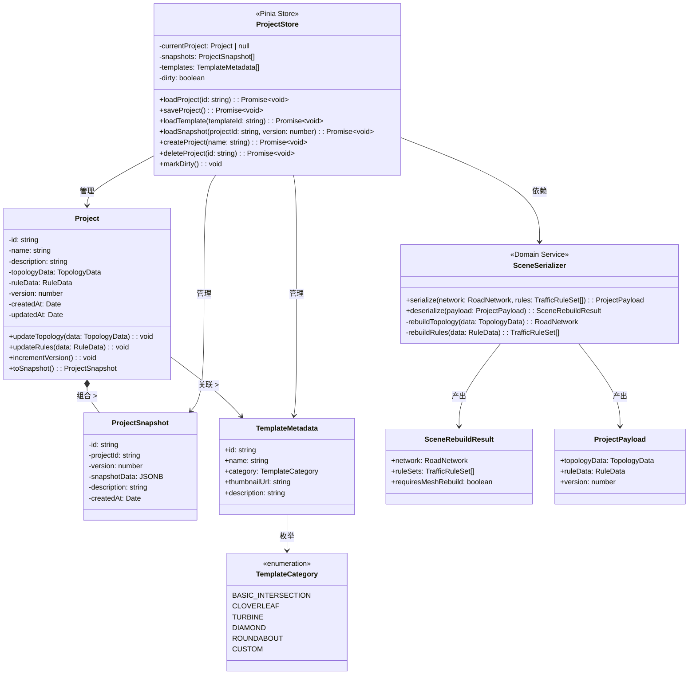
```mermaid
classDiagram
    class Project {
        -id: string
        -name: string
        -description: string
        -topologyData: TopologyData
        -ruleData: RuleData
        -version: number
        -createdAt: Date
        -updatedAt: Date
        +updateTopology(data: TopologyData): void
        +updateRules(data: RuleData): void
        +incrementVersion(): void
        +toSnapshot(): ProjectSnapshot
    }

    class ProjectSnapshot {
        -id: string
        -projectId: string
        -version: number
        -snapshotData: JSONB
        -description: string
        -createdAt: Date
    }

    class TemplateMetadata {
        +id: string
        +name: string
        +category: TemplateCategory
        +thumbnailUrl: string
        +description: string
    }

    class TemplateCategory {
        <<enumeration>>
        BASIC_INTERSECTION
        CLOVERLEAF
        TURBINE
        DIAMOND
        ROUNDABOUT
        CUSTOM
    }

    class SceneSerializer {
        <<Domain Service>>
        +serialize(network: RoadNetwork, rules: TrafficRuleSet[]): ProjectPayload
        +deserialize(payload: ProjectPayload): SceneRebuildResult
        -rebuildTopology(data: TopologyData): RoadNetwork
        -rebuildRules(data: RuleData): TrafficRuleSet[]
    }

    class SceneRebuildResult {
        +network: RoadNetwork
        +ruleSets: TrafficRuleSet[]
        +requiresMeshRebuild: boolean
    }

    class ProjectPayload {
        +topologyData: TopologyData
        +ruleData: RuleData
        +version: number
    }

    class ProjectStore {
        <<Pinia Store>>
        -currentProject: Project | null
        -snapshots: ProjectSnapshot[]
        -templates: TemplateMetadata[]
        -dirty: boolean
        +loadProject(id: string): Promise~void~
        +saveProject(): Promise~void~
        +loadTemplate(templateId: string): Promise~void~
        +loadSnapshot(projectId: string, version: number): Promise~void~
        +createProject(name: string): Promise~void~
        +deleteProject(id: string): Promise~void~
        +markDirty(): void
    }

    Project *-- ProjectSnapshot : 组合 >
    Project --> TemplateMetadata : 关联 >
    TemplateMetadata --> TemplateCategory : 枚举
    SceneSerializer --> ProjectPayload : 产出
    SceneSerializer --> SceneRebuildResult : 产出
    ProjectStore --> Project : 管理
    ProjectStore --> ProjectSnapshot : 管理
    ProjectStore --> TemplateMetadata : 管理
    ProjectStore --> SceneSerializer : 依赖
```

### 4.6 评估与可视化子系统 (FR6)

#### 4.6.1 功能详细说明

**对标机制**：原版交通视图、`Traffic Report` 模组、VISSIM/SUMO 数据输出

本子系统完美复刻《城市：天际线》原生的直观交通视图，并提供专业级的数据下钻能力。通过 GPU Shader 渲染热力图、Line2 胖线渲染飞线、CSS2DRenderer 渲染 LOS 徽章，实现零 CPU 开销的实时可视化。

| 功能编号 | 功能名称 | 详细描述 | 关键实现机制 |
|:---|:---|:---|:---|
| FR6.1 | 原生交通流量视图 | 提供全局"红-黄-绿"热力图开关。基于路段/车道的实际使用率（流量/容量比）实时渲染道路表面颜色，一秒定位全局拥堵瓶颈 | `HeatmapShader` 使用 `ShaderMaterial`，将 `HeatmapData.laneCongestionMap` 作为 Uniform 传入 Fragment Shader，`mix(绿,黄,红)` 按拥堵系数插值，GPU 驱动零 CPU 开销 |
| FR6.2 | 原生交通路线飞线视图 | 用户点击路段/路口，系统以彩色动态飞线形式高亮显示所有经过该节点的车辆历史轨迹与未来导航路线。支持按车型过滤飞线颜色 | `FlightLineRenderer` 使用 `THREE.Line2`（胖线）+ UV 动画实现流动效果；`FlightLineData` 包含车辆轨迹点序列与计划路径；按 `VehicleType` 过滤渲染 |
| FR6.3 | 车道级微观指标统计 | 点击具体车道，右侧面板显示：交通量(pcu/h)、平均速度、空间密度、最大排队长度 | `LaneMetric` 实体由 SimulationWorker 滚动统计，通过 `StoreEventBus.simulation:metrics-updated` 事件推送到 `EvaluationStore` |
| FR6.4 | 交叉口延误与 LOS 评估 | 选中交叉口时，计算平均控制延误（秒/车），根据 HCM 标准自动映射为 A-F 服务水平评级，3D 场景中悬浮显示 LOS 徽章 | `HCMLOSClassifier` 执行延误→LOS 分级；`LOSBadgeRenderer` 使用 `CSS2DRenderer` 在 3D 场景中渲染 HTML 样式 A-F 徽章 |
| FR6.5 | 评估报表导出 | 支持导出 CSV 格式的底层车辆轨迹数据，及 PDF 格式的图文评估简报（含热力图截图、LOS 评级表） | 前端 `EvaluationStore.exportCSV()` 本地生成 CSV；`exportPDF()` 通过 `POST /api/reports/export` 调用后端 Apache POI 生成 PDF |

**核心数据流**：SimulationWorker 每帧计算 → `SimulationFrameData` 返回主线程 → `SimulationStore` 发布 `simulation:metrics-updated` 事件 → `EvaluationStore` 订阅并更新 `EvaluationReport` → 驱动 `HeatmapShader`/`FlightLineRenderer`/`LOSBadgeRenderer` 渲染

**性能保障**：热力图使用 GPU Shader（零 CPU 开销）；飞线使用 Line2 + UV 动画（GPU 驱动流动）；LOS 徽章使用 CSS2DRenderer（DOM 渲染，不占用 WebGL Draw Call）。

#### 4.6.2 类图

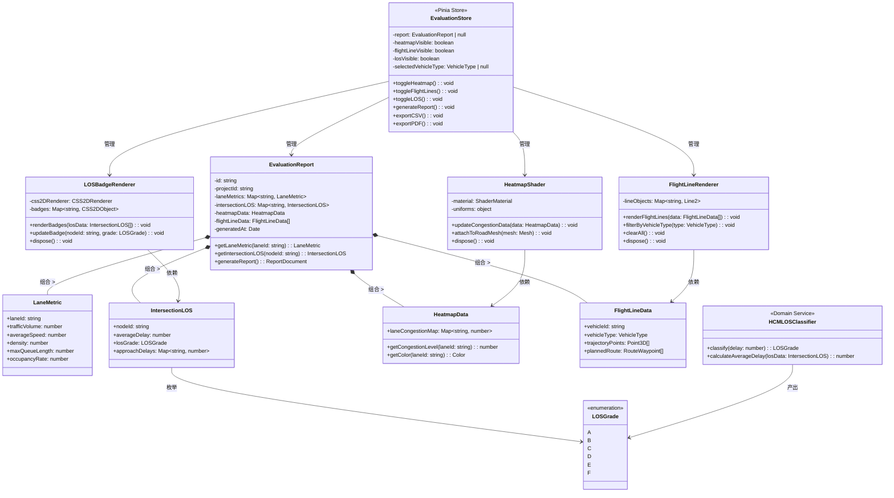
```mermaid
classDiagram
    class EvaluationReport {
        -id: string
        -projectId: string
        -laneMetrics: Map~string, LaneMetric~
        -intersectionLOS: Map~string, IntersectionLOS~
        -heatmapData: HeatmapData
        -flightLineData: FlightLineData[]
        -generatedAt: Date
        +getLaneMetric(laneId: string): LaneMetric
        +getIntersectionLOS(nodeId: string): IntersectionLOS
        +generateReport(): ReportDocument
    }

    class LaneMetric {
        +laneId: string
        +trafficVolume: number
        +averageSpeed: number
        +density: number
        +maxQueueLength: number
        +occupancyRate: number
    }

    class IntersectionLOS {
        +nodeId: string
        +averageDelay: number
        +losGrade: LOSGrade
        +approachDelays: Map~string, number~
    }

    class LOSGrade {
        <<enumeration>>
        A
        B
        C
        D
        E
        F
    }

    class HeatmapData {
        +laneCongestionMap: Map~string, number~
        +getCongestionLevel(laneId: string): number
        +getColor(laneId: string): Color
    }

    class FlightLineData {
        +vehicleId: string
        +vehicleType: VehicleType
        +trajectoryPoints: Point3D[]
        +plannedRoute: RouteWaypoint[]
    }

    class HeatmapShader {
        -material: ShaderMaterial
        -uniforms: object
        +updateCongestionData(data: HeatmapData): void
        +attachToRoadMesh(mesh: Mesh): void
        +dispose(): void
    }

    class FlightLineRenderer {
        -lineObjects: Map~string, Line2~
        +renderFlightLines(data: FlightLineData[]): void
        +filterByVehicleType(type: VehicleType): void
        +clearAll(): void
        +dispose(): void
    }

    class LOSBadgeRenderer {
        -css2DRenderer: CSS2DRenderer
        -badges: Map~string, CSS2DObject~
        +renderBadges(losData: IntersectionLOS[]): void
        +updateBadge(nodeId: string, grade: LOSGrade): void
        +dispose(): void
    }

    class HCMLOSClassifier {
        <<Domain Service>>
        +classify(delay: number): LOSGrade
        +calculateAverageDelay(losData: IntersectionLOS): number
    }

    class EvaluationStore {
        <<Pinia Store>>
        -report: EvaluationReport | null
        -heatmapVisible: boolean
        -flightLineVisible: boolean
        -losVisible: boolean
        -selectedVehicleType: VehicleType | null
        +toggleHeatmap(): void
        +toggleFlightLines(): void
        +toggleLOS(): void
        +generateReport(): void
        +exportCSV(): void
        +exportPDF(): void
    }

    EvaluationReport *-- LaneMetric : 组合 >
    EvaluationReport *-- IntersectionLOS : 组合 >
    EvaluationReport *-- HeatmapData : 组合 >
    EvaluationReport *-- FlightLineData : 组合 >
    IntersectionLOS --> LOSGrade : 枚举
    HeatmapShader --> HeatmapData : 依赖
    FlightLineRenderer --> FlightLineData : 依赖
    LOSBadgeRenderer --> IntersectionLOS : 依赖
    HCMLOSClassifier --> LOSGrade : 产出
    EvaluationStore --> EvaluationReport : 管理
    EvaluationStore --> HeatmapShader : 管理
    EvaluationStore --> FlightLineRenderer : 管理
    EvaluationStore --> LOSBadgeRenderer : 管理
```

### 4.7 命令模式 (Undo/Redo 架构)

#### 4.7.1 功能详细说明

**设计模式**：命令模式 (Command Pattern)

本模块为系统提供全局的撤销/重做能力，确保用户任何误操作均可恢复。同时作为系统级容错机制，当 Worker 线程抛出几何计算异常时，自动调用栈顶命令的 `undo()` 实现状态无损回滚。

| 能力 | 详细描述 | 实现机制 |
|:---|:---|:---|
| 50 步撤销/重做 | 所有用户操作（画线、升级道路、调整高程、配置信控、设置车道限制）均支持至少 50 步的撤销与重做 | `HistoryStack` 维护 `undoStack: ICommand[]` 和 `redoStack: ICommand[]`，`maxSize=50`；新命令 push 时清空 redoStack |
| 命令接口统一 | 所有可撤销操作必须实现 `ICommand` 接口 | `ICommand` 定义 `execute()` / `undo()` / `getDescription()` 三个方法；每个命令内部保存执行前的状态快照用于 undo |
| Worker 异常自动回滚 | 当 GeometryWorker 抛出异常（如多边形自交、Offset 失败）时，系统自动调用栈顶命令的 `undo()` | `DrawRoadCommand.execute()` 内部 try-catch Worker 调用；异常时调用 `HistoryStack.undo()` 自动回滚 |
| 命令调度中心 | `EditorStateStore` 作为唯一命令调度入口，所有操作通过 `executeCommand()` 统一执行 | `EditorStateStore.drawRoad()` / `upgradeRoad()` / `deleteRoad()` / `moveNode()` 均内部创建 Command 并调用 `executeCommand()` |

**已实现的命令类**：

| 命令类 | 触发场景 | execute 行为 | undo 行为 |
|:---|:---|:---|:---|
| `DrawRoadCommand` | 用户绘制新路段 | 创建 `RoadSegment` → Worker offset/union → 拓扑自愈 | 删除 `RoadSegment` → Worker 重算交叉口 → 拓扑回退 |
| `UpgradeRoadCommand` | 用户使用升级刷 | 保存旧 `CrossSectionProfile` → 替换新 Profile → Worker 重算 | 恢复旧 `CrossSectionProfile` → Worker 重算 |
| `SetLaneRestrictionCommand` | 用户设置车道限速/禁行 | 保存旧 `LaneRestriction` → 设置新限制 → Decal 更新 | 恢复旧 `LaneRestriction` → Decal 更新 |
| `MoveNodeCommand` | 用户移动节点位置 | 保存旧 `Point2D` → 更新位置 → Worker 重算边界 | 恢复旧 `Point2D` → Worker 重算边界 |
| `DeleteRoadCommand` | 用户使用推土机删除路段 | 保存被删路段完整快照 + deletedConnectors + deletedRestrictions + deletedTurnRestrictions → 删除 RoadSegment → Worker 重算交叉口 → 删除关联规则 | 恢复被删路段快照 + 恢复 deletedConnectors/Restrictions/TurnRestrictions → Worker 重算交叉口 → 恢复关联规则 |
| `SetLaneConnectorCommand` | 用户添加车道连接器 | 保存旧 LaneConnector[] → 添加新连接器 → 重建引导曲线 → 3D渲染 | 恢复旧 LaneConnector[] → 重建引导曲线 → 3D渲染 |
| `AddSignalStepCommand` | 用户添加信控步阶 | 保存旧 SignalStep[] → 添加新步阶 → validate() | 恢复旧 SignalStep[] → validate() |
| `SetElevationCommand` | 用户修改路段高程 | 保存旧 ElevationProfile → 更新高程 → Worker 重算路面网格 | 恢复旧 ElevationProfile → Worker 重算路面网格 |
| `MoveVertexCommand` | 用户拖拽多边形边界顶点 | 保存旧顶点位置 → 更新顶点坐标 → Worker 重算交叉口多边形 → 3D渲染 | 恢复旧顶点位置 → Worker 重算交叉口多边形 → 3D渲染 |
| `SetTangentDirectionCommand` | 用户拖拽3D切线手柄 | 保存旧切线方向 → 更新切线 → Worker 重算 Coons Patch 曲面 → 3D渲染 | 恢复旧切线方向 → Worker 重算曲面 → 3D渲染 |
| `SetTurnRestrictionCommand` | 用户设置转向限制 | 保存旧 TurnRestriction[] → 添加/移除限制 → RuleValidationService.validate() | 恢复旧 TurnRestriction[] → validate() |
| `SetNodeControlModeCommand` | 用户切换路口控制模式 | 保存旧 controlMode → 更新模式 → 清理/初始化信控/让行规则 | 恢复旧 controlMode → 重建规则 |
| `SetCrossSectionCommand` | 用户在断面编辑器中修改断面并应用 | 保存旧 CrossSectionProfile → 替换为新 profile → Worker 重算路面网格 → 3D渲染 | 恢复旧 CrossSectionProfile → Worker 重算路面网格 → 3D渲染 |
| `SetLaneArrowCommand` | 用户设置车道转向箭头 | 保存旧 LaneArrow → 更新 allowedDirections → RuleValidationService.validate() → DecalRenderer 更新箭头贴花 | 恢复旧 LaneArrow → validate() → DecalRenderer 更新箭头贴花 |

#### 4.7.2 类图


```mermaid
classDiagram
    class ICommand {
        <<interface>>
        +execute(): void
        +undo(): void
        +getDescription(): string
    }

    class DrawRoadCommand {
        -store: RoadNetworkStore
        -startPoint: Point2D
        -endPoint: Point2D
        -profile: CrossSectionProfile
        -createdSegmentId: string | null
        +execute(): void
        +undo(): void
        +getDescription(): string
    }

    class UpgradeRoadCommand {
        -store: RoadNetworkStore
        -segmentId: string
        -oldProfile: CrossSectionProfile
        -newProfile: CrossSectionProfile
        +execute(): void
        +undo(): void
        +getDescription(): string
    }

    class SetLaneRestrictionCommand {
        -store: TrafficRuleStore
        -laneId: string
        -oldRestriction: LaneRestriction
        -newRestriction: LaneRestriction
        +execute(): void
        +undo(): void
        +getDescription(): string
    }

    class MoveNodeCommand {
        -store: RoadNetworkStore
        -nodeId: string
        -oldPosition: Point2D
        -newPosition: Point2D
        +execute(): void
        +undo(): void
        +getDescription(): string
    }

    class DeleteRoadCommand {
        -store: RoadNetworkStore
        -ruleStore: TrafficRuleStore
        -segmentId: string
        -deletedSnapshot: RoadSegment | null
        -deletedConnectors: LaneConnector[]
        -deletedRestrictions: LaneRestriction[]
        -deletedTurnRestrictions: TurnRestriction[]
        +execute(): void
        +undo(): void
        +getDescription(): string
    }

    class SetLaneConnectorCommand {
        -store: TrafficRuleStore
        -nodeId: string
        -oldConnectors: LaneConnector[]
        -newConnector: LaneConnector
        +execute(): void
        +undo(): void
        +getDescription(): string
    }

    class AddSignalStepCommand {
        -store: TrafficRuleStore
        -controllerId: string
        -oldSteps: SignalStep[]
        -newStep: SignalStep
        +execute(): void
        +undo(): void
        +getDescription(): string
    }

    class SetElevationCommand {
        -store: RoadNetworkStore
        -segmentId: string
        -oldProfile: ElevationProfile
        -newProfile: ElevationProfile
        +execute(): void
        +undo(): void
        +getDescription(): string
    }

    class MoveVertexCommand {
        -store: RoadNetworkStore
        -nodeId: string
        -vertexIndex: number
        -oldPosition: Point2D
        -newPosition: Point2D
        +execute(): void
        +undo(): void
        +getDescription(): string
    }

    class SetTangentDirectionCommand {
        -store: NodeAdjustmentStore
        -nodeId: string
        -handleIndex: number
        -oldDirection: Vector3
        -newDirection: Vector3
        +execute(): void
        +undo(): void
        +getDescription(): string
    }

    class SetTurnRestrictionCommand {
        -store: TrafficRuleStore
        -nodeId: string
        -oldRestrictions: TurnRestriction[]
        -newRestriction: TurnRestriction
        +execute(): void
        +undo(): void
        +getDescription(): string
    }

    class SetNodeControlModeCommand {
        -store: TrafficRuleStore
        -nodeId: string
        -oldMode: NodeControlMode
        -newMode: NodeControlMode
        +execute(): void
        +undo(): void
        +getDescription(): string
    }

    class HistoryStack {
        -undoStack: ICommand[]
        -redoStack: ICommand[]
        -maxSize: number
        +push(command: ICommand): void
        +undo(): boolean
        +redo(): boolean
        +canUndo(): boolean
        +canRedo(): boolean
        +clear(): void
    }

    class EditorStateStore {
        <<Pinia Store>>
        -history: HistoryStack
        -activeTool: EditorTool
        +drawRoad(start: Point2D, end: Point2D, profile: CrossSectionProfile): void
        +upgradeRoad(segmentId: string, newProfile: CrossSectionProfile): void
        +deleteRoad(segmentId: string): void
        +moveNode(nodeId: string, newPosition: Point2D): void
        +executeCommand(command: ICommand): void
        +undo(): void
        +redo(): void
        +setActiveTool(tool: EditorTool): void
        +setLaneConnector(from: LaneAnchor, to: LaneAnchor): void
        +setLaneRestriction(laneId: string, restriction: LaneRestriction): void
        +addSignalStep(nodeId: string, step: SignalStep): void
        +setElevation(segmentId: string, profile: ElevationProfile): void
        +setTurnRestriction(nodeId: string, restriction: TurnRestriction): void
    }

    class EditorTool {
        <<enumeration>>
        DRAW_ROAD
        UPGRADE_ROAD
        DELETE_ROAD
        LANE_CONNECTOR
        LANE_RESTRICTION
        SIGNAL_EDITOR
        NODE_ADJUST
        SELECT
    }

    ICommand <|.. DrawRoadCommand : 实现
    ICommand <|.. UpgradeRoadCommand : 实现
    ICommand <|.. SetLaneRestrictionCommand : 实现
    ICommand <|.. MoveNodeCommand : 实现
    ICommand <|.. DeleteRoadCommand : 实现
    ICommand <|.. SetLaneConnectorCommand : 实现
    ICommand <|.. AddSignalStepCommand : 实现
    ICommand <|.. SetElevationCommand : 实现
    ICommand <|.. MoveVertexCommand : 实现
    ICommand <|.. SetTangentDirectionCommand : 实现
    ICommand <|.. SetTurnRestrictionCommand : 实现
    ICommand <|.. SetNodeControlModeCommand : 实现
    HistoryStack o-- ICommand : 聚合 >
    EditorStateStore *-- HistoryStack : 组合 >
    EditorStateStore --> EditorTool : 枚举
```

---

## 5. 数据库详细设计 (PostgreSQL + PostGIS)

### 5.1 ER 图

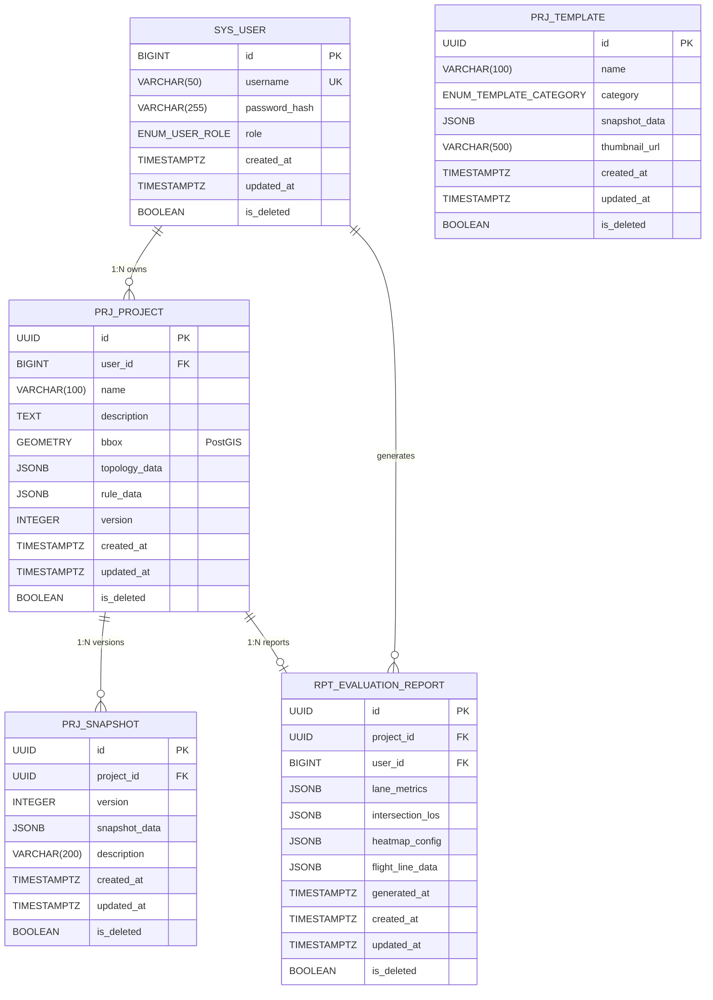
```mermaid
erDiagram
    SYS_USER {
        BIGINT id PK
        VARCHAR(50) username UK
        VARCHAR(255) password_hash
        ENUM_USER_ROLE role
        TIMESTAMPTZ created_at
        TIMESTAMPTZ updated_at
        BOOLEAN is_deleted
    }

    PRJ_PROJECT {
        UUID id PK
        BIGINT user_id FK
        VARCHAR(100) name
        TEXT description
        GEOMETRY bbox "PostGIS"
        JSONB topology_data
        JSONB rule_data
        INTEGER version
        TIMESTAMPTZ created_at
        TIMESTAMPTZ updated_at
        BOOLEAN is_deleted
    }

    PRJ_SNAPSHOT {
        UUID id PK
        UUID project_id FK
        INTEGER version
        JSONB snapshot_data
        VARCHAR(200) description
        TIMESTAMPTZ created_at
        TIMESTAMPTZ updated_at
        BOOLEAN is_deleted
    }

    PRJ_TEMPLATE {
        UUID id PK
        VARCHAR(100) name
        ENUM_TEMPLATE_CATEGORY category
        JSONB snapshot_data
        VARCHAR(500) thumbnail_url
        TIMESTAMPTZ created_at
        TIMESTAMPTZ updated_at
        BOOLEAN is_deleted
    }

    RPT_EVALUATION_REPORT {
        UUID id PK
        UUID project_id FK
        BIGINT user_id FK
        JSONB lane_metrics
        JSONB intersection_los
        JSONB heatmap_config
        JSONB flight_line_data
        TIMESTAMPTZ generated_at
        TIMESTAMPTZ created_at
        TIMESTAMPTZ updated_at
        BOOLEAN is_deleted
    }

    SYS_USER ||--o{ PRJ_PROJECT : "1:N owns"
    SYS_USER ||--o{ RPT_EVALUATION_REPORT : generates
    PRJ_PROJECT ||--o{ PRJ_SNAPSHOT : "1:N versions"
    PRJ_PROJECT ||--o| RPT_EVALUATION_REPORT : "1:N reports"
```

### 5.2 建表 DDL

```sql
CREATE EXTENSION IF NOT EXISTS postgis;
```

#### 5.2.1 sys_user — 用户表

```sql
CREATE TABLE sys_user (
    id              BIGINT          PRIMARY KEY GENERATED ALWAYS AS IDENTITY,
    username        VARCHAR(50)     NOT NULL UNIQUE,
    password_hash   VARCHAR(255)    NOT NULL,
    role            enum_user_role  NOT NULL DEFAULT 'USER',
    created_at      TIMESTAMPTZ     NOT NULL DEFAULT NOW(),
    updated_at      TIMESTAMPTZ     NOT NULL DEFAULT NOW(),
    is_deleted      BOOLEAN         NOT NULL DEFAULT FALSE
);

COMMENT ON TABLE  sys_user              IS '用户鉴权与权限管理表';
COMMENT ON COLUMN sys_user.id           IS '主键，自增';
COMMENT ON COLUMN sys_user.username     IS '用户名，唯一';
COMMENT ON COLUMN sys_user.password_hash IS 'BCrypt加密密码';
COMMENT ON COLUMN sys_user.role         IS '角色：ADMIN / USER';
```

#### 5.2.2 prj_project — 工程主表

```sql
CREATE TABLE prj_project (
    id              UUID            PRIMARY KEY DEFAULT gen_random_uuid(),
    user_id         BIGINT          NOT NULL REFERENCES sys_user(id) ON DELETE RESTRICT,
    name            VARCHAR(100)    NOT NULL,
    description     TEXT            DEFAULT '',
    bbox            GEOMETRY(POLYGON, 4326),
    topology_data   JSONB           NOT NULL DEFAULT '{}',
    rule_data       JSONB           NOT NULL DEFAULT '{}',
    version         INTEGER         NOT NULL DEFAULT 1,
    created_at      TIMESTAMPTZ     NOT NULL DEFAULT NOW(),
    updated_at      TIMESTAMPTZ     NOT NULL DEFAULT NOW(),
    is_deleted      BOOLEAN         NOT NULL DEFAULT FALSE
);

CREATE INDEX idx_project_user_id ON prj_project(user_id);
CREATE INDEX idx_project_bbox ON prj_project USING GIST(bbox);
CREATE UNIQUE INDEX uk_project_user_name ON prj_project(user_id, name);

COMMENT ON TABLE  prj_project              IS '工程主表，核心拓扑与规则以JSONB存储';
COMMENT ON COLUMN prj_project.bbox         IS 'PostGIS空间范围，用于空间查询';
COMMENT ON COLUMN prj_project.topology_data IS '路网拓扑JSONB：节点、路段、半边、横断面';
COMMENT ON COLUMN prj_project.rule_data     IS '交规规则JSONB：车道连接器、信控、限速等';
```

#### 5.2.3 prj_snapshot — 工程快照表

```sql
CREATE TABLE prj_snapshot (
    id              UUID            PRIMARY KEY DEFAULT gen_random_uuid(),
    project_id      UUID            NOT NULL REFERENCES prj_project(id) ON DELETE CASCADE,
    version         INTEGER         NOT NULL,
    snapshot_data   JSONB           NOT NULL,
    description     VARCHAR(200)    DEFAULT '',
    created_at      TIMESTAMPTZ     NOT NULL DEFAULT NOW(),
    updated_at      TIMESTAMPTZ     NOT NULL DEFAULT NOW(),
    is_deleted      BOOLEAN         NOT NULL DEFAULT FALSE
);

CREATE INDEX idx_snapshot_project_id ON prj_snapshot(project_id);
CREATE UNIQUE INDEX uk_snapshot_project_version ON prj_snapshot(project_id, version);

COMMENT ON TABLE  prj_snapshot              IS '工程版本快照，支持回滚';
COMMENT ON COLUMN prj_snapshot.snapshot_data IS '完整工程快照JSONB';
COMMENT ON COLUMN prj_snapshot.is_deleted    IS '快照软删除标记，默认硬删除策略但保留字段扩展';
```

#### 5.2.4 prj_template — 样例模板表

```sql
CREATE TABLE prj_template (
    id              UUID            PRIMARY KEY DEFAULT gen_random_uuid(),
    name            VARCHAR(100)    NOT NULL,
    category        enum_template_category NOT NULL,
    snapshot_data   JSONB           NOT NULL,
    thumbnail_url   VARCHAR(500)    DEFAULT '',
    created_at      TIMESTAMPTZ     NOT NULL DEFAULT NOW(),
    updated_at      TIMESTAMPTZ     NOT NULL DEFAULT NOW(),
    is_deleted      BOOLEAN         NOT NULL DEFAULT FALSE
);

CREATE INDEX idx_template_category ON prj_template(category);

COMMENT ON TABLE  prj_template              IS '典型枢纽样例库';
COMMENT ON COLUMN prj_template.category      IS '分类：基础路口/苜蓿叶立交/涡轮立交等';
```

#### 5.2.5 rpt_evaluation_report — 评估报告表

```sql
CREATE TABLE rpt_evaluation_report (
    id                  UUID            PRIMARY KEY DEFAULT gen_random_uuid(),
    project_id          UUID            NOT NULL REFERENCES prj_project(id) ON DELETE CASCADE,
    user_id             BIGINT          NOT NULL REFERENCES sys_user(id) ON DELETE RESTRICT,
    lane_metrics        JSONB           NOT NULL DEFAULT '{}',
    intersection_los    JSONB           NOT NULL DEFAULT '{}',
    heatmap_config      JSONB           NOT NULL DEFAULT '{}',
    flight_line_data    JSONB           NOT NULL DEFAULT '{}',
    generated_at        TIMESTAMPTZ     NOT NULL DEFAULT NOW(),
    created_at          TIMESTAMPTZ     NOT NULL DEFAULT NOW(),
    updated_at          TIMESTAMPTZ     NOT NULL DEFAULT NOW(),
    is_deleted          BOOLEAN         NOT NULL DEFAULT FALSE
);

CREATE INDEX idx_report_project_id ON rpt_evaluation_report(project_id);
CREATE INDEX idx_report_user_id ON rpt_evaluation_report(user_id);

COMMENT ON TABLE  rpt_evaluation_report              IS '交通评估报告';
COMMENT ON COLUMN rpt_evaluation_report.lane_metrics  IS '车道级指标JSONB';
COMMENT ON COLUMN rpt_evaluation_report.intersection_los IS '交叉口LOS评级JSONB';
COMMENT ON COLUMN rpt_evaluation_report.user_id       IS '用户ID，用于行级数据隔离';
```

> **注**：本节 DDL 为简化版本，完整的 CHECK 约束、触发器、GIN 索引与列注释请参照《数据库设计文档 V2.3》。

### 5.3 JSONB 数据结构定义

#### 5.3.1 topology_data 结构

```typescript
interface TopologyData {
    nodes: {
        id: string;
        position: { x: number; y: number };
        elevation: number;
        boundary: { x: number; y: number }[];
        controlMode: 'YIELD' | 'TRAFFIC_LIGHT' | 'ROUNDABOUT' | 'NONE';
        connectedSegmentIds: string[];
    }[];
    segments: {
        id: string;
        startNodeId: string;
        endNodeId: string;
        centerLine: { x: number; y: number }[];
        profile: CrossSectionProfile;
        elevation: ElevationProfile;
    }[];
    halfEdges: {  // ⚠ 冗余派生数据：可由 nodes + segments 重建，持久化仅为避免运行时重算
        id: string;
        originNodeId: string;
        twinId: string;
        nextId: string;
        segmentId: string;
        laneIndex: number;
    }[];
}
```

> **注**：`centerLine` 存储贝塞尔曲线采样控制点（Point2D[]），运行时通过 `bezier-js` 重建为 `BezierCurve` 对象。`halfEdges` 为冗余派生数据，可从 `nodes` + `segments` 完整重建，持久化目的仅为避免每次加载时的运行时重算开销。

#### 5.3.2 rule_data 结构

```typescript
interface RuleData {
    ruleSets: {
        nodeId: string;
        nodeControlMode: 'YIELD' | 'TRAFFIC_LIGHT' | 'ROUNDABOUT' | 'NONE';
        crosswalkEnabled: boolean;
        turnRestrictions: TurnRestriction[];
        laneArrows: {
            laneId: string;
            nodeId: string;
            allowedDirections: ('LEFT' | 'STRAIGHT' | 'RIGHT' | 'U_TURN')[];
        }[];
        laneConnectors: {
            id: string;
            fromLaneId: string;
            toLaneId: string;
            fromAnchor: { x: number; y: number };
            toAnchor: { x: number; y: number };
        }[];
        trafficLight: {
            id: string;
            steps: SignalStep[];
            sensors: VirtualSensor[];
            strategy: 'FIXED_TIMING' | 'SENSOR_ACTUATED';
        } | null;
        laneRestrictions: {
            laneId: string;
            restriction: LaneRestriction;
        }[];
    }[];
    odConfig: {
        pairs: {
            fromNodeId: string;
            toNodeId: string;
            volumePerHour: number;
        }[];
        vehicleMix: {
            ratios: {
                type: VehicleType;
                ratio: number;
            }[];
        };
    };
}
```

> **注**：`LaneConnector.guideCurve`（CatmullRomCurve3 引导曲线）为运行时根据 `fromAnchor`/`toAnchor` 自动重建的计算字段，不持久化存储。

#### 5.3.3 snapshot_data 结构统一说明

`prj_snapshot.snapshot_data` 与 `prj_template.snapshot_data` 共享相同的 JSONB 结构，定义如下：

```typescript
interface SnapshotData {
    topology: TopologyData;
    rules: RuleData;
}
```

即快照数据 = 拓扑数据 + 规则数据的组合。工程快照与模板快照使用同一份接口定义，确保模板加载后可直接反序列化到 `RoadNetworkStore` 和 `TrafficRuleStore`。

---

## 6. 核心时序图

### 6.1 道路绘制与拓扑自愈时序图

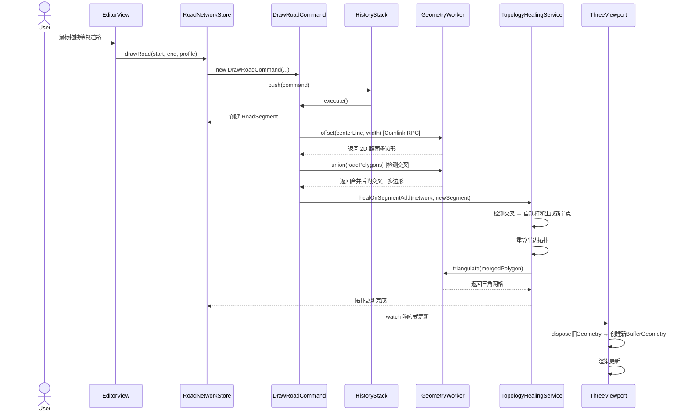
```mermaid
sequenceDiagram
    actor User
    participant View as EditorView
    participant Store as RoadNetworkStore
    participant Cmd as DrawRoadCommand
    participant History as HistoryStack
    participant Worker as GeometryWorker
    participant Topology as TopologyHealingService
    participant Three as ThreeViewport

    User->>View: 鼠标拖拽绘制道路
    View->>Store: drawRoad(start, end, profile)
    Store->>Cmd: new DrawRoadCommand(...)
    Store->>History: push(command)
    History->>Cmd: execute()
    
    Cmd->>Store: 创建 RoadSegment
    Cmd->>Worker: offset(centerLine, width) [Comlink RPC]
    Worker-->>Cmd: 返回 2D 路面多边形
    
    Cmd->>Worker: union(roadPolygons) [检测交叉]
    Worker-->>Cmd: 返回合并后的交叉口多边形
    
    Cmd->>Topology: healOnSegmentAdd(network, newSegment)
    Topology->>Topology: 检测交叉 → 自动打断生成新节点
    Topology->>Topology: 重算半边拓扑
    Topology->>Worker: triangulate(mergedPolygon)
    Worker-->>Topology: 返回三角网格
    Topology-->>Store: 拓扑更新完成
    
    Store->>Three: watch 响应式更新
    Three->>Three: dispose旧Geometry → 创建新BufferGeometry
    Three->>Three: 渲染更新
```

### 6.2 道路升级工具时序图

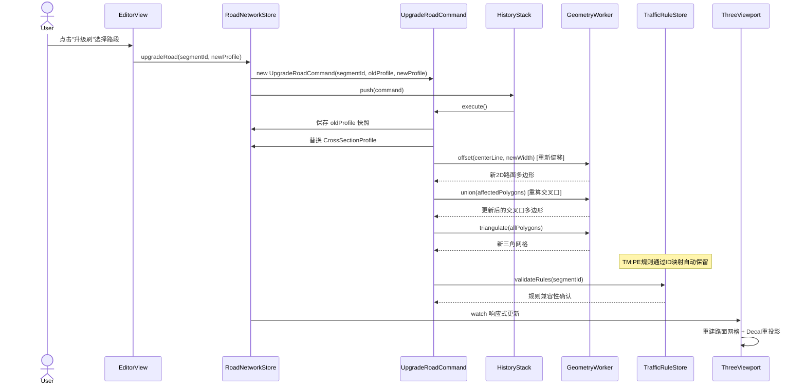
```mermaid
sequenceDiagram
    actor User
    participant View as EditorView
    participant Store as RoadNetworkStore
    participant Cmd as UpgradeRoadCommand
    participant History as HistoryStack
    participant Worker as GeometryWorker
    participant RuleStore as TrafficRuleStore
    participant Three as ThreeViewport

    User->>View: 点击"升级刷"选择路段
    View->>Store: upgradeRoad(segmentId, newProfile)
    Store->>Cmd: new UpgradeRoadCommand(segmentId, oldProfile, newProfile)
    Store->>History: push(command)
    History->>Cmd: execute()
    
    Cmd->>Store: 保存 oldProfile 快照
    Cmd->>Store: 替换 CrossSectionProfile
    
    Cmd->>Worker: offset(centerLine, newWidth) [重新偏移]
    Worker-->>Cmd: 新2D路面多边形
    
    Cmd->>Worker: union(affectedPolygons) [重算交叉口]
    Worker-->>Cmd: 更新后的交叉口多边形
    
    Cmd->>Worker: triangulate(allPolygons)
    Worker-->>Cmd: 新三角网格
    
    Note over RuleStore: TM:PE规则通过ID映射自动保留
    Cmd->>RuleStore: validateRules(segmentId)
    RuleStore-->>Cmd: 规则兼容性确认
    
    Store->>Three: watch 响应式更新
    Three->>Three: 重建路面网格 + Decal重投影
```

### 6.3 微观仿真运行时序图

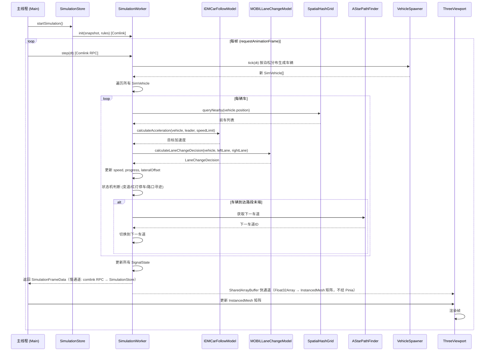
```mermaid
sequenceDiagram
    participant Main as 主线程 (Main)
    participant Store as SimulationStore
    participant Worker as SimulationWorker
    participant IDM as IDMCarFollowModel
    participant MOBIL as MOBILLaneChangeModel
    participant Spatial as SpatialHashGrid
    participant PathFinder as AStarPathFinder
    participant Spawner as VehicleSpawner
    participant Three as ThreeViewport

    Main->>Store: startSimulation()
    Store->>Worker: init(snapshot, rules) [Comlink]
    
    loop 每帧 (requestAnimationFrame)
        Main->>Worker: step(dt) [Comlink RPC]
        
        Worker->>Spawner: tick(dt) 按泊松分布生成车辆
        Spawner-->>Worker: 新 SimVehicle[]
        
        Worker->>Worker: 遍历所有 SimVehicle
        
        loop 每辆车
            Worker->>Spatial: queryNearby(vehicle.position)
            Spatial-->>Worker: 前车列表
            
            Worker->>IDM: calculateAcceleration(vehicle, leader, speedLimit)
            IDM-->>Worker: 目标加速度
            
            Worker->>MOBIL: calculateLaneChangeDecision(vehicle, leftLane, rightLane)
            MOBIL-->>Worker: LaneChangeDecision
            
            Worker->>Worker: 更新 speed, progress, lateralOffset
            Worker->>Worker: 状态机判断 (变道/红灯停车/路口寻迹)
            
            alt 车辆到达路段末端
                Worker->>PathFinder: 获取下一车道
                PathFinder-->>Worker: 下一车道ID
                Worker->>Worker: 切换到下一车道
            end
        end
        
        Worker->>Worker: 更新所有 SignalState
        
        Worker-->>Main: 返回 SimulationFrameData（慢通道: comlink RPC → SimulationStore）
        Worker-->>Three: SharedArrayBuffer 快通道（Float32Array → InstancedMesh 矩阵，不经 Pinia）
        Main->>Three: 更新 InstancedMesh 矩阵
        Three->>Three: 渲染帧
    end
```

### 6.4 评估可视化时序图

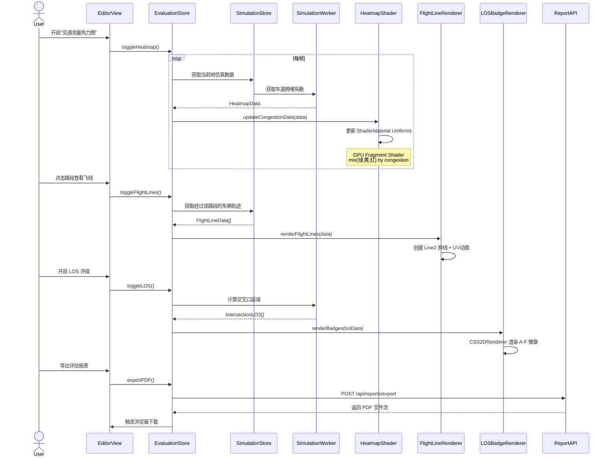
```mermaid
sequenceDiagram
    actor User
    participant View as EditorView
    participant Store as EvaluationStore
    participant SimStore as SimulationStore
    participant Worker as SimulationWorker
    participant Heatmap as HeatmapShader
    participant FlightLine as FlightLineRenderer
    participant LOS as LOSBadgeRenderer
    participant Backend as ReportAPI

    User->>View: 开启"交通流量热力图"
    View->>Store: toggleHeatmap()
    
    loop 每帧
        Store->>SimStore: 获取当前帧仿真数据
        SimStore->>Worker: 获取车道拥堵系数
        Worker-->>Store: HeatmapData
        
        Store->>Heatmap: updateCongestionData(data)
        Heatmap->>Heatmap: 更新 ShaderMaterial Uniforms
        Note over Heatmap: GPU Fragment Shader<br/>mix(绿,黄,红) by congestion
    end
    
    User->>View: 点击路段查看飞线
    View->>Store: toggleFlightLines()
    Store->>SimStore: 获取经过该路段的车辆轨迹
    SimStore-->>Store: FlightLineData[]
    Store->>FlightLine: renderFlightLines(data)
    FlightLine->>FlightLine: 创建 Line2 胖线 + UV动画
    
    User->>View: 开启 LOS 评级
    View->>Store: toggleLOS()
    Store->>Worker: 计算交叉口延误
    Worker-->>Store: IntersectionLOS[]
    Store->>LOS: renderBadges(losData)
    LOS->>LOS: CSS2DRenderer 渲染 A-F 徽章
    
    User->>View: 导出评估报表
    View->>Store: exportPDF()
    Store->>Backend: POST /api/reports/export
    Backend-->>Store: 返回 PDF 文件流
    Store->>View: 触发浏览器下载
```

### 6.5 工程保存与加载时序图

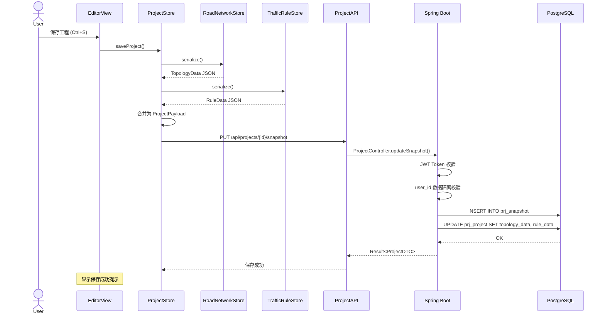
```mermaid
sequenceDiagram
    actor User
    participant View as EditorView
    participant Store as ProjectStore
    participant NetStore as RoadNetworkStore
    participant RuleStore as TrafficRuleStore
    participant API as ProjectAPI
    participant Backend as Spring Boot
    participant DB as PostgreSQL

    User->>View: 保存工程 (Ctrl+S)
    View->>Store: saveProject()
    
    Store->>NetStore: serialize()
    NetStore-->>Store: TopologyData JSON
    
    Store->>RuleStore: serialize()
    RuleStore-->>Store: RuleData JSON
    
    Store->>Store: 合并为 ProjectPayload
    
    Store->>API: PUT /api/projects/{id}/snapshot
    API->>Backend: ProjectController.updateSnapshot()
    Backend->>Backend: JWT Token 校验
    Backend->>Backend: user_id 数据隔离校验
    Backend->>DB: INSERT INTO prj_snapshot
    Backend->>DB: UPDATE prj_project SET topology_data, rule_data
    DB-->>Backend: OK
    Backend-->>API: Result<ProjectDTO>
    API-->>Store: 保存成功
    
    Note over View: 显示保存成功提示
```

### 6.6 枢纽节点微调时序图 (FR2)

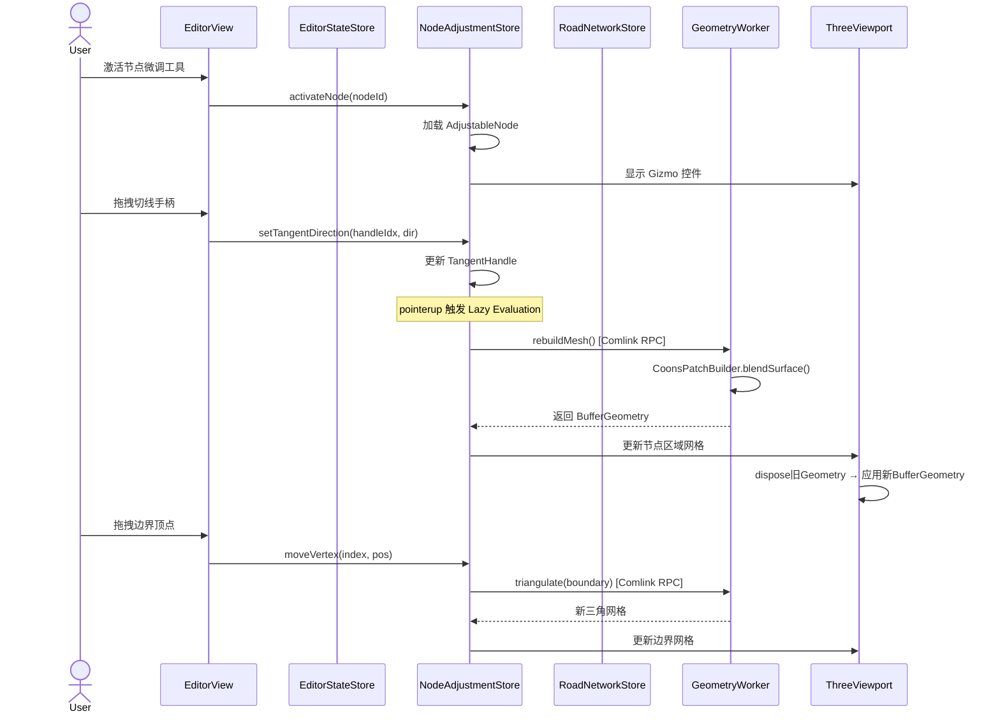
```mermaid
sequenceDiagram
    actor User
    participant View as EditorView
    participant Editor as EditorStateStore
    participant AdjStore as NodeAdjustmentStore
    participant NetStore as RoadNetworkStore
    participant Worker as GeometryWorker
    participant Three as ThreeViewport

    User->>View: 激活节点微调工具
    View->>AdjStore: activateNode(nodeId)
    AdjStore->>AdjStore: 加载 AdjustableNode
    AdjStore->>Three: 显示 Gizmo 控件

    User->>View: 拖拽切线手柄
    View->>AdjStore: setTangentDirection(handleIdx, dir)
    AdjStore->>AdjStore: 更新 TangentHandle

    Note over AdjStore: pointerup 触发 Lazy Evaluation
    AdjStore->>Worker: rebuildMesh() [Comlink RPC]
    Worker->>Worker: CoonsPatchBuilder.blendSurface()
    Worker-->>AdjStore: 返回 BufferGeometry

    AdjStore->>Three: 更新节点区域网格
    Three->>Three: dispose旧Geometry → 应用新BufferGeometry

    User->>View: 拖拽边界顶点
    View->>AdjStore: moveVertex(index, pos)
    AdjStore->>Worker: triangulate(boundary) [Comlink RPC]
    Worker-->>AdjStore: 新三角网格
    AdjStore->>Three: 更新边界网格
```

### 6.7 交规配置时序图 (FR3)

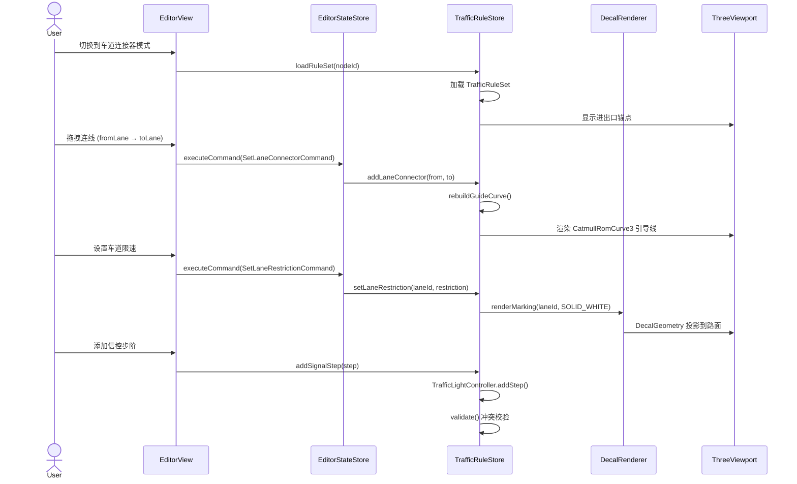
```mermaid
sequenceDiagram
    actor User
    participant View as EditorView
    participant Editor as EditorStateStore
    participant RuleStore as TrafficRuleStore
    participant Decal as DecalRenderer
    participant Three as ThreeViewport

    User->>View: 切换到车道连接器模式
    View->>RuleStore: loadRuleSet(nodeId)
    RuleStore->>RuleStore: 加载 TrafficRuleSet
    RuleStore->>Three: 显示进出口锚点

    User->>View: 拖拽连线 (fromLane → toLane)
    View->>Editor: executeCommand(SetLaneConnectorCommand)
    Editor->>RuleStore: addLaneConnector(from, to)
    RuleStore->>RuleStore: rebuildGuideCurve()
    RuleStore->>Three: 渲染 CatmullRomCurve3 引导线

    User->>View: 设置车道限速
    View->>Editor: executeCommand(SetLaneRestrictionCommand)
    Editor->>RuleStore: setLaneRestriction(laneId, restriction)
    RuleStore->>Decal: renderMarking(laneId, SOLID_WHITE)
    Decal->>Three: DecalGeometry 投影到路面

    User->>View: 添加信控步阶
    View->>RuleStore: addSignalStep(step)
    RuleStore->>RuleStore: TrafficLightController.addStep()
    RuleStore->>RuleStore: validate() 冲突校验
```

### 6.8 Worker 异常回滚时序图

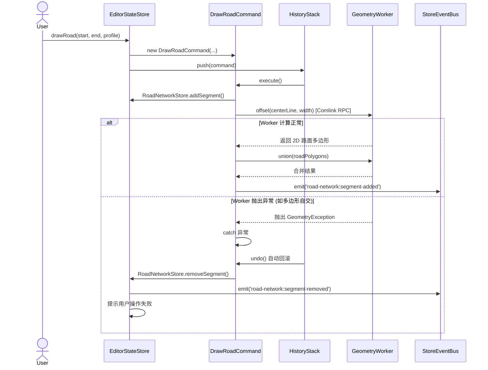
```mermaid
sequenceDiagram
    actor User
    participant Editor as EditorStateStore
    participant Cmd as DrawRoadCommand
    participant History as HistoryStack
    participant Worker as GeometryWorker
    participant EventBus as StoreEventBus

    User->>Editor: drawRoad(start, end, profile)
    Editor->>Cmd: new DrawRoadCommand(...)
    Editor->>History: push(command)
    History->>Cmd: execute()

    Cmd->>Editor: RoadNetworkStore.addSegment()
    Cmd->>Worker: offset(centerLine, width) [Comlink RPC]

    alt Worker 计算正常
        Worker-->>Cmd: 返回 2D 路面多边形
        Cmd->>Worker: union(roadPolygons)
        Worker-->>Cmd: 合并结果
        Cmd->>EventBus: emit('road-network:segment-added')
    else Worker 抛出异常 (如多边形自交)
        Worker-->>Cmd: 抛出 GeometryException
        Cmd->>Cmd: catch 异常
        History->>Cmd: undo() 自动回滚
        Cmd->>Editor: RoadNetworkStore.removeSegment()
        Editor->>EventBus: emit('road-network:segment-removed')
        Editor->>Editor: 提示用户操作失败
    end
```

### 6.9 样例库加载时序图 (FR5.1)

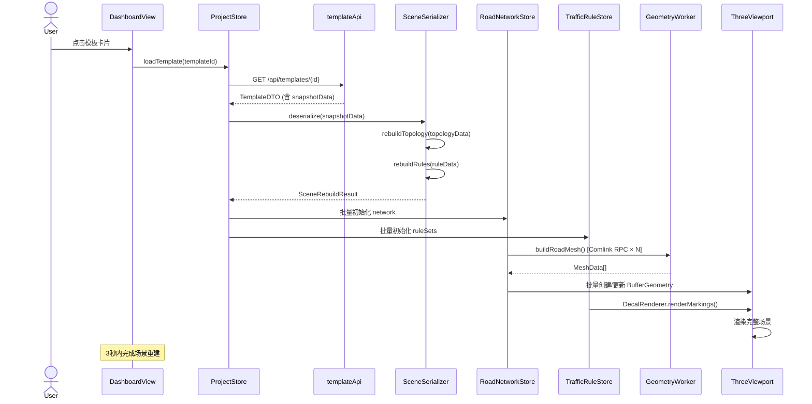
```mermaid
sequenceDiagram
    actor User
    participant Dashboard as DashboardView
    participant ProjStore as ProjectStore
    participant API as templateApi
    participant Serializer as SceneSerializer
    participant NetStore as RoadNetworkStore
    participant RuleStore as TrafficRuleStore
    participant Worker as GeometryWorker
    participant Three as ThreeViewport

    User->>Dashboard: 点击模板卡片
    Dashboard->>ProjStore: loadTemplate(templateId)
    ProjStore->>API: GET /api/templates/{id}
    API-->>ProjStore: TemplateDTO (含 snapshotData)

    ProjStore->>Serializer: deserialize(snapshotData)
    Serializer->>Serializer: rebuildTopology(topologyData)
    Serializer->>Serializer: rebuildRules(ruleData)
    Serializer-->>ProjStore: SceneRebuildResult

    ProjStore->>NetStore: 批量初始化 network
    ProjStore->>RuleStore: 批量初始化 ruleSets

    NetStore->>Worker: buildRoadMesh() [Comlink RPC × N]
    Worker-->>NetStore: MeshData[]
    NetStore->>Three: 批量创建/更新 BufferGeometry

    RuleStore->>Three: DecalRenderer.renderMarkings()
    Three->>Three: 渲染完整场景

    Note over Dashboard: 3秒内完成场景重建
```

---

## 7. 接口详细设计

### 7.1 RESTful API 接口规范

#### 7.1.1 统一返回对象

```typescript
interface Result<T> {
    code: number;
    message: string;
    data: T;
}
```

#### 7.1.2 接口清单

| 接口路径 | 方法 | 描述 | 请求体 | 响应体 |
|:---|:---|:---|:---|:---|
| `/api/auth/login` | POST | 用户登录 | `{ username, password }` | `Result<{ token, expiresIn }>` |
| `/api/auth/register` | POST | 用户注册 | `{ username, password }` | `Result<{ userId }>` |
| `/api/projects` | POST | 创建工程 | `{ name, description }` | `Result<ProjectDTO>` |
| `/api/projects` | GET | 获取工程列表 | Query: `page, size` | `Result<Page<ProjectDTO>>` |
| `/api/projects/{id}` | GET | 获取工程详情 | - | `Result<ProjectDTO>` |
| `/api/projects/{id}` | DELETE | 删除工程 | - | `Result<void>` |
| `/api/projects/{id}/snapshot` | PUT | 保存工程快照 | `{ topologyData, ruleData, description }` | `Result<SnapshotDTO>` |
| `/api/projects/{id}/snapshots` | GET | 获取快照列表 | Query: `page, size` | `Result<Page<SnapshotDTO>>` |
| `/api/projects/{id}/snapshots/{version}` | GET | 加载指定版本 | - | `Result<ProjectDTO>` |
| `/api/templates` | GET | 获取样例库列表 | Query: `category` | `Result<TemplateDTO[]>` |
| `/api/templates` | POST | 保存用户自定义断面模板 | Body: `UserTemplatePayload` | `Result<TemplateDTO>` |
| `/api/templates/{id}` | GET | 获取样例详情 | - | `Result<TemplateDTO>` |
| `/api/reports` | GET | 获取评估报告列表 | Query: `projectId` | `Result<ReportDTO[]>` |
| `/api/reports/{id}` | GET | 获取评估报告详情 | - | `Result<ReportDTO>` |
| `/api/reports/export` | POST | 导出评估报表 | `{ projectId, format, metrics }` | `Binary (PDF/CSV)` |

#### 7.1.3 DTO 定义

```typescript
interface ProjectDTO {
    id: string;
    name: string;
    description: string;
    topologyData: TopologyData;
    ruleData: RuleData;
    version: number;
    createdAt: string;
    updatedAt: string;
}

interface SnapshotDTO {
    id: string;
    projectId: string;
    version: number;
    description: string;
    createdAt: string;
}

interface TemplateDTO {
    id: string;
    name: string;
    category: string;
    snapshotData: SnapshotData;
    thumbnailUrl: string;
}
```

### 7.2 Worker 内部接口 (Comlink RPC)

#### 7.2.1 GeometryWorker

```typescript
interface GeometryWorkerAPI {
    offset(centerLine: Point2D[], width: number): Promise<Polygon2D>;
    union(polygons: Polygon2D[]): Promise<Polygon2D>;
    difference(subject: Polygon2D, clip: Polygon2D): Promise<Polygon2D>;
    triangulate(polygon: Polygon2D): Promise<Triangle2D[]>;
    buildRoadMesh(segment: RoadSegmentData): Promise<MeshData>;
}
```

#### 7.2.2 SimulationWorker

遵循接口隔离原则 (ISP)，将 SimulationWorker 的能力拆分为三个独立接口：

```typescript
interface ISimulationControl {
    init(snapshot: RoadNetworkSnapshot, rules: RuleData): Promise<void>;
    start(): Promise<void>;
    pause(): Promise<void>;
}

interface ISimulationQuery {
    step(dt: number): Promise<SimulationFrameData>;
    getLaneMetrics(): Promise<Map<string, LaneMetric>>;
    getIntersectionLOS(): Promise<Map<string, IntersectionLOS>>;
    getFlightLineData(segmentId: string): Promise<FlightLineData[]>;
    getODMatrix(): Promise<ODMatrix>;
    setODMatrix(matrix: ODMatrix): Promise<void>;
    getVehicleMixConfig(): Promise<VehicleMixConfig>;
    setVehicleMixConfig(config: VehicleMixConfig): Promise<void>;
}

interface ISimulationVehicleMgmt {
    spawnVehicles(count: number): Promise<void>;
}

interface SimulationWorkerAPI extends ISimulationControl, ISimulationQuery, ISimulationVehicleMgmt {}
```

### 7.3 Pinia Store 间通信接口

Store 间通过 `StoreEventBus` 事件总线解耦，禁止 Store 之间直接引用。发布方仅触发事件，订阅方自行监听响应。

```typescript
interface StoreEventMap {
    'road-network:segment-added': { segmentId: string };
    'road-network:segment-removed': { segmentId: string };
    'road-network:segment-deleted': { segmentId: string; cascadeRuleCount: number };
    'road-network:segment-upgraded': { segmentId: string; oldProfile: CrossSectionProfile };
    'road-network:node-changed': { nodeId: string };
    'road-network:profile-changed': { segmentId: string; oldProfile: CrossSectionProfile; newProfile: CrossSectionProfile };
    'traffic-rule:rule-changed': { nodeId: string };
    'traffic-rule:lane-arrow-changed': { nodeId: string; laneId: string; directions: TurnDirection[] };
    'simulation:started': {};
    'simulation:paused': {};
    'simulation:stopped': {};
    'simulation:vehicle-spawned': { vehicleId: string };
    'simulation:frame-updated': { frameData: SimulationFrameData };
    'simulation:metrics-updated': { laneMetrics: Map<string, LaneMetric>; intersectionLOS: Map<string, IntersectionLOS> };
    'simulation:od-matrix-changed': { odMatrix: ODMatrix };
    'simulation:vehicle-mix-changed': { mixConfig: VehicleMixConfig };
    'evaluation:report-generated': { reportId: string };
}

class StoreEventBus {
    private static instance: StoreEventBus;
    private emitter: mitt<StoreEventMap>;

    static getInstance(): StoreEventBus;
    emit<K extends keyof StoreEventMap>(event: K, payload: StoreEventMap[K]): void;
    on<K extends keyof StoreEventMap>(event: K, handler: (payload: StoreEventMap[K]) => void): void;
    off<K extends keyof StoreEventMap>(event: K, handler: (payload: StoreEventMap[K]) => void): void;
}
```

**Store 间通信约束**：
- ✅ `SimulationStore` 发布 `simulation:frame-updated` → `EvaluationStore` 订阅
- ✅ `SimulationStore` 发布 `simulation:metrics-updated` → `EvaluationStore` 订阅
- ✅ `RoadNetworkStore` 发布 `road-network:segment-added` → `TrafficRuleStore` 订阅
- ✅ `RoadNetworkStore` 发布 `road-network:segment-deleted` → `TrafficRuleStore` 订阅（级联删除规则）
- ✅ `SimulationStore` 发布 `simulation:od-matrix-changed` → `SimulationWorker` 订阅
- ✅ `SimulationStore` 发布 `simulation:vehicle-mix-changed` → `SimulationWorker` 订阅
- ✅ `TrafficRuleStore` 发布 `traffic-rule:rule-changed` → `SimulationStore` 订阅
- ✅ `TrafficRuleStore` 发布 `traffic-rule:lane-arrow-changed` → `SimulationStore` 订阅
- ❌ 禁止 `EvaluationStore` 直接调用 `SimulationStore` 的方法

---

## 8. 前端核心类型定义汇总

### 8.1 基础几何类型

```typescript
interface Point2D {
    x: number;
    y: number;
}

interface Point3D {
    x: number;
    y: number;
    z: number;
}

interface Polygon2D {
    exterior: Point2D[];
    holes: Point2D[][];
}

interface Triangle2D {
    a: Point2D;
    b: Point2D;
    c: Point2D;
}

interface BoundingBox {
    minX: number;
    minY: number;
    maxX: number;
    maxY: number;
}
```

### 8.2 Mesh 传输类型

```typescript
interface MeshData {
    positions: Float32Array;
    normals: Float32Array;
    uvs: Float32Array;
    indices: Uint32Array;
}
```

---

## 9. 关键算法伪代码

### 9.1 2.5D 路面网格生成流水线

```
输入: centerLine (贝塞尔曲线), profile (横断面), elevation (高程)
输出: MeshData (Three.js BufferGeometry 数据)

1. 利用 bezier-js 采样中心线为 N 个离散点
2. 对每个采样点计算切线方向
3. 利用 clipper-lib 对中心线做左右 Offset，生成 2D 路面多边形
   // Offset距离 = 车道宽度之和/2 + 人行道宽度，即道路半宽
4. 若有交叉口，对多个路面多边形执行 Union 布尔运算
   // Union消除重叠区域，生成完整交叉口2D边界
5. 利用 d3-delaunay 对 2D 多边形做 Delaunay 三角剖分
   // 三角剖分将多边形转为GPU可渲染的三角形图元
6. 根据端点高程线性插值，为每个顶点赋予 Z 值
   // 2.5D策略：XY平面由几何计算保证正确性，Z轴仅做视觉投影
   // 若存在RampTransition，则按transitionCurve类型插值坡度过渡
7. 计算法线、UV 坐标
   // 法线用于光照计算，UV用于路面纹理/Decal贴花投影
8. 输出 MeshData
```

### 9.2 IDM 跟驰模型

```
输入: vehicle (当前车), leader (前车 | null), speedLimit
输出: acceleration (加速度)

1. v0 = min(vehicle.maxSpeed, speedLimit)     // 期望速度：取车辆最大速度与车道限速的较小值
2. s0 = vehicle.minGap                         // 最小安全间距：静止时与前车保持的最小距离（米）
3. T  = 1.5                                    // 安全车头时距：以当前速度行驶1.5秒的距离作为安全缓冲
4. a  = vehicle.maxAcceleration                // 最大加速度：车辆在自由流状态下的最大加速能力（m/s²）
5. b  = vehicle.comfortableDeceleration        // 舒适减速度：驾驶员习惯的制动减速度（m/s²），通常3-4

6. IF leader == null:                          // 无前车：自由行驶
7.   s_star = s0 + v * T                       // 期望间距 = 最小间距 + 速度×时距
8. ELSE:                                       // 有前车：跟驰状态
9.   delta_v = vehicle.speed - leader.speed    // 相对速度：正值表示正在接近前车
10.  s = leader.progress - vehicle.progress - leader.bodyLength  // 实际车间距（弧长差 - 车身长度）
11.  s_star = s0 + max(0, v*T + v*delta_v/(2*sqrt(a*b)))  // 期望间距：含动态制动项

12. acceleration = a * (1 - (v/v0)^4 - (s_star/s)^2)  // IDM核心公式：自由加速项 - 速度项 - 间距项
13. RETURN clamp(acceleration, -b_max, a)      // 限制加速度范围，防止物理不合理值
```

### 9.3 MOBIL 变道模型

```
输入: vehicle (当前车), leftLane (左车道信息), rightLane (右车道信息)
输出: LaneChangeDecision (是否变道 + 目标车道ID)

1. IF 实线区 (allowLeftChange=false AND allowRightChange=false):
2.   RETURN { shouldChange: false, targetLaneId: null, direction: NONE }

3. p  = 0.2                                    // 礼貌因子：越大越"礼貌"，越不容易变道
4. b_safe = 3.0                                 // 安全减速度阈值：后车最大可接受减速度(m/s²)

5. FOR EACH targetLane IN [leftLane, rightLane]:
6.   IF targetLane 被禁行 (LaneRestriction 禁止变道):
7.     CONTINUE
8.   a_c = IDM.calculateAcceleration(vehicle, targetLane.leader)  // 变道后自身加速度
8.5 IF targetLane.follower 为空:
8.6   decel = 0, a_n_new = 0                    // 无后车，安全性准则自动满足
8.7   GOTO 激励性准则判断
9.   a_n = targetLane.follower 的当前加速度                       // 目标车道后车当前加速度
10.  a_n_new = IDM.calculateAcceleration(targetLane.follower, vehicle)  // 变道后后车新加速度
11.  decel = a_n - a_n_new                       // 后车减速代价
12.  gain = a_c - vehicle.currentAcceleration    // 自身加速度增益
13.  IF a_n_new < -b_safe:                       // 安全性准则不满足（标准MOBIL：后车新加速度不低于-b_safe）
14.    CONTINUE                                  // 变道太危险，跳过此方向
15.  IF gain - p * decel > 0:                    // 激励性准则满足
16.    RETURN { shouldChange: true, targetLaneId: targetLane.id, direction: LEFT/RIGHT }
    // 注：车辆在路口前会检查 LaneArrow.allowedDirections，
    // 若当前车道不允许目标转向，MOBIL 的激励性准则中
    // "自身加速度增益"会额外加上"转向合规奖励"，
    // 使车辆更倾向于变到允许目标转向的车道。

17. RETURN { shouldChange: false, targetLaneId: null, direction: NONE }
```

### 9.4 HCM LOS 分级标准

```
输入: averageDelay (平均控制延误，秒/车)
输出: LOSGrade (A-F)

// HCM (Highway Capacity Manual) 服务水平分级标准
// 延误越低，服务水平越高；F级表示严重拥堵
IF averageDelay <= 10  RETURN A    // 自由流，几乎无延误
IF averageDelay <= 20  RETURN B    // 稳定流，短暂延误
IF averageDelay <= 35  RETURN C    // 稳定流，可接受延误
IF averageDelay <= 55  RETURN D    // 接近不稳定流，可容忍延误
IF averageDelay <= 80  RETURN E    // 不稳定流，显著延误
RETURN F                            // 强制流或崩溃流，严重拥堵
```

---

## 10. 非功能性设计细节

### 10.1 性能保障措施

| 场景 | 措施 | 目标指标 |
|:---|:---|:---|
| 3D 渲染 | InstancedMesh 渲染车辆/路灯/树木 | Draw Call < 50 |
| 热力图 | GPU ShaderMaterial + Uniform | 零 CPU 开销 |
| 飞线渲染 | Line2 + UV 动画 | GPU 驱动流动 |
| 几何计算 | Web Worker + Comlink | 主线程不阻塞 |
| 仿真计算 | SpatialHashGrid + 1D 跟驰 | 500车 < 10ms/帧 |
| 拖拽预览 | Lazy Evaluation (pointerup 触发) | 拖拽中 60FPS |

### 10.2 内存管理规范

```typescript
// 所有 Three.js 资源必须在 onUnmounted 中释放
onUnmounted(() => {
    geometry?.dispose();
    material?.dispose();
    if (material instanceof ShaderMaterial) {
        material.uniforms.texture?.value?.dispose();
    }
    decalMeshes.forEach(mesh => {
        mesh.geometry.dispose();
        mesh.material.dispose();
    });
});
```

### 10.3 安全设计

| 层面 | 措施 |
|:---|:---|
| 传输层 | HTTPS + CORS 白名单 |
| 认证层 | JWT Token + Redis 黑名单 |
| 授权层 | Spring Security + user_id 行级隔离 |
| 数据层 | BCrypt 密码加密 + JSONB 参数化查询 |
| 前端层 | XSS 过滤 + CSRF Token |

### 10.4 容错与回滚

| 场景 | 机制 |
|:---|:---|
| 用户误操作 | Command Pattern 50步 Undo/Redo |
| Worker 计算异常 | try-catch + 自动 undo 栈顶命令 |
| 网络中断 | IndexedDB 离线缓存 |
| 工程版本回退 | prj_snapshot 版本快照 |

---

## 11. 部署架构详细设计

```mermaid
flowchart TB
    subgraph Client ["客户端 (Browser)"]
        Browser[Chrome 90+ / Edge 90+]
    end

    subgraph NginxLayer ["Nginx 反向代理"]
        Nginx[Nginx :80/:443]
    end

    subgraph AppLayer ["应用层 (Docker)"]
        Frontend["前端静态资源\n(Vite Build → Nginx serve)"]
        Backend["Spring Boot :8080\n(Docker Container)"]
    end

    subgraph DataLayer ["数据层 (Docker)"]
        PG["PostgreSQL + PostGIS\n:5432"]
        Redis["Redis\n:6379"]
    end

    subgraph Volume ["持久化存储"]
        V1["pg_data/"]
        V2["redis_data/"]
        V3["uploads/"]
    end

    Browser -->|"HTTPS"| Nginx
    Nginx -->|"静态资源"| Frontend
    Nginx -->|"/api/*"| Backend
    Backend --> PG
    Backend --> Redis
    PG --> V1
    Redis --> V2
    Backend --> V3
```

### 11.1 Docker Compose 编排

```yaml
services:
  backend:
    build: ./backend
    ports: ["8080:8080"]
    environment:
      SPRING_DATASOURCE_URL: jdbc:postgresql://db:5432/urbanmicro
      SPRING_REDIS_HOST: redis
    depends_on: [db, redis]

  db:
    image: postgis/postgis:14-3.4
    volumes: ["pg_data:/var/lib/postgresql/data"]
    environment:
      POSTGRES_DB: urbanmicro
      POSTGRES_PASSWORD: ${DB_PASSWORD}

  redis:
    image: redis:7-alpine
    volumes: ["redis_data:/data"]

  nginx:
    image: nginx:alpine
    ports: ["80:80", "443:443"]
    volumes: ["./frontend/dist:/usr/share/nginx/html", "./nginx.conf:/etc/nginx/nginx.conf"]
    depends_on: [backend]

volumes:
  pg_data:
  redis_data:
```

---

**文档审批记录**

| 角色 | 姓名 | 日期 | 审批意见 |
|:---|:---|:---|:---|
| 架构师/作者 | — | 2026-05-23 | 初始版本，基于DDD方法论完成详细设计 |
| 架构师/修订 | — | 2026-05-23 | V1.1：SOLID原则修订 — 抽取ICarFollowModel/IPathFinder/ISignalStrategy接口；Store间事件总线解耦；RoadNetworkStore职责拆分；后端Service接口化+converter层；前端adapters层；补充FR2/FR3/异常回滚时序图；RampTransition值对象；数据库审计字段补齐；SimulationWorkerAPI接口拆分(ISP)；算法中文注释 |
| 架构师/修订 | — | 2026-05-25 | V1.2：道路绘制交互+MOBIL变道+OD模型修订 — 新增FR1.6连续绘制与对齐工具、FR1.7推土机与删除工具、FR4.5 MOBIL变道模型、FR4.6车辆需求与OD模型；更新FR1.1绘制状态机、FR1.2坡度约束、FR1.3降级保护；新增MOBILLaneChangeModel/VehicleSpawner/ODMatrix/VehicleMixConfig等领域类；补充DeleteRoadCommand/SetLaneConnectorCommand/AddSignalStepCommand/SetElevationCommand命令类；新增9.3 MOBIL变道算法伪代码；SimulationWorker接口扩展OD/车型配置；StoreEventMap新增segment-deleted/od-matrix-changed/vehicle-mix-changed事件 |
| 架构师/修订 | — | 2026-05-25 | V1.3：数据库对齐修订 — 统一ElevationMode为ANARCHY；RuleData补充odConfig；DDL对齐TIMESTAMPTZ/enum/ON DELETE；修复TemplateDTO类型；补充报告查询API；标注序列化策略 |
| 架构师/修订 | — | 2026-05-25 | V1.4：全面审查修复 — MOBIL安全准则修正、RuleData.trafficLight补id/sensors、ER图对齐TIMESTAMPTZ/enum/flight_line_data、补LaneInfo/RuleValidationService类、补FR2/FR3命令类、SimulationWorker.init()类型统一、补仿真生命周期事件 |
| 架构师/修订 | — | 2026-05-25 | V1.5：补充自定义断面编辑器 — FR1.8需求+CrossSectionEditorStore类+SetCrossSectionCommand+用户模板API+profile-changed事件 |
| 架构师/修订 | — | 2026-05-25 | V1.6：补充车道级转向箭头 — FR3.5需求+LaneArrow值对象+TrafficRuleSet扩展+SetLaneArrowCommand+MOBIL转向合规+RuleData.laneArrows |
| 架构师/修订 | — | 2026-05-29 | V1.7：补充夹角标注 — FR1.9需求+AngleAnnotation/AnglePair值对象+向量点积算法+Sprite渲染 |
| 项目经理/导师 | — | | |
| 评审专家 | — | | |

---
*文档结束。本详细设计文档 V1.6 在 V1.5 基础上补充了车道级转向箭头功能：新增 FR3.5 需求（每条车道独立设置允许转向、新建路口时根据 LaneConnector 自动推断箭头、用户手动覆盖、3D 箭头贴花渲染、仿真车辆提前选择正确车道）；新增 `LaneArrow` 值对象存储于 `TrafficRuleSet.laneArrows[]`；扩展 `TrafficRuleSet` 聚合根新增 `setLaneArrow()`/`getLaneArrow()`/`autoInferArrows()` 方法；新增 `SetLaneArrowCommand` 命令类支持箭头修改的撤销/重做；MOBIL 变道模型增加转向合规奖励机制；`RuleData` 接口新增 `laneArrows` 字段；`StoreEventMap` 新增 `traffic-rule:lane-arrow-changed` 事件。所有设计决策均严格遵循概要设计说明书中确立的核心技术路线，并满足开发规约中的全部约束条件。*
